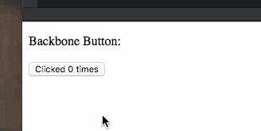

 It’s happening! We’re moving [Yup](https://www.yup.com) to React! ?? We’ve got 37,380 lines of Backbone and Handlebars JavaScript with architectural roots reaching as far back as 2013. Since then, there’s been a pivot, some ebb and flow of different engineers, and more fundamental product changes than you can shake a stick at. We’ve had a bug for the past 4 or 5 months that everyone on the team and every user has seen. We’ve even got in-the-wild video recordings of it, but nobody has been able to reproduce it reliably enough to even begin debugging it, let alone fix it.

After many months of poking and prodding and cajoling and covertly moving our codebase from ES5 to ES6, I got the green light to embark on an epic re-architecture refactor adventure. The refactor to end all refactors. The update to take us to infinity and beyond. No pressure. ? Of course, this refactoring can’t endanger the product roadmap, slow down the team, or cause any sort of inconvenience for the business. That’s right. For the foreseeable future (possibly forever?), the React and Backbone parts of the code have to live together in harmony. To get things started, we’re going to limit this Epic Refactor™ to a small, 7,100-line part of the codebase. That’s not terrifying at all! I mean, what could possibly go wrong™?

## Proof-of-concept for views

Today, I built a quick proof-of-concept for how we can put large swaths of existing code into an otherwise React application. React is going to become the main part. Less React than Backbone at first, but React will be taking over the orchestrating of what renders when and how and where. Right now, our app is built out of Backbone views like this:

    class BackboneButton extends Backbone.View {
        constructor() {
            super();

            this.model = new Backbone.Model({
                N: 0
            });

            this.events = {
                "click button": "buttonClick"
            }

            this.template = Handlebars.compile('Clicked {{N}} times');
            this.listenTo(this.model, 'change', this.render);
        }

        render() {
            this.$el.html(this.template(this.model.attributes));
        }

        buttonClick() {
            const N = this.model.get('N');

            this.model.set({N: N+1});
        }
    }

This is a typical Backbone pattern. You have a `model` that holds some state, a Handlebars `template` that puts variable values into HTML, an `events` hash, and a `change` listener. The user clicks a button and triggers a jQuery event, which calls the `buttonClick` callback. `buttonClick` updates the model, which triggers a `change` event. This triggers a component re-render, which inserts updated HTML into the page.

It’s reactive and almost functional. Pure beauty. Not so great in practice… it’s kind of a mess. Don’t believe me? Re-read the 2nd paragraph about Heisenbugs. The first step to using these views in a React app is a wrapper that looks like this:

    class ButtonWrapper extends React.Component {
        button = new BackboneButton();

        componentDidUpdate() {
            this._render();
        }

        componentDidMount() {
            this._render();
        }

        _render() {
            this.button.setElement(this.refs.anchor).render();
        }

        render() {
            return (
                

                    

    Backbone Button:

                    

                

            );
        }
    }

Our React component that doesn’t do much: it renders a `
` element and uses Backbone’s `setElement` function to tell a Backbone view that this is where it should live. This approach works great for inserting large isolated chunks of current _stuff_ into an otherwise React app. Here’s a CodePen that proves this code works fine: \[codepen_embed height="265" theme_id="0" slug_hash="rrrgbr" default_tab="result" user="swizec"]See the Pen [React + Backbone, step 1](http://codepen.io/swizec/pen/rrrgbr/) by Swizec Teller ([@swizec](http://codepen.io/swizec)) on [CodePen](http://codepen.io).\[/codepen_embed] That was easy. I did it all before my 3rd cup of tea! ? Now I’m stuck trying to make the data architecture inter-op. How do I build an overall unidirectional data flow architecture that works with these independent Backbone+Model views?

> … but [#mobx](https://twitter.com/hashtag/mobx?src=hash) smells a lot like Backbone-style state management and that's the whole reason we need a refactor.
>
> ? — Swizec (@Swizec) [September 19, 2016](https://twitter.com/Swizec/status/778001873978613760)

Hmmm… ? P.S.– I could seriously use some help with this refactor thing. If you're looking to get hired, [shoot me an email](mailto:swizec@swizec.com).
