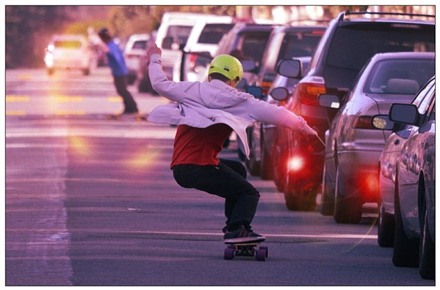
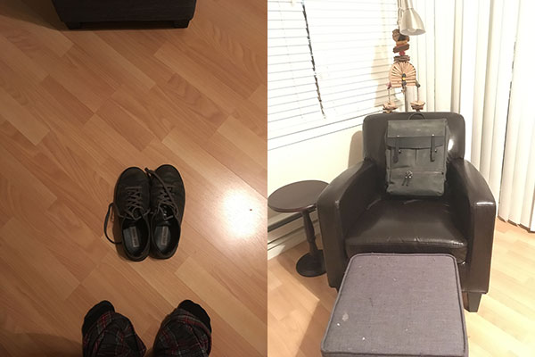
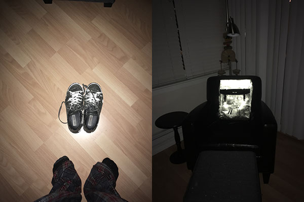

Remember that Volvo LifePaint video from last year?

DID YOU KNOW YOU CAN BUY THAT STUFF ON AMAZON!?!

It’s called [albedo](https://www.amazon.com/s/ref=nb_sb_noss_1?url=search-alias%3Daps&field-keywords=albedo+spray&rh=i%3Aaps%2Ck%3Aalbedo+spray), and it costs about $20 per can. The internet tells me that’s much cheaper than the Volvo-branded version. But the can is small, and you will finish it quick.

It works great, though :D

I bought it so I can be shiny when riding my Boosted Board at night. Drivers in this city can be pretty aggressive. They zoom past and make me poop my pants.

Pooping your pants at 22mph is dangerous.

See? I’ve got my back towards the road when riding. I can’t see cars passing. My butt clenches every time they pass aggressively.

Now check out how shiny my shoes and backpack were 10 minutes after dousing them in shiny magic paint. The shoes are a last minute _“Oooh, that’s gonna be cool!”_ idea. The backpack was planned all along.

Just look at those shoes! It’s surreal how shiny they are. And that’s from an iPhone flash. Who knows how shiny they’ll be under car headlights. Wow.

At least, that’s what I thought at first. I was never again able to reproduce an effect quite so dramatic. And it’s hard to show your friends how cool your shoes are when it takes night time and flash photography to show.

It’s almost impossible to see under normal lighting. You can kinda see that I may have ruined the expensive birthday gift backpack my girlfriend got me, and the shoes sooooort of have a sheen if a light hits them just right.

See. Nothing. Just an off-color backpack and some shoes.

But with flash, they’re still shiny even a whole week of daily use. The paint on my shoes has mostly rubbed off because they’re smooth, but the backpack is going as strong as ever.

I tried to draw a face on the backpack, but it just looks creepy instead … maybe that’s why cars have been keeping their distance lately. ?

As for how it’s possible to have an invisible spray that’s also highly reflective (but only in the direction light is coming from), [here’s the patent](https://www.google.com/patents/US5109060). At least I think that’s the patent.

> Stable spray-coatable, water base composition having about 2 percent solids, that dries into glittering film having plurality of reflective surfaces resistant to flaking, comprising: a blend of a surfactant free first solution comprising, butyl methacrylate, butyl acrylate, 2-ethylhexyl acrylate, glacial methacrylic acid and styrene; a blend of a self-crosslinking second solution comprising, 2-ethylhexyl acrylate, butyl methacrylate, glacial methacrylic acid, styrene and at least one cross-linking polymer; a thickener gel; transparent polyethylene terephthalate chips on which reflective material has been vacuum deposited and cured fast by an epoxy resin, and ammonia.

Sure sounds like the patent.

Oh, and the patent expired some 16 years ago. You can make this stuff yourself and no one will come after you. Enjoy ☺️