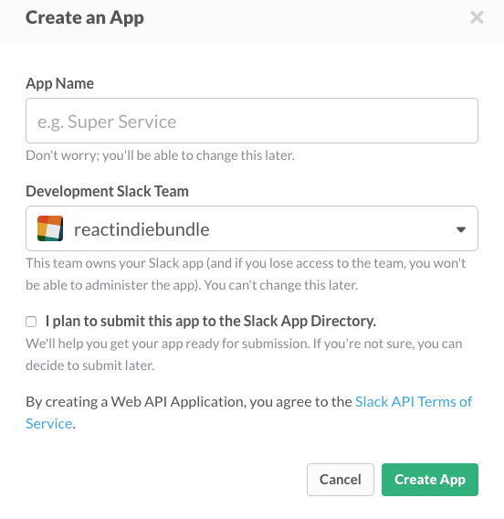
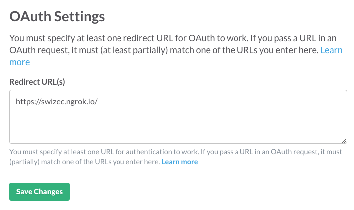
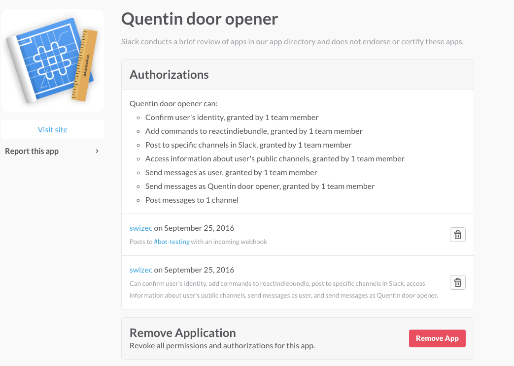
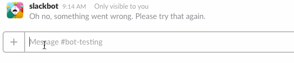

_This is a Livecoding Recap – an almost-weekly post about interesting things discovered while livecoding ?. Always under 500 words and with pictures. You can follow my channel, [here](https://livecoding.tv/swizec). New streams almost **every Sunday at 2pm PDT**. There’s live chat, come say hai ?_

This is embarrassing. That [Slack bot that opens doors](https://swizec.com/blog/livecoding-22-a-door-answering-slackbot/swizec/7038) from last week… it still doesn’t work. I thought we almost had it. I thought I’d identified the hard part. I thought it was just a matter of sitting down and smashing it out.

I was blindsided by OAuth and the exploding complexity that always comes in tutorials and API docs! They show you how simple their API is. How absolutely beautiful to use!

One line of code, two clicks of set up, and you’re sending messages to Slack like a champ. Two clicks, a bit of code, and you’re a bot! You can listen to people’s conversations.

Champ! King of the world. ??

Oh, you want to _actually_ receive the promised POST requests from those message buttons? Boy, do I have a trip for you!

First, you have to set up a Slack app. Not an ad-hoc custom integration like you’ve had until now. Oh no, you need a _real_ app. It takes a few clicks on this screen:

Then it’s going to say that this app is part of your team, _but it’s not_. You have to set up OAuth, have a server that can do OAuth, and then authorize your team with this new app. You need to add an `https` URL on this screen:

On the server side, you’re in for a world of doubya-tee-eff, mate. If you’re on express.js, then you can use [Grant](https://github.com/simov/grant) to set up Slack OAuth somewhat painlessly. _In theory_, this is all it takes:

    // app.js
    var session = require('express-session'),
        Grant = require('grant-express');

    var grant = new Grant({
        server: {
            protocol: 'https',
            host: 'swizec.ngrok.io',
            callback: '/callback',
            transport: 'session',
            state: true
        },
        slack: {
            key: '14110144963.81022664631',
            secret: '24df277cd8e3d24e32087885c6ee7c80',
            scope: ['chat:write:bot', 'chat:write:user', 'channels:read', 'commands', 'incoming-webhook'],
            //callback: '/connect/slack/callback'
        }
    });

    // ...

    app.use(session({secret: 'grant',
                     resave: false,
                     saveUninitialized: true}));

    app.use(grant);

This uses express’s in-memory session storage, which means that as soon as you restart the server, sessions will be forgotten. The good news is that you don’t have to hold on to them; you just need them long enough to do the OAuth dance.

Oh ,and that `callback` parameter Grant asks for? That is _not_ the same as the `Redirect URL` that Slack asks for. Set them to the same value, and you’re going for an endless redirect ride. Learned that the hard way. ☺️

Go to `<server>/connect/slack` and do the OAuth dance for your team. If all goes well, Slack rewards you with this message:

If you go to Slack’s app management panel, you should see something like this:

/partyhard

Your app is officially set up for your team. The slash command you created while debugging and trying to figure out what’s up works. You say `/hai` and it says `pong`.

But when you click a button on a message that you sent, you still get the error. No POST request hits your server. It’s an immediate error. It doesn’t even _try_ to do the thing.

It’s an identity issue, I think. Based on [last week’s livecoding](https://swizec.com/blog/livecoding-22-a-door-answering-slackbot/swizec/7038), we’re sending Slack messages based on an ad-hoc integration API key. But we’re a real app, so we should send them as the app.

Slack’s documentation doesn’t say how to do that. It talks only about API keys, but apps don’t get API keys. Or I don’t understand the docs. Or I’m blind.

I should send them an email. ?
