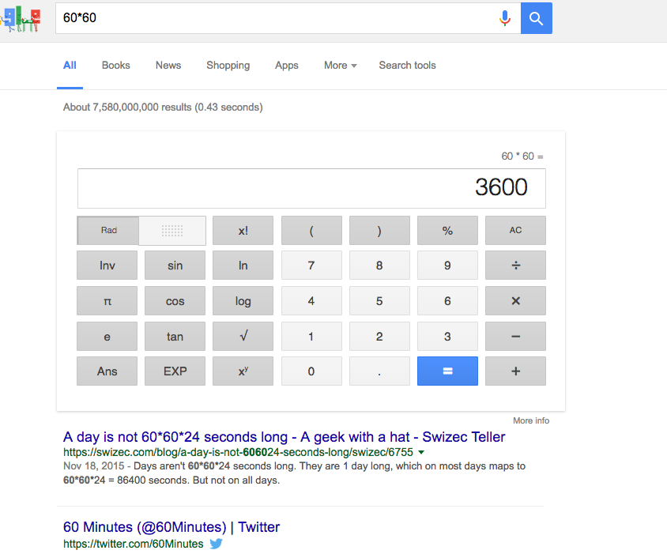
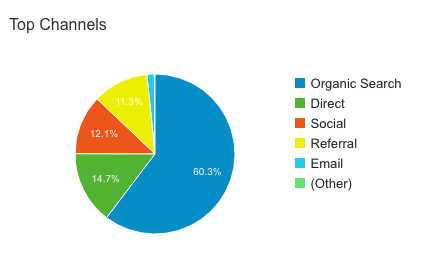

Try it. [Google 60\*60](https://www.google.com/webhp?sourceid=chrome-instant&ion=1&espv=2&ie=UTF-8#q=60*60)

First you get the calculator, then you get my blog where I bitch about programming time stuff. Wat.

Out of all the other websites on the internet, Google has decided that my blog is the single best resource possible to learn about “60\*60”. I… thanks?

The experiment even reproduces! I googled incognito, I had my friends google it, I even googled on my girlfriend’s laptop to make sure it’s not a programmer thing. Swizec.com is first result. It’s the best thing out there.

Better even than [wikipedia’s page titled 60x60](https://en.wikipedia.org/wiki/60x60). Or the _60 Minutes_ account on Twitter.

If you wanna learn about 60\*60, come to my site. I gotchu, fam. Apparently …

### Doing the SEO

I have no idea how Google decided I’m an expert on multiplying 60 by 60, but I can tell you this: I don’t know how SEO works. It sounds like black magic to me.

My search engine optimization strategy goes like this:

1. Publish stuff
2. Avoid fanciness, make site readable (i.e. use Wordpress)
3. ???
4. 60% organic search traffic

Maybe this is a strategy that works. Maybe I got lucky. Maybe it’s because my blog has been alive for 10 years. Maybe it works because I keep posting. Maybe all of that.

¯\\\_(ツ)\_/¯

Organic search drives 60% of my traffic, 14.7% comes from untraceable sources[1](#fn1-2164 "see footnote"), 12% social, 11% referral[2](#fn2-2164 "see footnote"), and a teeeeeeny tiiiny little sliver of email - 1.5%. That’s 490 people in the past 30 days.

Like so many people from email.

So why am I spending so much emotional energy on email? The weekly newsletters, the subscribe forms, the sinking feeling that every unsubscribe brings. And for what? Less than 2% of all traffic.

Silly.

And yet, when an email goes out, there’s an uptick in traffic, an uptick in comments, an uptick in sales. An uptick in just about everything.

So what the hell is all that organic traffic doing?

¯\\\_(ツ)\_/¯

Oh, I guess my advice to you is _if you want SEO, have something for people to find._ Nothing you do will work if there’s nothing for Google to find. SEO is a dead industry. Don’t even sweat about it. Just have good shit for people to find.

* * *

1.
2. I call “direct” untraceable because it could mean a lot of things. I doubt very many people are manually going to swizec.com [↩︎](#fnr1-2164 "return to article")
3.
4. Most likely backlinks from all those automated sites that keep stealing and republishing my content without attribution. I keep getting the pingbacks, and I keep not seeing any attribution on the pages themselves. Oh well. [↩︎](#fnr2-2164 "return to article")
5.