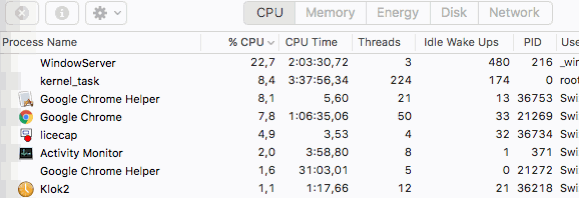
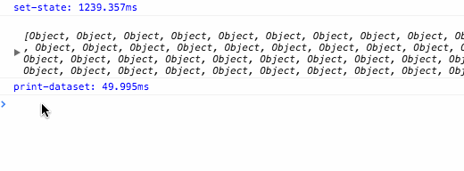
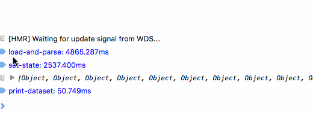
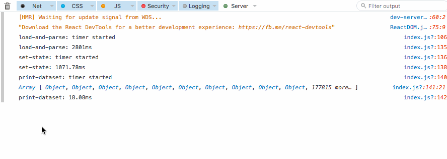
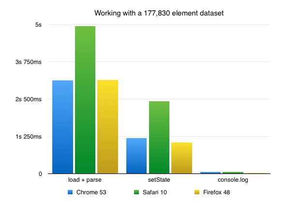

JavaScript is great. You can slice & dice huge datasets on the fly, and play with them, and explore them, and turn them into pictures. All live in the browser.

Not “big data” huge, more like _“Holy shit 5 years ago this would crash my browser”_ huge. Like, you’re playing with a dataset on 177,830 salaries[1](#fn1-30036 "see footnote") in the US software industry, and your computer doesn’t even notice until you do something stupid.

Something like debug your code, reload a bunch of times, and maybe `console.log` the whole dataset to make sure it parsed.

That’s, what…? Like, 10 seconds of high CPU load for one `console.log`? Something like that. The more you do it, the longer it takes.

Here’s what reading that output looks like:

As long as that CPU load is high, you can’t do much. After a few tries, even your reload button stops working and you have to forcefully crash the browser tab to get back to work.

It’s so annoying because everything else is so damn fast! Want to `.map` your dataset? No biggie, 10ms max. Want to `.filter`? 10ms. Want to filter and map and flush React updates to DOM and do all the things? You won’t even notice it does anything.

But debugging your code… eesh. Can’t console.log very well, React dev tools are glacial, and god forbid you try to inspect element if there are thousands of DOM nodes on the page.

Not to mention the initial page setup. Loading and parsing the dataset (CSV) from cache takes about 3 seconds, running the initial `setState` takes about a second. That’s up to 5 seconds between every full page reload and seeing output.

5 seconds might not sound like a lot, but it adds up. I don’t know about you, but I run my code at least once every minute. That’s 5 minutes of waiting every hour, 40 minutes in a work day, and 3 working hours in a week.

_“Don’t console.log your whole dataset then.”_

Thank you, Captain Obvious. `console.log(data[0])` is your best friend in these situations.

And yet, you can do a lot by changing your browser.

Safari makes logs useful right away. It even shows property types. That was a nice surprise.

Firefox makes the output easy to work with, too. But it struggles if you quickly traverse into a deep part of the output.

As far as presentation quality goes: Safari is shiniest, Firefox is practicalest, and Chrome is spartaniest.

Oh, and Firefox wins the overall _“How long do I have to wait before I can test my code?”_ challenge as well[2](#fn2-30036 "see footnote"). You can shave a few milliseconds off the initial `setState({data: foo})` call.

Fascinating. I’m a total nerd ? ?

* * *

1.
2. Playing with the dataset is in progress; pretty pictures in a week or two. [↩︎](#fnr1-30036 "return to article")
3.
4. Tests were run manually in each browser. The graph shows average time for each operation. [↩︎](#fnr2-30036 "return to article")
5.