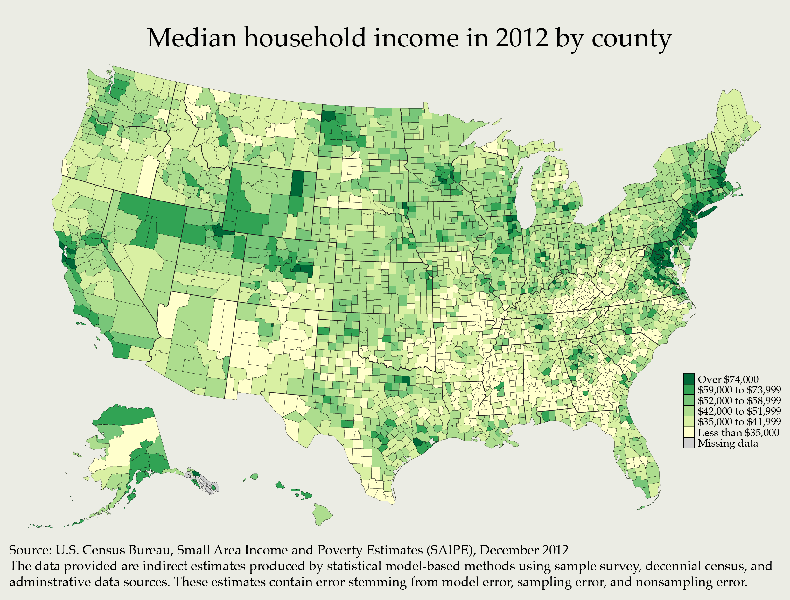
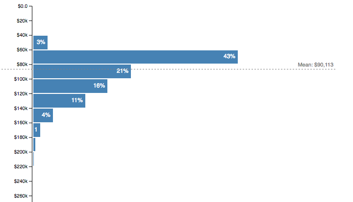

I just spent 2 hours looking for a dataset on county-level median household income in the US. I want to compare it to the software engineer salary dataset I already have.

While that’s brewing, here are some facts I found, complete with sources and in no particular order. Not all facts agree with each other, and I don’t know why. ?

> 25.2% of the United States's population lives in a upper middle class household; with an annual income between $75,000 and $150,000.
>
> — Swizec (@Swizec) [September 29, 2016](https://twitter.com/Swizec/status/781396400680505344)

[\[CareerTrends.com\]](http://cost-of-living.careertrends.com/l/615/The-United-States)

The median household income tells you what is considered “middle class” in a certain area. 67% of median to 200% of median falls into middle class. You can use this as a rough proxy for cost of living in an area.

[\[LifeHacker\]](http://lifehacker.com/how-the-median-income-compares-to-cost-of-living-in-129-1727448351)

“Cost of living” is not a defined thing. Most researchers build a composite index based on tens, sometimes hundreds, of indicators that feel right. Things like cost of groceries, rent, transportation, and stuff like that.

> In this data set, the Composite Index is a measurement of the relative price of goods and services within an area. These prices include things like rent, healthcare, groceries, transportation, and more. Collectively, they are considered the “cost of living.”
>
> All percentages are comparisons to the national average. The national average is represented by “100%,” so a city that has a 132% composite index is a city where goods and services (or the cost of living) are about 32% more than the national average.

[\[Experian Data Quality\]](https://www.edq.com/data-quality-infographics/cost-of-living-in-america/)

In 2005, a household income over $250,000 put you in the top 1.5%. [\[1\]](https://en.wikipedia.org/wiki/Affluence_in_the_United_States) By 2014, that same income put you in the top 3%. [\[2\]](https://en.wikipedia.org/wiki/Household_income_in_the_United_States#Distribution_of_household_income) This implies the top of the pile really is retaining more than it used.

Median household income does not follow a uniform random distribution. This implies network effects play a large role in how much you can earn.

Social class in the US has an interesting definition:

While many people in the US believe in a three-class system, sociologists disagree on their precise definition and acknowledge that class structure (particularly in the the “middle class") does not always match income distribution.[\[3\]](https://en.wikipedia.org/wiki/Household_income_in_the_United_States#Social_class)

Why so much focus on those oh so very evil people at the top? The ones we hate vicariously through episodes of Mr. Robot?

Because the average software engineer makes $90,000/year, according to my dataset.

If you’re an average software engineer in the United States, and you have a salaried job, _you are an upper middle class **household**_. You, personally, as an individual.

?

I don’t know exactly what I’m making yet, but it smells like there’s a good story in here somewhere.
