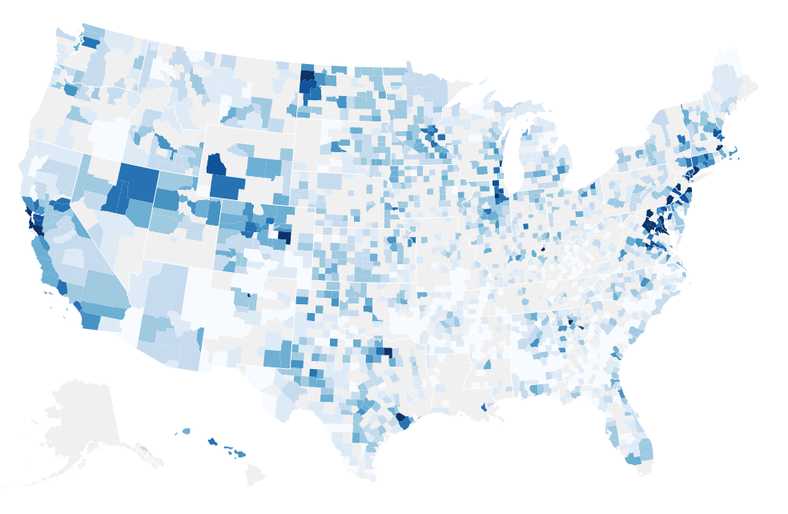
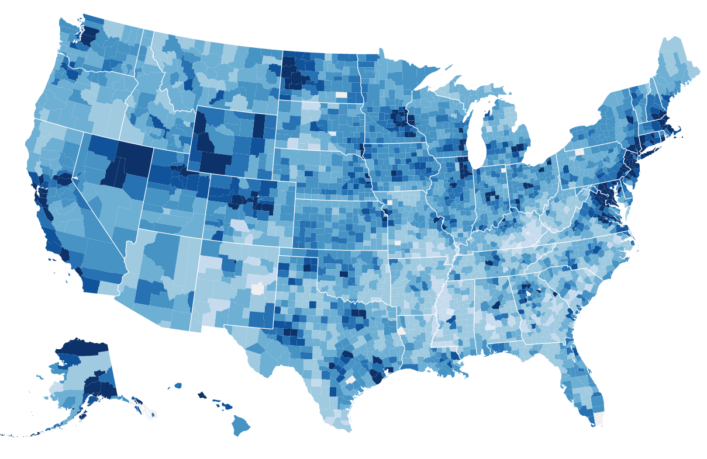

_This is a Livecoding Recap – an almost-weekly post about interesting things discovered while livecoding ?. Always under 500 words and with pictures. You can follow my channel, [here](https://livecoding.tv/swizec). New content almost **every Sunday at 2pm PDT**. There’s live chat, come say hai ?_


I just spent 3 hours normalizing datasets. Then I wrote a script that did it in less than 5 seconds. I am not a smart man.


Did you know there were 32 states with a Washington county in the US? And there are 24 Jackson counties? 16 Wayne counties… 12 Marshalls… ?


County names are only unique per-state, not per-all-of-the-country. Now you know. And now I know, too!


Fixing that problem let me turn this picture from livecoding:





Into this picture:





The latter has less gray and more blue. That’s good. It means there are fewer counties that didn’t match our dataset. Some remain. I don’t know how to fix those.


You’re looking at a choropleth map of median household incomes in the United States that I built with React and D3v4.


Buffalo County in South Dakota is the poorest county in the US with a median household income of $21,658. City of Falls Church County in Virginia is the richest with $125,635. Richest part of the country is about 6x richer than the poorest. ?


These are medians we’re talking about, not maximums. In both cases, 90% of households fall within a few thousand dollars of the median.


More about that later this week when we compare this median household data to that dataset of salaries in the software industry. That should be fun ?


## Here’s how it’s built


We cribbed off of [Mike Bostock’s choropleth example](https://bl.ocks.org/mbostock/4060606) and modified it for React.


After loading our datasets – a TopoJSON of US counties and states (geo info) and a table of median household incomes per county – we start with a `CountyMap` component. It draws the overall map and deals with calculating the quantize threshold scale for colors.


The component is about 50 lines, so I added comments to each method.

```
class CountyMap extends Component {
    // Setup default D3 objects
    // projection - defines our geo projection, how the map looks
    // geoPath - calculates d attribute of  so it looks like a map
    // quantize - threshold scale with 9 buckets
    constructor(props) {
        super(props);

        this.projection = d3.geoAlbersUsa()
                            .scale(1280);
        this.geoPath = d3.geoPath()
                         .projection(this.projection);
        this.quantize = d3.scaleQuantize()
                          .range(d3.range(9));

        this.updateD3(props);
    }

    // update D3 objects when props update
    componentWillReceiveProps(newProps) {
        this.updateD3(newProps);
    }

    // Re-center the geo projection
    // Update domain of quantize scale
    updateD3(props) {
        this.projection.translate([props.width / 2, props.height / 2]);

        if (props.medianIncomes) {
            this.quantize.domain([10000, 75000]);
        }
    }

    // If no data, do nothing (we might mount before data loads into props)
    render() {
        if (!this.props.usTopoJson) {
            return null;
        }else{
            // Translate topojson data into geojson data for drawing
            // Prepare a mesh for states and a list of features for counties
            const us = this.props.usTopoJson,
                  statesMesh = topojson.mesh(us, us.objects.states, (a, b) => a !== b),
                  counties = topojson.feature(us, us.objects.counties).features;

            // Loop through counties and draw  components
            // Add a single  for state borders
            return (
                
                    {counties.map((feature) => )}

                     
                
            );
        }
    }
}
```


I hope that makes sense. It follows [my standard React+D3js approach](http://swizec.com/reactd3js/).


For the counties, we can use a stateless functional component that gets all relevant data through props. It looks like this:

```
// Combine array of colors and quantize scale to pick fill colo
// Return a  element
const County = ({ data, geoPath, feature, quantize }) => {
    let color = BlankColor;

    if (data) {
        color = ChoroplethColors[quantize(data.medianIncome)];
    }

    return ()
};
```


With some setup and a bit of data loading, those two components create a choropleth map of median household incomes in the United States. [Watch the video](https://www.livecoding.tv/swizec/videos/YYKW3-comparing-177k-software-salaries) to see how it all fits together.


P.S.: the edited and improved versions of these videos are becoming a video course. Readers of the engineer package of [React+d3js ES6](http://swizec.com/reactd3js/) get the video course for free when it’s ready.