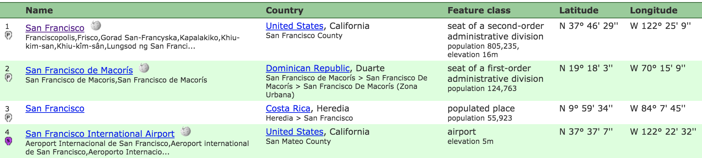

Ever had to figure out which county a town falls into? It’s harder than it looks.

San Francisco falls in San Francisco County. That’s easy.

Los Angeles is in Los Angeles County. Done.

New York spans five counties because a borough is the same as a county. And Boston falls in Suffolk County. Menlo Park is in San Mateo and so is Palo Alto. ?

Borough, county, parish, census area, municipality and sometimes city (but sometimes not) all mean the same – a county. Oh, and [names are not globally unique](http://swizec.com/blog/livecoding-24-choropleth-react-js/swizec/7078), only state-unique. Marvelous.

So, how do you tie town-based datasets to county-based datasets? Say you want to compare tech salaries to median household income. I choose this example because that’s what I’m doing. ?

* * *

The tech salary is a CSV that looks like this:

```
supreme tech solutions llc,software analyst,"75,000","walnut creek, ca",10/25/2012,10/25/2012,certified
supreme tech solutions llc,software analyst,"76,690","brisbane, ca",10/16/2012,10/16/2012,certified
west corporation,software analyst,"85,000","omaha, ne",10/12/2012,10/24/2012,certified
wincere inc,software analyst,"86,133","anaheim, ca",11/01/2012,12/31/2012,certified
```

Company, job title, base salary, location (town + state), start date, visa succeeded. Supreme Tech Solutions, LLC employed a software analyst for $75,000 in Walnut Creek, CA on October 25th, 2012, and his or her H1B visa went through.

The census dataset for median household incomes looks like this:

```
Autauga County,AL,54.366,50.916,57.816
Baldwin County,AL,49.626,46.516,52.736
Barbour County,AL,34.971,32.475,37.467
```

County, state, median household income, 90% confidence interval lower bound, upper bound. In Autauga County, Alaska, the median household income is $54,366 and 90% of households fall between $50,916 and $57,816.

Notice the problem? One has town names, the other has county names. I don’t think census data for specific towns even exists.

[Geonames.org](geonames.org) to the rescue! They’ve built up a sturdy database of geographical names. Everything from latitude and longitude to interesting meta data like pseudonyms and even landmark names.

There’s an API with libraries for many languages, but it doesn’t return county names. I wish it did, because scraping their HTML search results felt dirty. Those do return a county name.



Scraping geonames’ search using Python and [pyquery](https://pythonhosted.org/pyquery/) looks like this:

```
def countynames():
    with open("h1bs-2012-2016-cleaned.csv", "rb") as csvfile:
        reader = csv.reader(csvfile)
        reader.next()
        with open("h1bs-2012-2016-final.csv", "wb") as csvoutfile:
            writer = csv.writer(csvoutfile)

            writer.writerow(['employer',
                             'job title',
                             'base salary',
                             'city',
                             'county',
                             'state',
                             'submit date',
                             'start date',
                             'case status'])

            counties = {}

            for row in reader:
                if len(row) > 0:
                    location = row[3]

                    if location not in counties:
                        url = "http://geonames.net/search.html?q=%s&username=YOUR_USERNAME" % location.replace(' ', '+').replace(',', '')

                        d = pq(url)
                        county = d('table.restable tr:eq(2) td:eq(2) small').text()
                        counties[location] = county

                    _location = location.split(',')

                    outrow = [row[0],
                                    row[1],
                                     row[2],
                                     _location[0].strip(),
                                     counties[location],
                                     _location[1],
                                     row[4],
                                     row[5],
                                     row[6]]
                    print outrow
                    writer.writerow(outrow)
```

Ho boy, so much code! Let me walk you through it.

We start by opening the input file - `with open(file) as csvfile:`. The rest of our code works with this file. When we’re done, Python will close the file pointer and do any cleanup.

Then we create a `csvreader` and skip the header with `reader.next()`. We follow by opening the output file, creating a `csvwriter`, and writing a header row with `writerow`.

We’re going to use a `counties` dictionary to avoid pinging Geonames for things we already know. We loop through rows in our input file with `for row in reader`. Each row is now an array of strings called `row`.

`location` is in `row[3]`. If we don’t have it yet, we make a request to `geonames.net/search.html` with a `q` search term and a `username`. This lets us use the donate-only service, which is faster and more reliable. We’re also making a lot of requests – not paying would be a dick move.

`pq(url)` gives us a jQuery-like interface to the HTML response. We access the `<small>` in 2nd column of 2nd row of table with class restable with `d('table.restable tr:eq(2) td:eq(2) small')` then get its `text()` value. That’s the county name.

I had to inspect source on the geonames website to find that lookup. This code is fragile, and it will break if geonames changes anything. But the search results page looks like it hasn’t been redesigned in about 10 years, so I think we’re good.

With the county name fetched, we cache the result in `counties` and write a new row into the output file with `writer.writerow()`.

Ain’t Python grand?