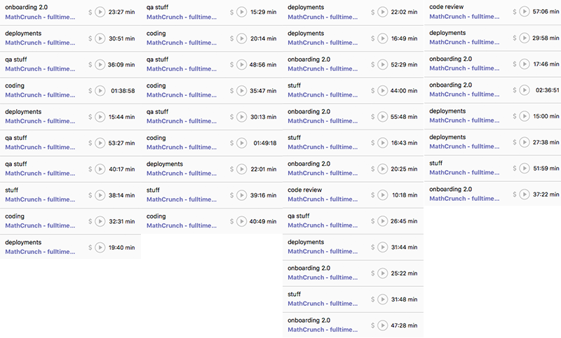

Because coding is play and engineering is work.

What’s less obvious is that play gets more work done than work. Free from obligation, you can explore more options, discover new possibilities, and stay in flow for longer. Let me show you. Here’s a typical week of engineering according to my time tracker. I try to click the button every time I context switch for more than 5 minutes. Call it research into office culture, if you will.

Each column is a day

This data is by no means perfect. Context switches happen within categories; I forget to click the button; and I’ve given up capturing the small distractions that happen. I also spend too much time in faux meetings on Slack. Those don’t show up here. But you can see a trend: most work happens in half-hour and aaaalmost-an-hour intervals. Then something comes up, and I have to switch. QA bugging out, absolutely horribly urgent code reviews that must happen right this instance, a deployment here and there, or a short meeting or two. If I’m very lucky, I get to work on something for almost 2 hours. Sometimes, if the stars align just so, almost 3. That happened _three_ times this week. Three times all week that I focused for more than an hour. ?

* * *

Now compare that mess to a night of coding. I started at 12:30am after a short nap. Before me, a [choropleth map of household incomes](https://swizec.com/blog/livecoding-24-choropleth-react-js/swizec/7078).

By 1:38am, it was a choropleth map of income disparity between the tech industry individuals and the median household. And a histogram.

> Declarative dataviz. [pic.twitter.com/v94lcaV5Df](https://t.co/v94lcaV5Df)
>
> — Swizec (@Swizec) [October 12, 2016](https://twitter.com/Swizec/status/786123886261743616)

At 2:35am, the map could focus on specific US states, and the histogram had a line that showed median household income in that state against a backdrop of tech salary distribution in said state.

> Most software developers in CA make more than the median household.  
>   
> Dataviz almost done ? [pic.twitter.com/tI6Dzhbuqt](https://t.co/tI6Dzhbuqt)
>
> — Swizec (@Swizec) [October 12, 2016](https://twitter.com/Swizec/status/786138188502884353)

By 3:46AM, the visualization had filtering controls, a dynamically updating title and description, and was ready to go.

> Many people have been asking me for this for almost 2 years. Now you can see where engineers are the richest compared to cost of living. [pic.twitter.com/LYHVOMZUDq](https://t.co/LYHVOMZUDq)
>
> — Swizec (@Swizec) [October 12, 2016](https://twitter.com/Swizec/status/786156052492328961)

At 4:47AM, it launched, complete with Twitter cards, Facebook open graph stuff, embedded tweets for retweeting, and an email form so people can sign up for more.

> Average salaries in 2016:  
>   
> Programmer: $65,796  
> Developer: $73,293  
> Engineer: $90,049  
>   
> Be an engineer.  
>   
> ➡️ <https://t.co/ziQ74fGFzh>
>
> — Swizec (@Swizec) [October 12, 2016](https://twitter.com/Swizec/status/786171463732563968)

It flopped on the open internets with just 1500 uniques, but look at that timeline. 4 solid hours of coding, and a _whole thing_ was born. In the context of engineering, something like this would take a week, involve 2 engineers, 1 project manager, 1 designer, 3 meetings, and 2 QA people. The end result would be 10% better. Sigh. PS: the viz flopped because I tried to give it a spin that doesn’t gel with the audience that received it, and I have to improve initial load time somehow. Lessons learned.
