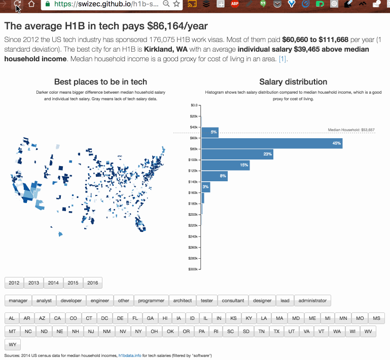

Big datasets are fun. The bigger, the better, _especially_ when you let people explore them live in their browser. But there’s a catch: big datasets are slow to load. Even with modern content delivery networks (CDNs), gzip compression, and high internet speeds, it can take a few seconds to load and parse a dataset. In my [H1B salaries visualization](https://swizec.github.io/h1b-software-salaries/), downloading data takes 1.7 seconds, parsing takes another 2 seconds, and rendering takes maybe a full second because some things are done stupidly. That’s a full 4 to 5 seconds before a user sees anything more than a _"Loading, please wait”_ message. Users are going to leave before they play with your dataset. Yes, even though it’s _so cool_ and the data is amazing and awesome, users don’t give a shit. It’s sad. ☹️ But there’s a trick to keep them around → show them an image first! Check this out:

See how you barely notice the page refresh? That’s on purpose. The main `App.render()` method is wrapped in a conditional statement that checks if the data is available. If it is, then we render the interactive visualization; if it isn’t, then we render a screenshot and default descriptions.

    // src/App.js

    render() {
        if (this.state.techSalaries.length < 1) {
            return (
                
            );
        }
        
        // render the main dataviz
    }

The `Preloader` component can be a functional stateless component, like this:

    // src/App.js

    import StaticViz from './preloading.png';

    const Preloader = () => (
        

            
    The average H1B in tech pays $86,164/year

            

    Since 2012 the US tech industry has sponsored 176,075 H1B work visas. Most of them paid $60,660 to $111,668 per year (1 standard deviation). The best city for an H1B is Kirkland, WA with an average individual salary $39,465 above local household median. Median household salary is a good proxy for cost of living in an area.

            
            
    Loading data ...

        

    );

The `Preloader` component mimics the structure of your normal dataviz, but it’s hardcoded. The information is real, and it’s what people are looking for, but it doesn’t need the dataset to render. The easiest way to get this is to first build your real dataviz, then screenshot the picture, and then copy-paste the descriptions if they’re dynamic. Without dynamic descriptions, half your job is done already. That’s about it, really:

1.  render an image
2.  wait for data to load
3.  replace image with dynamic dataviz

It sounds dumb, but increases user satisfaction 341324%. If it works …

