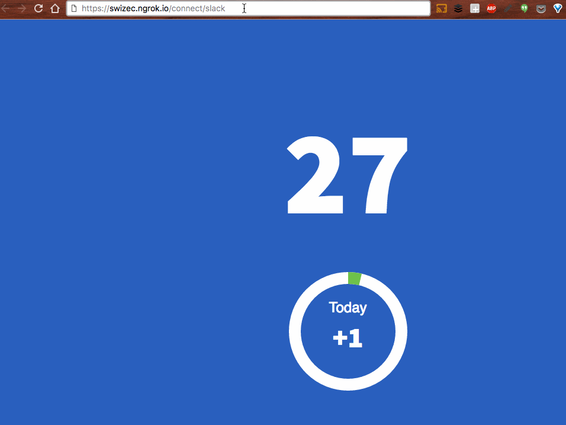

Why? Because it’s cool.


And in some cases, you can make a bot that answers the door. Like I [started here](https://swizec.com/blog/livecoding-22-a-door-answering-slackbot/swizec/7038) and [continued here](https://swizec.com/blog/livecoding-23-slackbots-oauth/swizec/7065). This isn’t a series. Don’t worry :)


You should start by setting up a [Twilio account](https://www.twilio.com/) and a [Slack app](https://api.slack.com/slack-apps). We’re going to build a node.js server running [Express](http://expressjs.com/) that:


1. Takes a phone call
2. Records what the caller says
3. Puts the caller on hold
4. Posts a message with buttons on Slack
5. Tells caller which button was pressed
6. Hangs up


Let’s assume you’ve already set up an Express project. It’s easy to do from scratch, and if you already have an existing one that you’re adding Slack and Twilio to, then you don’t need this step.


## Slack OAuth


The first thing we have to take care of is Slack’s OAuth dance. We’re going to use the `grant-express` plugin to add OAuth to our server, then do the dance to get a Slack token.


Run:


```
$ npm install --save grant-express express-session
```


This installs an OAuth plugin and a session middleware for Express. The first is for OAuth dancing, and the second is for storing information between API calls temporarily.


To enable the dance, add this to your `app.js` file:


```
// /app.js
let session = require('express-session'),
    Grant = require('grant-express');
let grant = new Grant({
    server: {
        protocol: 'https',
        host: 'swizec.ngrok.io', // use your domain name
        callback: '/callback',
        transport: 'session',
        state: true
    },
    slack: {
        key: YOUR_SLACK_KEY,
        secret: YOUR_SLACK_SECRET,
        scope: ['chat:write:bot', 'chat:write:user', 'channels:read', 'commands', 'incoming-webhook'],
        callback: '/handle_slack_callback'
    }
});
app.use(session({secret: 'grant',
                 resave: false,
                 saveUninitialized: true}));
app.use(grant);
```


`grant-express` comes half configured for Slack out of the box. You just have to tell it which scopes you’re going to use, what your access keys and secrets are (you find them in your config on Slack), and your server’s domain. For local development, I like to use [ngrok](https://ngrok.com/), hence `swizec.ngrok.io`.


Once you have that configured, you tell Express to use `grant` and `session` with two `app.use` calls.


To complete the dance, you need a `/handle_slack_callback` route, which goes in your `routes/index.js` file, if you’re as careless as I am. In a bigger app, you’d want to be more organized.


```
// /routes/index.js
router.get('/handle_slack_callback', (req, res) => {
    console.log(req.session.grant.response);
    
    // this is a good opportunity to save the token in a DB of some sort
    res.end(JSON.stringify(req.session.grant.response, null, 2));
});
```


Now you can go to `https://swizec.ngrok.io/connect/slack` and do the dance.





Save that `access_token`. It lets you post to Slack as an app.


Now that you’ve seen mine, you can make a thing that keeps posting to my test Slack channel. That would be mean of you but also kinda cool in that _“Whoa, the internet is humans!”_ kind of way.


## Twilio → Slack → Twilio


Now comes the tricky part: making Slack and Twilio talk to each other. Here’s a diagram that explains the flow of events.


The key trick to reading this diagrams: the vertical line is time. Starts on top, flows down.


Step-by-step in code, that gif looks like this:


### Phone call from Twilio


```
// routes/index.js
router.post('/call', function (req, res, next) {
    const caller = req.body.Caller;
    const callSid = req.body.CallSid;
    const twilio = require('twilio');
    let twiml = new twilio.TwimlResponse();
    twiml.say('Hello! State your name, then press any key.', {voice: 'alice'});
    twiml.record({
        action: `/call/recording/${callSid}`,
        maxLength: 60
    });
    res.type('text/xml');
    res.send(twiml.toString());
});
```


TwiML is Twilio’s XML format that you can use to tell their servers what to do with a phone call. In this case we’re saying a greeting and asking Twilio to record what a person says.


### Get recording + send Slack


```
// routes/index.js
router.post('/call/recording/:callSid', (req, res, next) => {
    const callSid = req.params.callSid;
    const twiml = new twilio.TwimlResponse();
    const recordingUrl = req.body.RecordingUrl;
    
    const twilio = require('twilio'),
          WebClient = require('@slack/client').WebClient;
        const webSlack = new WebClient(TOKEN_FROM_BEFORE);
        // Sets up Slack message
    let data = {
        attachments: [{
            fallback: 'Somebody is at the door',
            title: 'Somebody is at the door',
            title_link: recordingUrl,
            text: 'Click link to hear the recording',
            callback_id: `door_open:${callSid}`,
            actions: [
                {
                    name: 'open_door',
                    text: 'Let them in',
                    type: 'button',
                    value: 'open_door'
                },
                {
                    name: 'deny_access',
                    text: 'No.',
                    type: 'button',
                    value: 'deny_access'
                }
            ]
        }]
    };
    /* Post on Slack, pause Twilio phone call */
    webSlack.chat.postMessage('#bot-testing', '', data, () => {
        twiml.say('Thank you. Please hold.', {voice: 'alice'});
        twiml.pause({length: 240});
        twiml.say('Sorry, nobody pressed the button. Try calling a real human.', {voice: 'alice'});
        res.type('text/xml');
        res.send(twiml.toString());
    });
});
```


Most of this code is setting up the Slack message. We send it to Slack and in the callback, when we know it’s sent, we use TwiML to ask Twilio to pause the call for 240 seconds.


If the time is up, we say something. In most cases, the pause will be interrupted by a Slack callback.


The message we sent looks like this:


### Slack button pressed


```
// router/index.js
router.post('/slack/response', (req, res, next) => {
    const payload = JSON.parse(req.body.payload);
    const callSid = payload.callback_id.split(':')[1];
    const action = payload.actions[0];
    const twilio = require('twilio');
    const client = twilio(settings.twilio.accountSid, settings.twilio.authToken); // you get these in your Twilio dashboard
    let continueAt = '',
        lettingIn = false;
    if (action.value === 'open_door') {
        continueAt = 'call/open_the_door'
        lettingIn = true;
    }else{
        continueAt = 'call/dont_open_door';
        lettingIn = false;
    }
    client.calls(callSid).update({
        url: `https://swizec.ngrok.io/${continueAt}`,
        method: 'POST'
    }, (err, call) => {
        res.send({
            text: lettingIn ? "Letting them in" : "Telling them to go away"
        });
    });
});
```


We find out which button was pressed in `payload.actions`. They’re the same strings as we set up earlier – `open_door` is a `Yes`, anything else is a `No`.


`callSid` tells us which phone call we’re responding to. That’s why we put it in `callback_id` earlier :)


With `client.calls(callSid)`, we ask Twilio to let us continue the paused phone call. For some reason, we can’t directly tell the API what to say, but instead we have to set up more routes in our server.


In the callback, when we know Twilio knows what we want, we send a response to Slack, which updates the message that a user clicked on.


### Finish the call


```
// routes/index.js
const twilio = require('twilio');
router.post('/call/open_the_door', (req, res, next) => {
    const twiml = new twilio.TwimlResponse();
    twiml.say('Greetings! Come on up.', {voice: 'alice'});
    twiml.play({digits: 9});
    res.type('text/xml');
    res.send(twiml.toString());
});
router.post('/call/dont_open_door', (req, res, next) => {
    const twiml = new twilio.TwimlResponse();
    twiml.say('Sorry, nobody pressed the button. Try calling a real human.', {voice: 'alice'});
    res.type('text/xml');
    res.send(twiml.toString());
});
```


You can guess what this does, can’t you? If the `Yes` button was pressed, we tell the caller to come in and send a dial tone. If the `No` button was pressed, we ask the caller to try contacting a human.


In theory, that dial tone asks the building buzzer to open the door. But I haven’t tried this in the wild yet. ?


Happy slacktwillying!