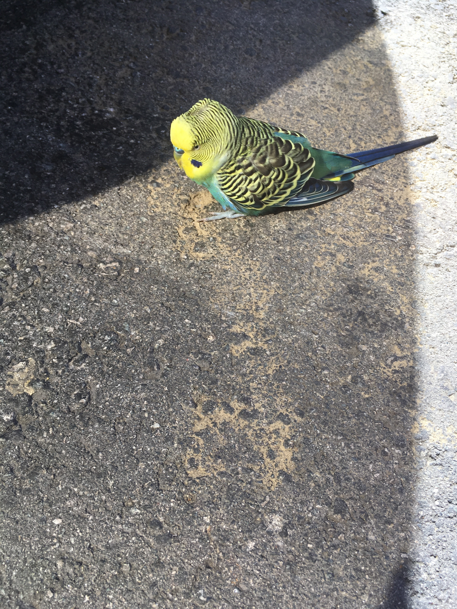
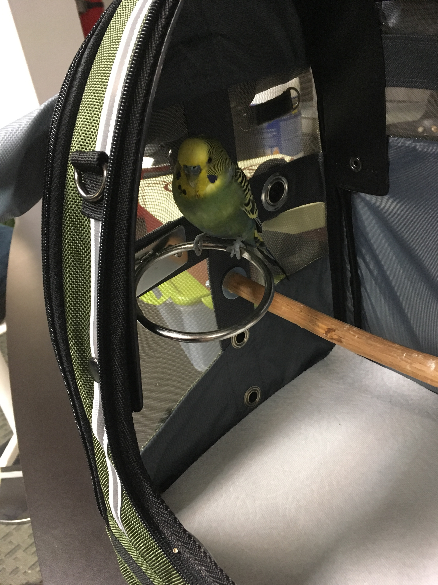

Today, we found a pet bird in the street. Well, my coworker found it, but he didn’t know what to do, so he left it there.

This poor bird was so hungry that it was chewing on a cigarette butt. It didn’t recognize peanut butter, which is my bird’s favorite, and even though it’s definitely a pet, Street Bird did not like to be picked up. It ran away every time I tried. Street Bird got hella upset when I took my shirt off and trapped it. Chirpchirpchirp. Like a pissed off tweety bird from a cartoon. Wish I’d recorded it.

The rescue was a success. Street Bird was safe from cars and predators, and for almost 5 minutes, he was too tired to protest his fate. I decided Street Bird is a boy. “Bird” is a noun with male grammatical gender in my native language. Some Wikipediaing and interneting later, I found out that since Street Bird’s nostrils are blue, that means he’s a boy. Grammar wins again! It’s a good thing I have a bird at home. I had everything I needed, complete with a spare carrier, spare food and water bowls, and spare bird food. That little fucker spent 20 minutes gorging himself on seeds when I put him away. He still wouldn’t let me touch him. He chirpchirped angrily and tried to flutter away if I tried. But that’s okay – fluttering is a huge improvement over feebly running away. Street Bird is starting to feel better. \[video width="720" height="1280" mp4="http&#x3A;//swizec.com/blog/wp-content/uploads/2016/10/Bird-in-carrier.mp4"]\[/video] For now, Street Bird is our new office pet. We’ll keep him fed and watered, and I’ll bring some toys so he’s not bored. I went to check up on him after I’d gone to the gym, and Street Bird is doing much better. He looks relaxed, he can reach every point in the carrier (he could only do the floor when I first put him in), and aaaaalmost let me touch him. Then he panicked and started fluttering.

He doesn’t try to escape if you leave the carrier open and walk away, so maybe he’s not lost. Maybe he was left out there on purpose? ? That would be sad. I hope this is not my new bird. _Please_ tell me someone in downtown SF is desperately looking for a lost parakeet budgie thing. Where could I post to find them? PS: My girlfriend named him Dewey.
