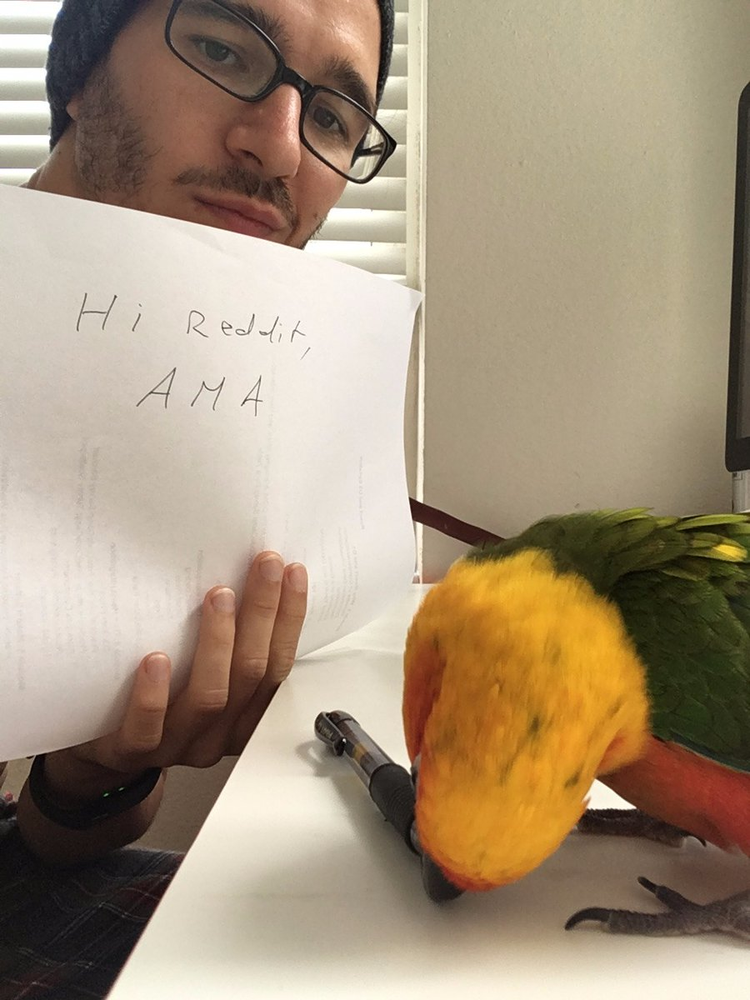
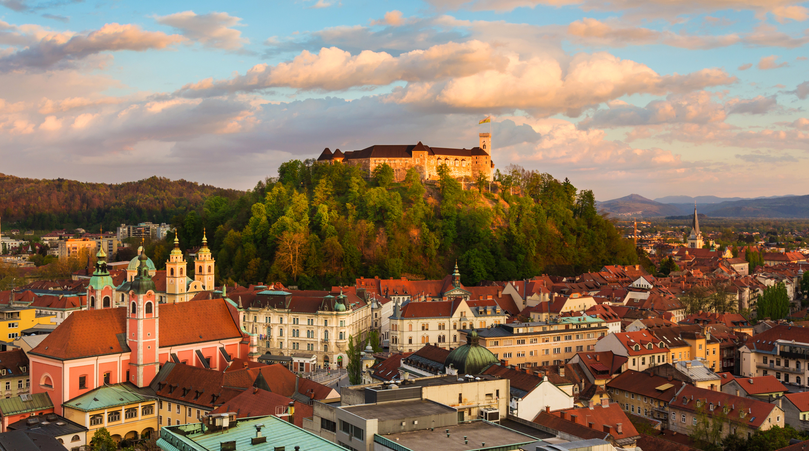

Yesterday, I became old. I'm 29 now, which means I have entered my 30th year. Kinda crazy to think about. Yes, 29 _does_ mean I'm in my 30th year. My girlfriend didn't believe me, but think about it: Are you in your 0th or your 1st year when you are born? Exactly. Birthdays denote the boundaries between years. Next year, I will have completed my 30th year and I will be 30. This year I am _in_ my 30th year, and I am 29. Maths.  I learned two things yesterday:

1.  Taking an appropriate picture is difficult when you're not wearing a shirt.
2.  AMAs, even those with just 8 upvotes, are more work than you think.

Questions boiled down into two categories: “What makes _you_ so special that you got the genius visa?” and “Why did you leave Slovenia? Is SF really better?”

## What makes _you_ so special?

Nothing. I am not unique. _You_, too, can get the "alien with extraordinary ability in X" visa! It's easier than it looks. Unlike the normal [H1B work visa](wikipedia), the [O-1 visa](wikipedia) doesn't involve a lottery. If you send an application, it will be considered. So that's easier. And unlike the H1B, you don't have to graduate college or have a crazy amount of full-time employment experience either. You can get it in one of two ways:

-   have 1 really big thing, like a Nobel prize or being Miss World
-   have very many small things like →

Be a visible member of the community (talks, blogs, opensource, \[self-]published tech books, all the fun stuff); have some friends who can write fancy-sounding recommendation letters (remember, you're visible in the community, you have them); perhaps do some consulting for other companies (freelancing/consulting is increasingly the norm for ambitious young people); and judge the works of others in a professional capacity (you're prominent in the community, selecting talks for conferences counts). Could I have achieved all of that in a big country? Probably not. Did being from a small country with a small tech community help? Infinitely. Longer answers on Reddit [here](https://www.reddit.com/r/IAmA/comments/59c6el/im_29_been_coding_for_20_years_last_year_the_us/d97984z/), [here](https://www.reddit.com/r/IAmA/comments/59c6el/im_29_been_coding_for_20_years_last_year_the_us/d97dggd/), and [here](https://www.reddit.com/r/IAmA/comments/59c6el/im_29_been_coding_for_20_years_last_year_the_us/d97dwy9/) and on my blog [here](https://swizec.com/blog/how-i-got-a-visa-normally-reserved-for-nobel-laureates/swizec/6767). Oh, and the final ingredient: A lot of _"Fuck it, let's try"_ when applying.

## Why did you leave Slovenia? Is SF really better?

Slovenia (my hometown, Ljubljana):  San Francisco:  In terms of quality of life, San Francisco is a shithole compared to Slovenia. I left because of the economy and the politics. Slovenia is tiny. Like super tiny. 2 million people kind of tiny. And 25 years after becoming a country, it's still a country in transition because these things take time. This brings with it a lot of problems. Our economy is small and extremely export-based. So much so that most of my friends either work for companies who sell to foreign companies, or they do remote work for foreign companies. I figured I might as well go to the foreign lands directly.

> Slovenia has seasons, which is nice. It's also a lot more easy going if you want it to. And smaller.

> If I had to use one word to describe SF versus Slovenia, it's "more". There's just more everything. More people, more restaurants to try, more bars to go to, more tech to see, more opportunity to work at interesting companies, more potential to maybe change the world if you get lucky.

Longer answers on Reddit [here](https://www.reddit.com/r/IAmA/comments/59c6el/im_29_been_coding_for_20_years_last_year_the_us/d97nd5t/), [here](https://www.reddit.com/r/IAmA/comments/59c6el/im_29_been_coding_for_20_years_last_year_the_us/d97abou/), [here](https://www.reddit.com/r/IAmA/comments/59c6el/im_29_been_coding_for_20_years_last_year_the_us/d97dis2/), and [here](https://www.reddit.com/r/programming/comments/59c7gv/im_29_been_coding_for_20_years_last_year_the_us/d98cic1/). Also on my blog [here](https://swizec.com/blog/does-it-make-sense-move-san-francisco/swizec/6805), and [here](https://swizec.com/blog/its-good-to-be-back-but-i-still-dont-know-where-i-like-it-more/swizec/6610) Oh, and there was a great question about self-promotion and sleaziness. But that deserves its own post :)
