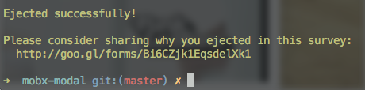

 `create-react-app` is the best thing that's happened to the React ecosystem since React 14 gave us functional components. No more messing around with random boilerplates or manual headaches around setting up your project from scratch. Instead, you run `create-react-app MyThing`, and it sets everything up. If you like MobX, there's a crucial piece missing: decorators. You don't have to use decorators with MobX, but that's like saying you don't _have to_ use JSX with React. You don't "have to”; you "want to". Because that's what the library was designed for. MobX is a state management competitor to Redux, by the way. I like it because there's almost no boilerplate. We've been using at The Day Job™ and it's been amaze so far. A React component that reacts to MobX data store changes would use the `@observer` decorator. Like this:

    import React, { Component } from 'react';
    import { observer } from 'mobx-react';
    @observer
    class Hello extends Component {
        render() {
            return 
    Hello {this.props.store.name}

        }
    }

You can think of decorators as function wrappers. A sort of functional composition, if you will. The observer decorator automatically runs a component’s `render` method when MobX detects a change in a store value that `render` references. Yes, MobX circumvents React's own prop and state change detection. I'm not sure yet how I feel about that, but so far, so good. Can't complain. It's those decorators that make working with MobX powerful and concise. But `create-react-app` doesn't enable them because of some interesting history. They used to be in Babel 5, then Babel 6 removed them because the official spec got pushed back. There's a Babel plugin you can use, but `create-react-app` maintainers have decided not to include it.

## How to get decorators in create-react-app

Ok, so here's what you do when setting up a new React app: **1)** Run `create-react-app`. This creates a new app with the official configuration. **2)** Run `npm run eject`. This moves files around and makes your app's configuration accessible. **3)** Run `npm install --saveDev babel-plugin-transform-decorators-legacy`. This installs the Babel plugin for decorators. It's called `legacy` even though it's a feature from the far future. **4)** Open `package.json`, find the `"babel"` section (line 78 for me), and add 4 lines so it looks like this:

    "babel": {
    "plugins": [
    "transform-decorators-legacy"
    ],
    "presets": [
    "react-app"
    ]
    },

**5)** Run `npm install --save mobx mobx-react`. This installs MobX. You're ready to go. Happy hacking! ?
