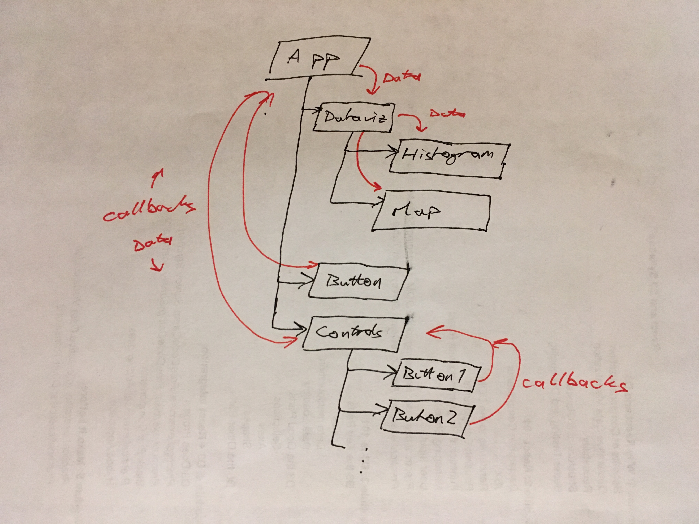

_This is a Livecoding Recap – an almost-weekly post about interesting things discovered while livecoding ?. Always under 500 words and with pictures. You can follow my channel, [here](https://livecoding.tv/swizec). New content almost **every Sunday at 2pm PDT**. There’s live chat, come say hai ?_


Well, this is embarrassing… there's supposed to be an embedded video right here but… I didn't make one.


After an hour of coding and talking and streaming and explaining all the things I was doing and struggling with OBS eating 300% CPU, leaving one core to almost keep up with Emacs and Chrome and Npm and JavaScript, someone said, _"Errr… chatting with you is great but… uhm… no video today?"_


?


No wonder the view count wasn't rising and everyone was bouncing! I had done 10 seconds of streaming, then I went blank ?


But I think I came up with a generalized, albeit not fleshed out, approach to taking a vanilla React project and adding MobX or Redux for state management. You should think of the code samples in this article as pseudocode.


Let's say you've been a good programmer, and you’ve followed a faux flux approach even without a state handling library. React is good at encouraging that practice. If you didn't, you're going to have problems refactoring. If you followed it loosely like I did, you're going to have problems, but not quite as many.


You have a main component that is _the_ source of truth. Child components have a bit of their own state, and they use callback chains to propagate changes back up the tree.





In theory, following the unidirectional dataflow paradigm: data/state flows down the tree, changes flow up the tree.


This is superb for example projects and small hierarchies, but it gets real messy real fast. You lose a lot of flexibility, and passing all those callbacks around gets old fast.


Oh, you want to make a global state change from a button deep down in this 10-step hierarchy? Better make all those components aware of what the tiny button is doing! Don't even think about moving it somewhere else.


That's where Redux or MobX step in.


**First**, you look at your App component's state. Let's say it has 5 \\important parts:


```
class App extends Component {
    state = {
        rawData: [],
        filteredData: [],
        filteringBy: null,
        filter: () => true
        someRandomBool: false
    };
}
```


You can deduce your entire component tree from the value of those 5 properties. If that's not true, then your refactor will require more steps, and most of them will hurt :)


Your **next step** is to create a Redux or MobX store. I'm going to show you MobX because I've been enjoying it a lot lately.


Looking at that `state`, you can guess that `rawData`, `filteringBy`, `filter`, and `someRandomBool` are the state properties. `filteredData` can be computed. It smells like `filter` might be computable as well, but it's on the fence.


In a MobX store, that looks like this:


```
class Store {
    @observable rawData = [];
    @observable filteringBy = null;
    @observable filter = () => true;
    @observalbe someRandomBool = false;
 
    @computed filteredData() {
        return this.rawData.filter(this.filter);
    }
}
```


`@observable` is a decorator that makes a variable observable. That's MobX lingo for _"I want stuff to happen when this changes"_. `@computed` is a decorator that makes the return value of a method observable _and_ adds memoization.


So no matter how often you hit that function, it only executes when its result might change. Otherwise, it's as fast as a static value.


That's why we used to put computable stuff in `this.state`. To make things faster. I like this new approach because it tells anyone who cares what's a base state of the system and what's deducible.


**After that**, you go back to your `App`, replace `state` with a `store`, and make App an observer.


```
@observer
class App extends Component {
    store = new Store()
 
    render() {
        // change all this.state to this.store
    }
}
```


And you're done. Mostly.


From this point onward, you should use `this.store` instead of `this.state`, and you can ignore `this.setState` in favor of good old `this.store.someRandomBool = true`. MobX's engine will trigger a re-render on any component that is an `@observer` and touches that value.


Neat.


Tomorrow, we'll talk about refactoring _that_ into actions so your business logic becomes an easy-to-understand state machine.