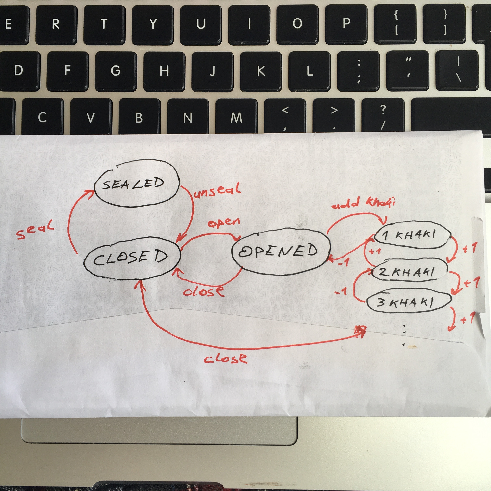
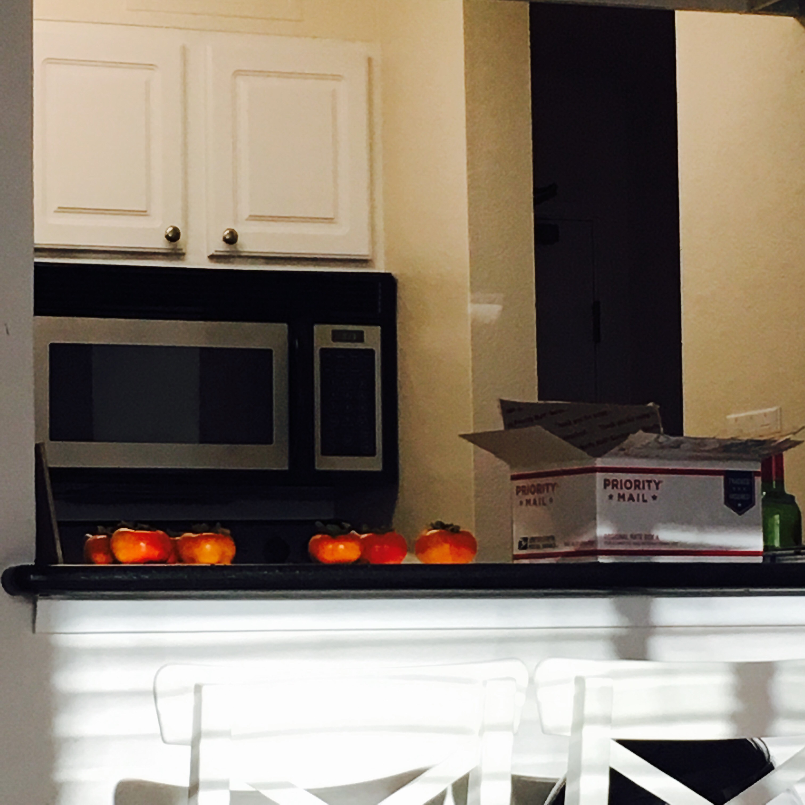

This article is a spiritual successor to [Adding MobX to a vanilla React project](https://swizec.com/blog/livecoding-25-adding-mobx-vanilla-react-project/swizec/7170), inspired by many of [@mwestrase's articles](https://medium.com/@mweststrate), and comes from a few weeks of refactoring a big Backbone app into a React+MobX app. It might not be _the_ way to structure a MobX app, but it's _a_ way, and it's been working well for me so far.





Design goals for this architecture are:


- minimize boilerplate
- your app is a state machine
- flexibility to move elements


We're going to minimize boilerplate by relying on React contexts and MobX's wonderful `inject` function. The combination makes your data stores available everywhere in the app without having to do any wiring and passing by props. Component needs to access the state machine? Inject the store.


Your designer can reshuffle the page as much as he or she wants, and all you have to do is change where components go. No rewiring of the business logic unless the business logic itself changes. For me, this was the missing piece of the puzzle with React. Using this approach, your components become truly independent, and you can do whatever you want.


It's so much fun that I even came to work early once! If you know me, you know how much I like long mornings for myself.


## This is how it's done


Contexts and inject give us flexibility and remove boilerplate. What about the state machines?


We're going to treat our MobX stores as the only source of truth in the app _and_ we're going to put actions into them. Actions change state and can be called from anywhere. Putting them in the store reduces boilerplate, makes sure all components have access to them, and lets you see the whole state machine in a single file.


This also makes your app easier to test. If your state machine works, everything works. This is because:


- MobX in strict mode guarantees state only changes in actions
- React guarantees the DOM is a pure expression of state


Yes, MobX works with mutable state and change observers and all that fun stuff. This sounds icky, if you've been listening to the past few years of functional programming propaganda about immutable state.


But you know what's cool? You get all the benefits of that anyway. MobX wraps your state changes in getters and setters, but it _could_ potentially back those with an immutable data structure and actions _could_ build a changelog for a time traveling debugger.


That might be a fun project. I could use a time traveling debugger for MobX ?


Models are another piece of the puzzle.


Models represent specific objects within your overall data structure. MobX stores are for state your whole app cares about; models are for state that only a specific instance of a specific React component cares about.


That sounds like it should go in component state, right? But that’s a bad idea because it makes your stuff harder to test and breaks the state machine ideal.


Models are also a great place to put actions that talk to your backend. Save, fetch, update, that sort of stuff.


* * *


## Let’s build a box of kakis


You should think of this as pseudocode.


Let's build a box of [kakis](https://en.wikipedia.org/wiki/Diospyros_kaki "Japanese persimmons"). I have one of those on my kitchen counter right now because they grow in my girlfriend's mom's backyard. Who knew? ¯\_(ツ)\_/¯





A box of kakis can be opened or closed. It can be sealed shut with sticky tape, and it contains kakis. Its state machine looks like this:


Once the box is open, you can add or remove as many kakis as you want. You can close the box from any `N kaki` state, but you have to open it to add or remove kakis. You can seal it only when it's closed and open it only when it's unsealed.


### Box, the model


As a MobX store or model, your box looks like this:


```
// src/models/Box.js

\import { observable, computed, action, extendObservable } from 'mobx';

export class Box {
    @observable sealed = true;
    @observable closed = true;
    @observable kakis = [];
 
    constructor(store, initialState) {
        this.store = store;
        extendObservable(this, initialState);
    }
 
    @computed get canSeal() {
        return this.closed;
    }
 
    @computed get canOpen() {
        return !this.sealed;
    }
 
    @computed get canManipulatekakis() {
        return !this.closed;
    }
 
    @action addkaki() {
        this.kakis.push(new kaki());
    }
 
    @action takekaki() {
        this.kakis.pop();
    }
 
    @action open() {
        if (this.canOpen) {
            this.opened = true;
        }
    }
 
    @action close() {
        this.closed = true;
    }
 
    @action seal() {
        if (this.canSeal) {
            this.sealed = true;
        }
    }
 
    @action unseal() {
        this.sealed = false;
    }
}
```


`@observable` is a MobX decorator that makes properties observable so MobX can do its thing. `extendObservable` is a convenient way to set a bunch of observable values on an object. `@computed` marks some properties as deriving purely from state so MobX can memoize them, and `@action` marks methods as actions.


Look at the state machine picture. Observables and computeds put together are the circles (states), and actions are the arrows (transitions between states).


### Main app component


So much work for a box, right? But look what happens when we put this in a React component:


```
// src/components/App.js

\import { Provider } from 'mobx-react';

\import { Box } from './models/Box';

// would normally go in src/stores/...
class MainStore {
    @observable box = null;
 
    @action getBoxFromMail() {
        this.box = new Box({sealed: true,
                                                closed: true,
                                                kakis: [new kaki(), new kaki()]});
    }
}

class App extends Component {
    mainStore = new MainStore();
 
    render() {
        const mainStore = this.mainStore;
     
        return (
            
                

                    
                        Get Mail
                    
                 
                    
                

            
        );
    }
}
```


We set up a new `MainStore`, which holds the main state for our app. Stuff that everyone needs like have you picked up the box of kakis from the mail yet, is your counter black, is your refrigerator running. That sort of thing.


Inside the render function, we use `Provider` to add `mainStore` to a React context. Any component inside `Provider` can get access to `mainStore` if it needs to.


The nice thing about bundling actions with your stores and models is that you can use them in `onClick` handlers. Which means most of your components can be stateless functional components.


### Box, the React component


Let me show you.


```
// src/components/Box.js

\import { inject, observer } from 'mobx-react';

const SealedOrOpened = observer(({ box }) => (
    if (box.sealed) {
        return 'Sealed and Closed';
    }else if (!box.sealed && !box.opened) {
        return 'You should open the box';
    }else{
        return 'Take some kakis!';
    }
));

// this helper normally goes somewhere else
const If = ({ cond, children }) => cond ? children : null;

const Box = inject('mainStore')(observer(({ mainStore }) => {
    const box = mainStore.box;
 
    return (
    

        
        
            Open box
        
     
        
            

                {box.kakis.map(kaki => )}
            

            
                Take a kaki
            
        
    

    );
));
```


That's the `Box` component in spirit. It renders some text telling you what to do with the box and gives you a button that opens it. Yes, I know there should be a button to take off the sticky tape, too.


Once you open the box, a list of kakis appears and a button to take them out one by one.


Notice that `Box` is a functional stateless component. You can do that because all the state and all the actions are in the `Box` MobX model. There’s no need to build local click handlers.


You might also notice that we `inject('mainStore')`'d into the Box component. That lets us move the component to anywhere within the DOM tree inside `Provider` and it will continue to work. No changes necessary.


### ❤️ all around


Your designer will love the flexibility, and your PM will fart rainbows at how fast you are.


Oh, and that `observer` thingy? That ensures your components re-render when state changes.


Next week, I'm going to write about persisting those changes to a backend of some sort. I’m still working on how to make that part effortless and clean :)


Maybe I should make a _Building Webapps With React and MobX_ book ? [Tell me](mailto:hi@swizec.com) if you're interested.