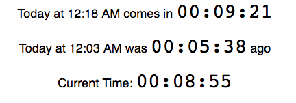
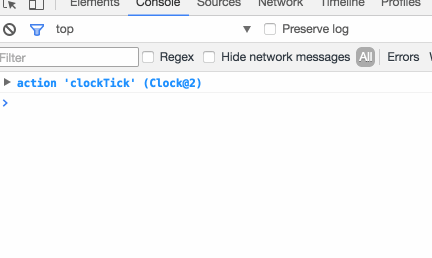

 Ever wanted to build a timer in React? It's a tricky thing. Ideally, React components rely only on their inputs – the props – so that they're testable, reusable, and easier to understand. Time is the ultimate state, that global dependency that just won't sit still. Calling `new Date()` or `moment()` to get the current time in your component makes it dirty. You can't test because it throws unpredictable results depending on system context. You can't reuse and re-render either. Damn thing keeps changing! _And_ you need some mechanism to keep refreshing that time state if you want your component to show something live. You can add a `setInterval` that runs `this.setState(moment())` every second, and that's going to work. But if you show multiple timers on screen, they're eventually going to diverge and look weird.

## Crib from system/hardware design

Those problems have all been solved already in electronics and operating systems: it’s [the clock signal](https://en.wikipedia.org/wiki/Clock_signal) in electronics and [system time](https://en.wikipedia.org/wiki/System_time) in operating systems. Both reduce time to a stateful resource that everyone shares. The idea is this:

-   make a `Clock` store
-   emit an action every `period` milliseconds
-   share `Clock` with everyone

With this approach, time becomes just another prop passed or injected into components that need it. Components themselves can treat it like an immutable value, which makes them easy to test, and because all components rely on the same `setInterval`, they're never going to fall out of sync. Let me show you.  I'm going to use MobX, but the same approach should work with Redux and even the classical state-from-main-component-callbacks-up-components approach. You can see [the code on Github](https://github.com/Swizec/mobx-clock-example).

## Clock store

First, we need a `Clock` store. It looks like this:

    import { observable, action } from 'mobx';
    import moment from 'moment';

    class Clock {
        @observable time = moment();

        constructor(period = 1000) {
            this.interval = setInterval(() => this.clockTick(),
                                        period);
        }

        @action clockTick(newTime = moment()) {
            this.time = newTime;
        }
    }

    const clock = new Clock();

    export default clock;

We have an `@observable` `time` property, which means MobX is going to communicate changes to any `observer`s. The `constructor` starts an interval with the specified period. In our case, this is going to be a 1Hz clock updating once per second. We store the interval in `this.interval` so that we can stop it. This implementation doesn't allow the clock to be stopped or reset, but it would be easy to add an action for that. Each tick of the clock triggers an `@action` called `clockTick`, which updates the `time` property to the current time. MobX is smart enough to let us naively replace it with a new instance of `moment()`, and I'm sure Redux would be too. The real trick to making this work is in the last two lines:

    const clock = new Clock();

    export default clock;

We export _an instance of Clock_, not the class. This ensures that anywhere we use `import Clock`, we get the same singleton. _"But inject()! You can inject() and that will make a singleton!”_ I hear you thinking. Yes, but you can only `inject()` into React components. Sometimes `MobX` stores need access to The Clock as well. You can't inject into those, but you _can_ import stuff.

## Time display

`Clock` was the fun part. Let me show you that it's easy to use :) We make a `Time*` component that displays durations. It can be a functional stateless component that takes `Clock` from React contexts via `inject()` and renders a thing.

    const CurrentTime = inject('Clock')(observer(({ Clock }) => (
        

            Current Time: 
        

    )));

Observes changes on `Clock` state and gets `Clock` from the context with `inject`. You could inject a static object with a `time = N` property when testing. The `Duration` component takes a `moment()` object and displays it as a digital clock. Like this:

    const Duration = ({ d }) => {
        let h = d.hours(),
            m = d.minutes(),
            s = d.seconds();

        [h, m, s] = [h, m, s].map(n => n < 10 ? `0${n}` : n);

        return {h}:{m}:{s};
    };

Take `hours`/`minutes`/`seconds` from the object, and prefix with a `0` when each is smaller than `10`. Yes, this breaks for negative values. It looks like this: `0-1:0-4:05`. But that shouldn't be hard to fix ? In [the full code](https://github.com/Swizec/mobx-clock-example), I built a generalized `Time` displays that defers to `TimeSince`, `TimeUntil`, and `CurrentTime` as necessary. Their code is almost identical, so I didn't want to explain it all here.

## Putting it together in App.js

Now that you have a system `Clock` and a way to show `Time`, you can put it all together inside your `App` like this:

    class App extends Component {
      render() {
          return (
              
                  

                      
                      

                          
                          
                          
                      

                  

              
        );
      }
    }

`Provider` puts the `Clock` singleton in React context. This gives all your components access to the `Clock` via `inject()` and you can do anything you want with it. Cool, isn't it? **And yes, it works in stores, too.** Check this out from my Day Job code. https&#x3A;//twitter.com/Swizec/status/795798444094853121 It's in a store, `isOutOfTime` is a `@computed` property that compares `Clock.time` to some pre-defined deadline. `when()` the deadline passes, an `@action` is called.

        @computed get timeLeft() {
            if (this.should_end_by) {
                return moment.duration(
                    this.should_end_by
                                      .diff(Clock.time)
                              );
            }else{
                return null;
            }
        }

        @computed get isOutOfTime() {
            return !_.isNull(this.timeLeft) && this.timeLeft <= 0;
        }

Isn't that cool? I think it's cool. The code is easy to understand, easy to test, no messing around with intervals and relying on slippery system properties. Things just work™. It's almost like your codebase is in a time monad ?
