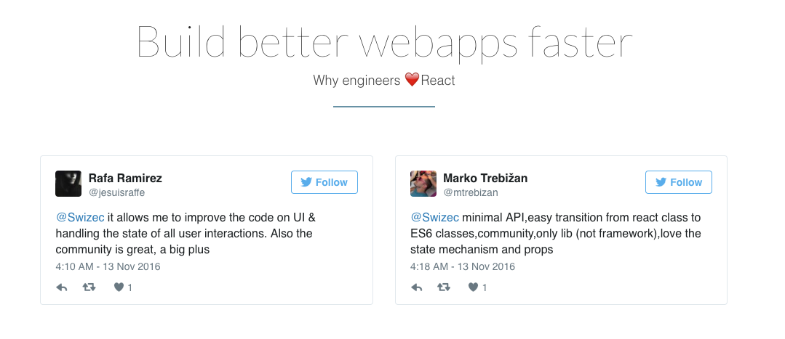

_This is a Livecoding Recap – an almost-weekly post about interesting things discovered while livecoding ?. Always under 500 words and with pictures. You can follow my channel [here](https://livecoding.tv/swizec). New content almost **every Sunday at 2pm Pacific**. There’s live chat, come say hai ?_ In an unprecedented move, this weekend I livecoded twice. There was much to do.   No livecoding for the third session. Girlfriends and birds need sleep, and my office has no door. Silly, I know. What kind of office doesn't have a door? ¯\_(ツ)\_/¯ The first session revolved around two things:

-   Wait, what's in the Bundle again?
-   I can't design, but maybe I can find a good thing on Themeforest.

The second session was all about:

-   Aaaaaah My old React framework for landing pages doesn't work with this theme I bought and this theme is being confusing and I don't know how turn bits of it into React components aaaaaah!

 I'm not going to spell out the first section here just yet. The bundle is going to be amazing, and if you want to see what it's _probably_ going to contain, watch the video. Hopefully I get final confirmation from the other authors soon ? There are going to be 3 tiers again, just like last year: Basic, Epic, Majestic. I wanted to do two tiers, but Stephen is a machine, and we have too much amazing stuff to offer. Pricing just didn't make sense with two tiers. Alas. Basic might be a bit pricey right now. Is $89 too much for the basic offering if full value is $149? ?

* * *

This year's page is built around the _"Why we ❤️ React"_ theme. Last year, it was all about "Take the leap, learn React, it's cool, we promise" and about making more money and building shit faster. That worked great in 2015, but I think that in 2016, everyone already knows a lot of this. So I wanted to make it more community focused. Promote the React love, let others talk about why it's great, then offer a helping hand in learning. Thoughts?  I'm hoping to convince the other authors - Stephen, Andrzej, Juho, Azat - to make a 10- or 20-second selfie video saying why they love React. That would work marvelously on the page, I think. Last time someone asked me for a video testimonial, it took 5 weeks to muster the courage. We'll see how that works. Cyber Monday is around the corner :D Hmmm ... technical stuff ? Honestly, there isn't that much technical stuff that goes into slapping together a landing page. It follows this pattern:

-   Look at bought theme
-   Oooh, I like this widget!
-   Inspect source
-   Copy-pasta source as React component
-   Repeat until done

Labour intensive at first, but gets quicker and quicker. For example, I can now make dark sections with top or bottom decoration like this:

    <DarkSection hasTop="rightSlope"
                 hasBottom="zigZag">
        <Content.WhyPain />
    </DarkSection>

Neat. You can see the [source on github](https://github.com/Swizec/new-react-bundle-page). Thanks to the audience for helping with the pricing and picking a theme. You guys rock :)
