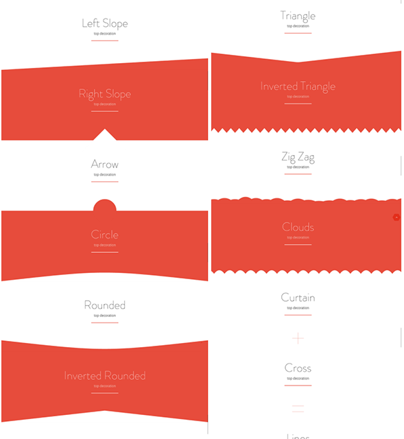

I made a terrible thing Sunday night. The theme that I bought for [the new React Indie Bundle page](https://swizec.com/blog/livecoding-26-new-page-react-indie-bundle/swizec/7211) has decorations built with SVG. You slap them into the page as `<svg>` tags, and it makes your sections look nice.  You're supposed to slap them into the page as `<svg>` tags. It's great that `create-react-app` has built-in support for importing svgs, right? Well… that's meant for images. `import arrow from 'decorations/arrow.svg` gives you a relative URL. Something like `public/decorations/arrow.svg` that you're meant to use as a `src` prop for an image tag.

    import arrow from 'decorations/arrow.svg`

    // ...
    const Arrow = () => (
        
    );

This, of course, does not work with with the Angle theme. That one wants you to use SVG as a first-class citizen of the DOM. So what's a guy to do? ? Well… heh… I built a python script that takes SVG and crudely turns it into a React component. This is a terrible idea, but with a lot of manual massaging, it worked. ?

## Here it is:

    import os

    # from http://stackoverflow.com/questions/4303492/how-can-i-simplify-this-conversion-from-underscore-to-camelcase-in-python
    def dash_to_camelcase(value):
        def camelcase():
            yield str.lower
            while True:
                yield str.capitalize

        c = camelcase()
        return "".join(c.next()(x) if x else '-' for x in value.split("-"))

    for subdir, dirs, files in os.walk('./top'):
        for file in files:
            path = os.path.join(subdir, file)
            name, ext = file.split('.')

            with open(path, 'r') as f:
                svg = f.read()

                svg = svg.replace('<svg', 'import React from "react"; export const %s = () => (<svg' % dash_to_camelcase(name), 1) \
                         .replace('class=', 'className=') \
                         .replace('preserveaspectratio=', 'preserveAspectRatio=') \
                         .replace('viewbox=', 'viewBox=') \
                         .replace('stroke-width=', 'strokeWidth=') \
                         .replace('', ')')

                with open(os.path.join(subdir, name+'.js'), 'w') as out:
                    out.write(svg)

The script traverses a directory and assumes all the files it finds are SVGs. This is the first red flag. Then it reads the SVG as text and performs some search & replace operations:

-   `<svg` becomes a React import, and an exported function declaration
-   `class`, `preserveaspectratio`, `viewbox`, and `stroke-width` are fixed to follow React's prop naming rules
-   `</svg>` gets a `)` to close the function body.

This is red flag number 2 through 6, maybe 7. Why? Because this is terrible, and I should feel bad. You can't parse [XML with Regex](http://stackoverflow.com/questions/1732348/regex-match-open-tags-except-xhtml-self-contained-tags), which this is a simplified instance of, and _for the love of god use a parser like lxml_. Several problems showed up:

-   Some files had two `<svg>` tags. I had to manually edit them _every time I re-ran the script because bugs_ ?
-   Some files had typos in their props, like `stroke-width = "`. This is valid XML, but my "parser" couldn't handle it ➡ manual edits
-   Files with two `<svg>`s have to be wrapped in a `
` to fulfill React's "one child per component" policy. This needs manual edits because my "parser" knows nothing.

2 hours after I started, I was done. Happy to have successfully turned 30 svgs into React components, I could now use the two that I needed. Excellent. Yak shaving at its finest. This could make a useful Webpack plugin, though. Import SVG as a React component? That sounds like something everybody needs ?
