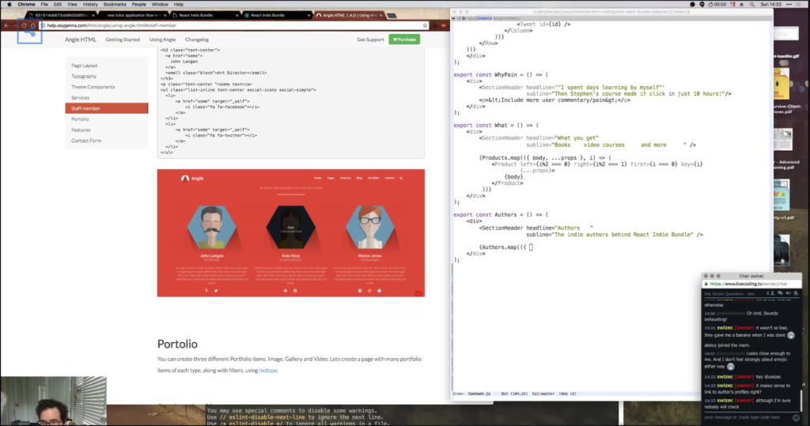

_This is a Livecoding Recap – an almost-weekly post about interesting things discovered while livecoding ?. Always under 500 words and with pictures. You can follow my channel [here](https://livecoding.tv/swizec). New streams almost **every Sunday at 2pm PDT**. There’s live chat, come say hai ?_  Continuing from [last week](https://swizec.com/blog/livecoding-26-new-page-react-indie-bundle/swizec/7211), we kept putting together the new page for the React Indie Bundle. I wanted to get it done this weekend, but then I didn't. Launching the first version tomorrow is getting tight ? To be honest, nothing crazy technical happened in this livecoding session. Slapping together content in React components followed by more slapping together of content.  It's really a somewhat repetitive process. Maybe there's a market for building React-ready templates? Just like most templates you buy now are built with Bootstrap so they're easy to customize, it would be cool if in the future we could get some that are built with React. Then instead of getting a bunch of HTML like this:

```

    

        

            
        

        

            
Says

            I like ancient stuff
        


  
    John Langan
  
  Art Director


some text


  
      
          
      
  
  
      
          
      
  
```

Which you have to manually retype, or copypasta, into an `Author` component like this:

    export const Author = ({ src, name, title, description, links }) => (
        

            

                

                

                    
                

            

            

                {name}
                {title}
            

            

    {description}


            

                {Object.keys(links).map((type, i) => (
                    
                        
                            
                        
                    
                 ))}
            

        

    );

_The template would give you `<Person />` by default. Is React still too hard for designers to grok? I know many of them understand HTML ? Then again, if you look at that, you'll see that the conversion looks a bit like this:-   `class` becomes `className`
-   content becomes `{something}`
-   repetitive content becomes `thing.map(<loop stuff>)`Almost sounds like you could automate that. Or is it juuuuuust tricky enough that you need a junior developer of some sort? Definitely a junior developer job, if you have access to one of those. Otherwise ,you gotta schlep through it yourself. But as my CTO would say, if a landing page can mean the difference between $0 and $60,000 in revenue, why _wouldn't_ you build it yourself?_
