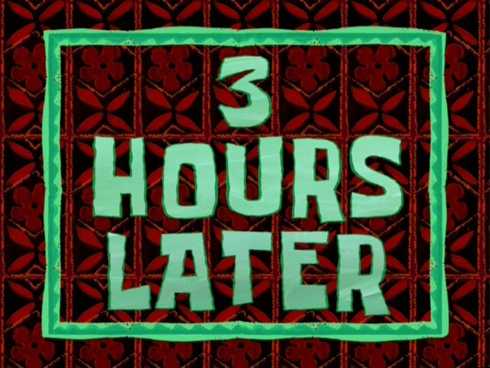
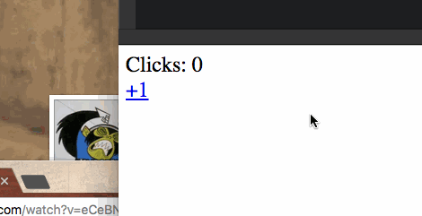
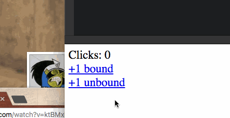
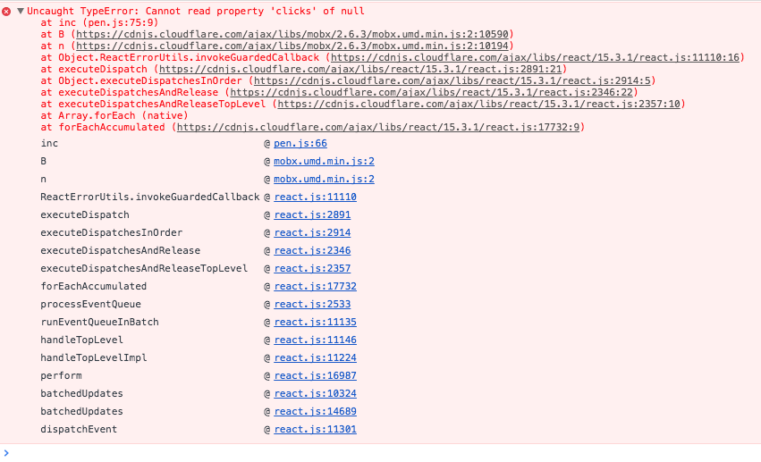

**Codereviewer:** _"Why is this binding necessary?"_


```
<Modal show={viewStore.modal.show}
       closeOnOuterClick={true}
       onClose={viewStore.closeModal.bind(viewStore)}
```


> This code follows my [Simple MobX-driven modals](https://swizec.com/blog/simple-mobx-driven-modals/swizec/7166) approach.


**Swiz:** _"Without binding, the callback would bind to Modal object when called, if I'm not mistaken."_


**Codereviewer:** _"Would it? That doesn't seem very intuitive."_


**Swiz:** _"Welcome to JavaScript's dynamic scoping. Where have you been the past few years?…_


_But you're right, it does seem to work. I think MobX's `@action` does a bind for us. It definitely wouldn't work with vanilla functions. I'll change the code code."_





Nope, no, nah. I should not have done that. That did not work. `@action` does not do any binding. Wrapping a function in a function does not create a closure with the correct local scope.


But it _did_ work in that one case I tried. Just not in the other. ?


## Let's investigate.


Here's a self-contained example in Codepen - a clicker.


\[codepen_embed height="265" theme_id="light" slug_hash="XNeENX" default_tab="result" user="swizec" editable="true" data-editable="true"]See the Pen [React, mobx, bind example](http://codepen.io/swizec/pen/XNeENX/) by Swizec Teller ([@swizec](http://codepen.io/swizec)) on [CodePen](http://codepen.io).\[/codepen_embed]


We have a `Store` that holds the number of `clicks` and contains an `inc` action to increase the count.


```
class Store {
  @observable clicks = 0;

  @action inc() {
    this.clicks += 1;
  }
}
```


A not-very-smart functional stateless component renders the current count and a link to click. We use `onClick` with a bounded action to detect clicks.


```
const Clicky = observer(({ store }) => (
  

    Clicks: {store.clicks}
    

    +1
  

));
```





Click the link, number goes up. 14 lines of actual code.


Ok, we know it works with a `.bind`. Will it work without one?


\[codepen_embed height="265" theme_id="light" slug_hash="LbzdBO" default_tab="js,result" user="swizec" editable="true" data-editable="true"]See the Pen [React, mobx, bind example, pt2](http://codepen.io/swizec/pen/LbzdBO/) by Swizec Teller ([@swizec](http://codepen.io/swizec)) on [CodePen](http://codepen.io).\[/codepen_embed]


We expanded our `Clicky` component with a link that uses an unbounded `store.inc` action call as the `onClick` callback.


```
const Clicky = observer(({ store }) => (
  

    Clicks: {store.clicks}
    

    +1 bound
    

    +1 unbound
  

));
```





Well, that didn't work. ?


The error reads `Uncaught TypeError: Cannot read property 'clicks' of undefined`. Looks like `this` isn't defined inside our callback.


Good ol' [dynamic scoping](https://en.wikipedia.org/wiki/Scope_(computer_science)#Dynamic_scoping), unintuitive as always. If that Wikipedia article doesn't tell you much, don't worry. It's _basically_ comp sci soup.


The gist of their 800-word explanation is this: with dynamic scoping, functions are scoped to where they're called, not where they're defined. It doesn't matter that `inc` is defined inside `Store`; it matters how React calls it.


So how _does_ React call our click callback? Let's see.


## A spelunk through a React event





It starts with `dispatchEvent`.


```
dispatchEvent: function (topLevelType, nativeEvent) {
    if (!ReactEventListener._enabled) {
      return;
    }

    var bookKeeping = TopLevelCallbackBookKeeping.getPooled(topLevelType, nativeEvent);
    try {
      // Event queue being processed in the same cycle allows
      // `preventDefault`.
      ReactUpdates.batchedUpdates(handleTopLevelImpl, bookKeeping);
    } finally {
      TopLevelCallbackBookKeeping.release(bookKeeping);
    }
  }
```


Looks like a function that takes native events from the browser and emits them into React's engine in batches. That's good for performance, great for debugging, and makes everyone's lives easier.


Our next step in the chain is `batchedUpdates`.


```
var transaction = new ReactDefaultBatchingStrategyTransaction();

var ReactDefaultBatchingStrategy = {
  isBatchingUpdates: false,

  /**
   * Call the provided function in a context within which calls to `setState`
   * and friends are batched such that components aren't updated unnecessarily.
   */
  batchedUpdates: function (callback, a, b, c, d, e) {
    var alreadyBatchingUpdates = ReactDefaultBatchingStrategy.isBatchingUpdates;

    ReactDefaultBatchingStrategy.isBatchingUpdates = true;

    // The code is written this way to avoid extra allocations
    if (alreadyBatchingUpdates) {
      callback(a, b, c, d, e);
    } else {
      transaction.perform(callback, null, a, b, c, d, e);
    }
  }
};
```


Told ya it was good for performance. Just look at that comment – _"components aren't updated unnecessarily"_.


I have no idea how this thing works. It smells like some sort of [currying](https://en.wikipedia.org/wiki/Currying).


But we know our next step, eventually, is `transaction.perform`.


```
perform: function (method, scope, a, b, c, d, e, f) {
    !!this.isInTransaction() ? "development" !== 'production' ? invariant(false, 'Transaction.perform(...): Cannot initialize a transaction when there is already an outstanding transaction.') : _prodInvariant('27') : void 0;
    var errorThrown;
    var ret;
    try {
      this._isInTransaction = true;
      // Catching errors makes debugging more difficult, so we start with
      // errorThrown set to true before setting it to false after calling
      // close -- if it's still set to true in the finally block, it means
      // one of these calls threw.
      errorThrown = true;
      this.initializeAll(0);
      ret = method.call(scope, a, b, c, d, e, f);
      errorThrown = false;
    } finally {
      try {
        if (errorThrown) {
          // If `method` throws, prefer to show that stack trace over any thrown
          // by invoking `closeAll`.
          try {
            this.closeAll(0);
          } catch (err) {}
        } else {
          // Since `method` didn't throw, we don't want to silence the exception
          // here.
          this.closeAll(0);
        }
      } finally {
        this._isInTransaction = false;
      }
    }
    return ret;
  },
```


?


That's a lot of code. Let's focus on the bits that matter:


```
perform: function (method, scope, a, b, c, d, e, f) {
// ...
      ret = method.call(scope, a, b, c, d, e, f);
// ...
```


A-ha! The second argument is `scope`. React specifically set that to `null` when calling `transaction.perform`, and `function.call` is a JavaScript way to define a function's scope at point of invocation.


> The `call()` method calls a function with a given `this` value and arguments provided individually.


I don't know _why_ React goes out of its way to set callback scope to `null`, but I'm sure it has something to do with correctness. Better to throw an explicit error and tell the engineer to fix their code than to get the wrong `this` by accident and fuck shit up.


And I'm not sure when, if ever, that `scope` argument would be something other than `null`.


¯\_(ツ)\_/¯


## What did we learn


Bind your callbacks.


Add a `.bind` or a fat arrow wrap -> `() => callback()`. Both work.