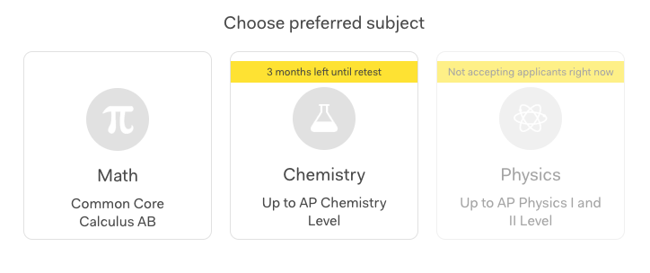
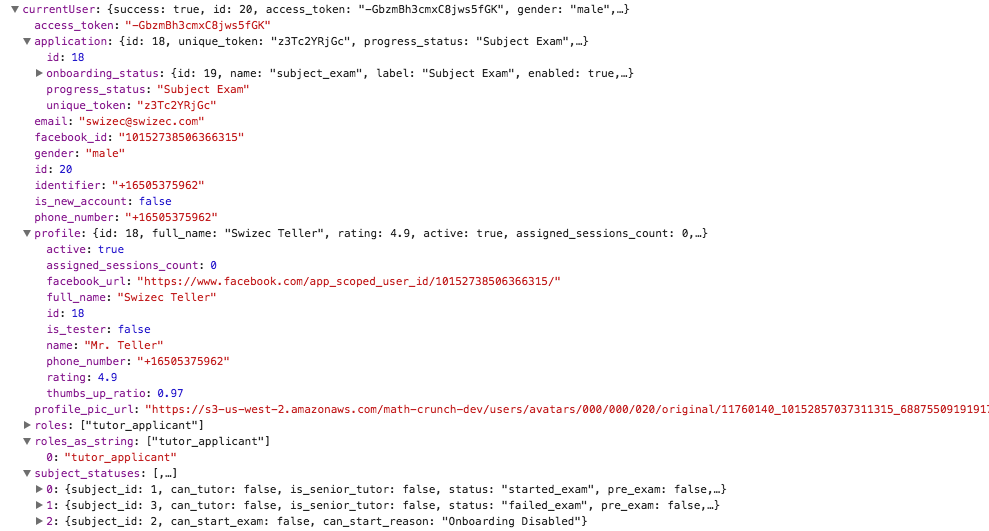

Let's take an example from [my day job](https://www.yup.com). An onboarding step for new tutors is a subject exam. It starts with this page:





In this case, the applicant has already flunked chemistry, we're not accepting physics, and they can still take a math exam. To build this, we need data about the current user, about the subjects, and how they relate to each other.


## Basic API-backed MobX model


Building a basic model with MobX is straightforward once you discover `extendObservable`. It's a store that gets its properties from the API.


A `User` model might look like this:


```
class User {
    constructor(mainStore, id) {
        this.mainStore = mainStore;
        this.id = id;
     
        this.fetchFromAPI()
    }
 
    @computed get url() {
        return `/api/users/${id}`;
    }
 
    @action fetchFromAPI() {
        fetch(this.url)
            .then(response => response.json())
            .then(action('set-user-params', json => {
                extendObservable(json);
            }));
    }
}
```


The `constructor` takes a user `id` and a `mainStore` reference. Having that reference to a parent store is often useful when spelunking through your data model. I learned that the hard way ?


We call `fetchFromAPI` to fetch the user data, use a `url` computed value for the URL, and naively use `extendObservable` to set all the API data as observables on our `User` model.


This approach embraces [duck typing](https://en.wikipedia.org/wiki/Duck_typing). There's no advance declaration of what a user model looks like. No description of properties, nothing you can rely on just by looking at the code. You're just gonna have to try to access a property and hope it works.


But when your model looks like this:





Do you really want to type all of that out? No, you don't.


`extendObservable` is a convenient approach for these situations. It gives you infinite flexibility and makes properties deeply observable.


That means using things like `user.subject_statuses[0].can_start_exam` Just Works™. You should be careful about undefineds, though. Until the API call goes through, anything beyond `user.` is undefined. That part is annoying.


Sidenote:


You can fake a [maybe monad](#) in MobX using `when`, like this:


```
when(() => user.subject_statuses,
        () => // do stuff with data)
```


## Connecting models is where things get awkward


Let's have a `mainStore` that looks a lot like the `User` model above. It may look like the `User` model, but it fetches a bunch of things about the environment, one of which is the current user's id, another of which is a list of subjects.


```
const MainStore {
    @observable currentUser = null;
 
    constructor() {
        fetch('/api/environment_data')
            .then(response => response.json())
            .then(this.setData);
    }
 
    @action setData(json) {
        this.currentUser = new User(this, json.currentUser.id);
        delete json.currentUser;
     
        extendObservable(this, json);
    }
}
```


Whoa, did you see that? We fetched data, took the `currentUser.id`, then deleted `currentUser` before using `extendObservable`. Wat.


The API returns an object with many properties. In our example, let's assume it looks like this:


```
{
    currentUser: {
        id: N,
        // other stuff, maybe
    },
    subjects: [
        {id: N, name: 'Math'},
        {id: N, name: 'Chemistry'},
        // ...
    ]
}
```


We want to avoid writing a bunch of boilerplate, so we use the `extendObservable` trick to set everything. But we don't want to overwrite our custom `currentUser`, which is a proper MobX model, not just an observable.


So we have to delete that part of the data before extending. Awkward.


And _why_ do we want `User` to be more than just an observable? Because it's going to need `@computed` values. We might re-fetch the model at random points or perform many actions that save stuff to the backend, change frontend state, and so on.


Dealing with all of that in `MainStore` would get hairy fast.


You're right. From the perspective of this example, that's a total [YAGNI](https://en.wikipedia.org/wiki/You_aren't_gonna_need_it) - ya ain't gonna need it. But bear with me.


## Add the domain logic, increase the awkward


Using the above `MainStore`, rendering a subject picker is straight forward. Loop through observable list of subjects, render elements. If something changes, MobX takes care of it.


Not that the number or naming of subjects ever changes.


```
const SubjectPicker = inject('mainStore')(observer(({ mainStore }) => {
    if (mainStore.subjects) {
        return (
            

                {mainStore.subjects.map((s, i) =>
                    
                 )}
            

        );
    } else {
        return null;
    }
}));
```


Assume we put an instance of `MainStore` in a `` as `mainStore`. That gives us global access via `inject` and cleans up our codebase.


A simplified `` component would look like this:


```
const Subject = observer(({ subject }) => (
    

        
{subject.name}

        {subject.userStatus.can_start_exam ? 'Go for it' : 'LoL Nope.'}
    

));
```


Not as pretty as the screenshot, but all that HTML and styling is irrelevant right now, so I took it out. Ours renders the subject name in an `h3` tag, and a string `Go for it` if you can take this exam or `LoL Nope` if you can't.


Now, the trouble; can you see it?


It's that `subject.userStatus.can_start_exam` bit. You see, we've found ourselves staring at a piece of data that lies _between_ concepts.


Ask a subject if it's startable and it needs to know who you're asking about. Ask a user and it needs to know which subject you're asking about. It _smells_ like a computable value, but where?


Computables can't take arguments.


So even though the `User` model has this data – stored in `subject_statuses` – we can't put the computed there. It can't go in `MainStore` either because that too would require arguments.


_"Dude, it's called a method. Just use a method"_, right?


Yes, methods and functions can take arguments. But MobX computeds are preferable because they automagically observe values, memoize their results, and so on. Cleaner code. Faster code.


We need a new `Subject` model that knows about `currentUser`. It looks like this:


```
class Subject {
    @observable currentUser = null;

    constructor(currentUser, data) {
        this.currentUser = currentUser;
        extendObservable(this, data);
    }

    @computed get userStatus() {
        return this.currentUser.subject_statuses
                            .find(s => this.id === s.subject_id);
    }
}
```


It takes a reference to `currentUser` and raw data about itself then uses `extendObservable` to set it all up. We've added a computed `userStatus` method that goes to `currentUser` and finds the correct data.


This part is awkward, too. A model that returns information from a different model? Wat.


I'm not sure. Maybe it's dumb. Maybe I'm dumb. I think it makes sense.


Anyway, in `MainStore`, we now do something like this:


```
    @action setData(json) {
        this.currentUser = new User(this, json.currentUser.id);
        delete json.currentUser;
     
        this.subjects = json.subjects.map(
            s => new Subject(this.currentUser, s)
        );
        delete json.subjects;
     
        extendObservable(this, json);
    }
```


Not very elegant, is it? And I think the `subjects` array stopped being observable in the process, so we have to add it as an `@observable` property explicitly.


## Conclusion


1. Use `extendObservable` to load and create large models
2. Create new models when submodels need `@action`s or `@computed`s
3. Do the `new Model` then `delete` dance when that happens


It would be nice if `extendObservable` could do this for us. I'm sure it's possible as long as model constructors are forced to follow a common pattern.


But maybe that exists already and I don't know about it? Would def be a fun opensource project. ?