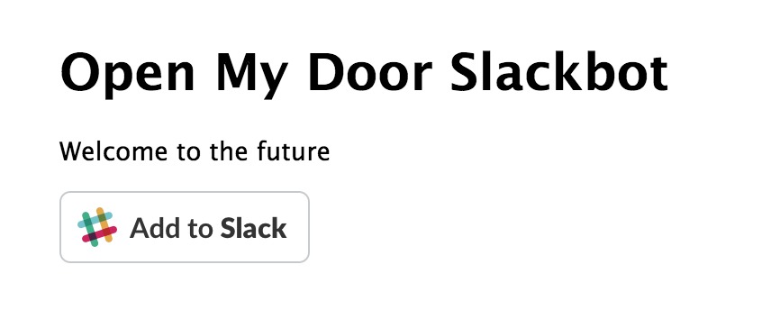

_This is a Livecoding Recap – an almost-weekly post about interesting things discovered while livecoding ?. Always under 500 words and with pictures. You can follow my channel, [here](https://livecoding.tv/swizec). New streams almost **every Sunday at 2pm PDT**. There’s live chat, come say hai ?_  Today was all about winning a bet. On Wednesday, the founder walked up to my desk and said: _"If you don't get that Slack bot set up, we're routing the buzzer phone number to your phone. I'm not joking."_ Well, the joke's on him. OpenMyDoor is ready for a real world test! ?? Weight off my chest. too. I hate phones. But first, some background. He was talking about [the Twilio+Slack bot](https://swizec.com/blog/make-slack-twilio-talk/swizec/7128) I [started building](https://swizec.com/blog/livecoding-22-a-door-answering-slackbot/swizec/7038), and [almost finished](https://swizec.com/blog/livecoding-23-slackbots-oauth/swizec/7065) in September. I had a working prototype running on my localhost some time in October. When I showed it to the coworker who's currently stuck answering the door, she loved it. Super excited. She's been giving me glares for the past 2 months. _"Where is my fucking bot!?"_ the glares ask. Then I hide under the couch and mumble something about how short nights and weekends are. Founder dude put his foot down, and here we are. Bot is ready 4 days later. ? In my defense, I _meant_ to do it this whole time, but I was busy putting together the [React Indie Bundle](http://www.reactindiebundle.com).

## What we did

 Here's what we did to win the bet:

-   put bot on Heroku as [openmydoor.herokuapp.com](https://openmydoor.herokuapp.com/)
-   made initiating the OAuth flow easier
-   made API keys and tokens configurable

That's right. You can't steal my auth anymore. You may have seen the exact tokens in the video, but I can regenerate and configure them easily. Ha! I should do that… The caveat is that it's still set up to only work with one Slack team at a time. Once you change the config, the bot is theirs. At least it's independent of my laptop now ? To make OpenMyDoor _actually_ useful, I have to add a database. Something simple to keep track of which OAuth token belongs to which phone number and Slack channel. Then we'll be able to route Twilio calls to correct teams. We'll do that next week on Saturday instead of Sunday because I'm having some sort of Christmas party on Sunday. See you next week. I have the perfect user onboarding flow in mind.
