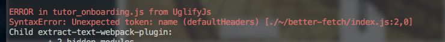

_"Yo Swiz, why aren't there any generated assets on preprod?"_ Preprod is production-but-not. As the last step before deploying to production, it acts just like the real deal. Real data, real users, real configuration, real everything except payments. Because that would be rude. _"Errr ... what do you mean there's no assets?"_ _"Well, we ran out of environments, so I'm testing on preprod. It's like Webpack doesn't output anything, but it works on localhost and all our other environments."_ O.o

    ERROR in tutor_onboarding.js from UglifyJs
    SyntaxError: Unexpected token: name (defaultHeaders) [./~/better-fetch/index.js:2,0]

 That's funny ... UglifyJS throws an error on the first line of my [better-fetch](https://swizec.com/blog/a-tiny-es6-fetch-wrapper/swizec/7177) library. Why would it do _that_? ? _"We don't minify our code on localhost, do we? What about on staging?"_ _"Yeah, only prod and preprod"_ Great, at least we know how nobody noticed this in over a month. It only happens on servers configured for production. Thank the-god-of-grizzled-veterans for preprod! Error happens, deploy goes through, assets are empty, nothing works. Imagine how _absolutely fantastic_ this would be to discover when deploying to real production ? Here's the line that broke [UglifyJS](https://github.com/mishoo/UglifyJS2):

    let defaultHeaders = {};

 I built a `fetch()` wrapper in ES6. Fuck me, right? Not like it's an ES6+ only API or anything like that…

> Hint: it is. It's ES6 only. You'd think building a wrapper in ES6 without compiling before `npm publish` would work, right?

Nope. Not if a project that imports your library minifies their assets.

## How to package your ES6 library so anyone can use it

3.73 months ago, I thought [packaging a library was hard](https://swizec.com/blog/livecoding-19-its-hard-to-package-a-library/swizec/6927). Turns out it's not so bad at all. You have to add [Babel](https://babeljs.io/), the ES6 -> ES5 compiler[1](#fn1), configure it, update your new `main` entry, and add a `build` script to npm scripts. That makes it easier to run. These 7 lines are all it takes: [diff on Github](https://github.com/Swizec/better-fetch/commit/9c7c6e2afc660ea9a35bc73a14d15aedc7f47b04) You have to install `babel-cli` and `babel-preset-latest`:

    $ npm install --save-dev babel-cli babel-preset-latest

And configure Babel:

    // package.json

    "babel": {
        "presets": ["latest"]
    }

Configuring in `package.json` is easiest. 17 characters is not a good enough reason to add another config file to your project. You should update your `main` entry as well. It tells npm which file to use when somebody uses `require('your-library')` or `import YourThing from 'your-library'`.

    // package.json

    "main": "lib/index.js"

Many projects use `lib/` for their compiled files. `dist/` is another popular choice. To improve your quality of life, you should add a `build` script. Also in `package.json`:

    // package.json
    "scripts": {
        "build": "babel src -d lib"
    }

Now you can use `npm run build` to run `babel`, read files from `src/`, and output the compiled versions in `lib/`. Library fixed. Crisis solved. \\o/

## Further quality of life improvement

While heroically saving the day with the above 7 lines of configuration, I found another way to improve my quality of life: automatic version bumping and GitHub pushing. Add these 3 lines to `package.json`:

    // package.json
    "scripts": {
        "preversion": "",
        "version": "npm run build && git add -A lib",
        "postversion": "git push && git push --tags && rm -rf build/temp",
    }

You can use `npm version X` where X is one of `patch`, `minor`, `major`, etc. to bump your library version number. That always works. These three lines make it better. `preversion` runs a command _before_ updating the version number. If the command fails, the version doesn't change. Usually these are tests. In my case, it's empty because I'm a bad person. `version` runs a command when the version updates. This is a great spot to compile your library and add the compiled files to git. `postversion` runs after the version updates. And _this_ is a great spot to push to GitHub and perform any build cleanup. Now you can update your library then run `npm version patch` to bump the version, build the lib, and push to github. `npm publish` announces the fix to the world. Time to congratulate yourself and grab a beverage. ?

## Lesson Learned

UglifyJS doesn't support ES6. They've been [working on it](https://github.com/mishoo/UglifyJS2/issues/448) since at least March of 2014. As of December 6th, 2016, it's still not ready. Turns out this is a hard problem. Most real world projects use UglifyJS to minify their JavaScript. You have to distribute a compiled version of your JavaScript libraries no matter what they do. Such is life.

* * *

1.  Yes, Babel is _technically_ a [transpiler](https://en.wikipedia.org/wiki/Source-to-source_compiler) [↩](#ffn1)
