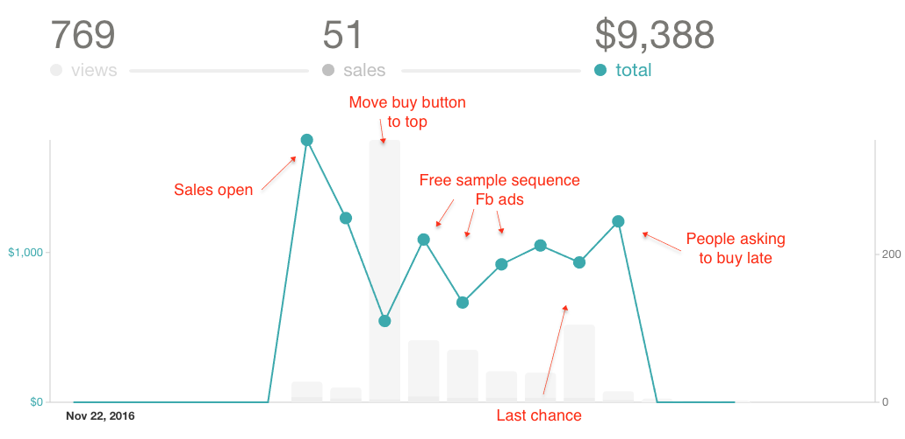
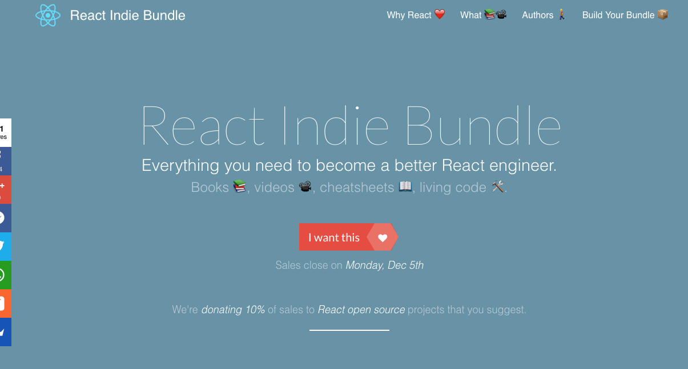
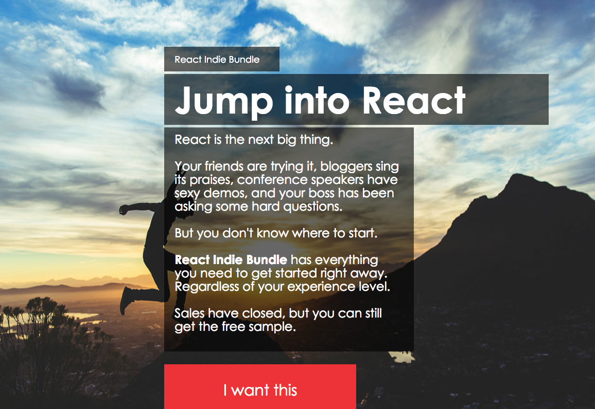
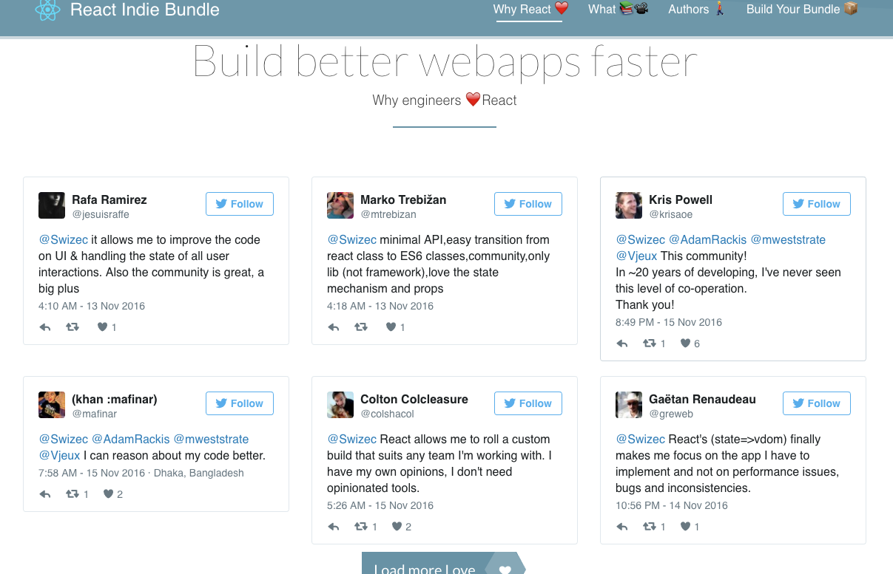
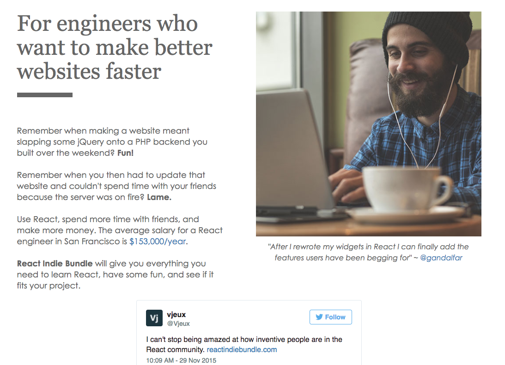
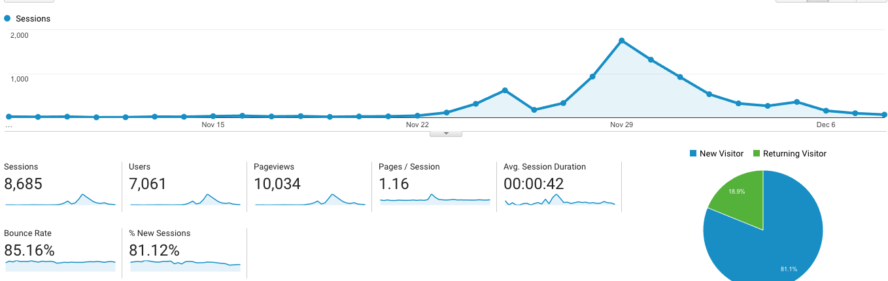
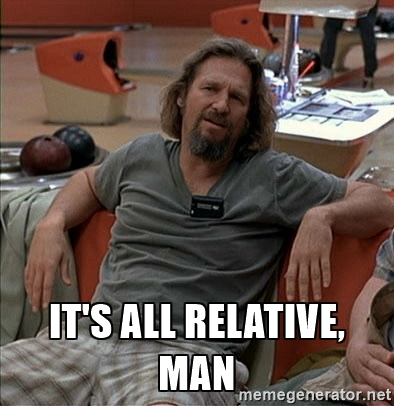

I messed up. I got arrogant, and I rushed it, and it flopped. Let me tell you how.

We used the same premise as last year:

- many authors
- multiple React books
- many video courses
- some other goodies
- 3 pricing tiers
- a week-long sale starting on Cyber Monday
- send emails to every mailing list the authors can muster
- donate 10% of the revenue to open source.

Using that approach, [we made $31,323 last year](https://swizec.com/blog/react-indie-bundle-report-or-how-we-made-31k-in-a-week/swizec/6762). This year, our products were better, our mailing lists were longer, the market was bigger, and our website was prettier. We made $9,388.

?

Marketing felt like screaming into the void. Where last year there was chatter on Twitter, responses on Facebook, and excited emails, this year there was… nothing.

It was like being [shadowbanned](https://en.wikipedia.org/wiki/Stealth_banning) by the world.

I don't think we were shadowbanned. I think our copywriting was shit, our product didn't have a hook, and our marketing was too impersonal.

## Bad copywriting

That was the first thing you saw on the website - a big fat **what**.

_Oh, it's a bundle. It has everything I need. What a logical choice to buy. Yawn._

Compare that to last year's site:

It looks like it was designed by a 12-year old in the 90's, but, man, look at that copy – a big fat **why**.

_Oh, it's the next big thing! My friends are talking about it, **and** you can help me out? Of course I'm gonna scroll down._

Continue down and the new page gets a little better on the why vs. what approach. It talks about why people love React.

This should have been the hero panel. _This_ sells React. _This_ is emotion. The above crap is just sterile and bad.

Now look at the second panel on the old page.

_Emotions_. There's a happy dude in a beanie, copy-evoking memories, talking about the salaries people can make, and reminding you that we're here to help you get there.

I forgot to mention that _anywhere_ on the new page. Not a single _why_ you'd want to buy the bundle. Just a bunch of here's what it is, here's what you get, this is what happens.

But _why_? ¯\\_(ツ)_/¯ Don't you know already? No. No, you don't.

You don't give a shit about my products unless I tell you why you should.

## A product without a hook

We had _one_ hook: $1000 of React resources for $450 or less. Sounds pretty good, right?

Do you know how much we used it in our ads and emails? Zero.

I don't even know why. Maybe I felt like it was too dirty to put money at the forefront? That should've been my first clue that something was wrong. When you don't feel good talking about your hook, something's wrong with either the hook or the product or both.

It was definitely the product.

Last year, we added face time with the authors, and that was great. Not many people used it, but it was _special_. Something they couldn't get anywhere else. So they bought our bundle then told us _"Eh, I don't really care about the consulting. I just liked the idea."_

I took that to mean, _"Oh cool, no need to include the difficult-to-logistics consulting calls to this year's bundle."_

Boy, was I wrong. Removing those made our bundle meh. It removed everything that was special and unique and turned it into just a bunch of stuff, most of which people preferred to buy separately.

**We sloppily added** interviews with React ecosystem creators and the ability to assemble your own bundle, but it was too little too late. We failed to incorporate it into the core messaging, and we didn't even send a very strong email or two about the change.

That was dumb.

This is what happens when your product lacks a hook and nobody cares.

8,685 visitors, and only 769 scrolled down far enough to find the Gumroad buttons. About 8%. ?

Last year, we had more than 14,000 visitors, and 13% scrolled down enough to find the Gumroad buttons. Looks like those 5% make all the difference. Network effects kick in, sales are made, things happen.

## Impersonal marketing

We, or at least I, thought we were big and cool and that everyone would have been excited to see the bundle come back. Thousands of email subscriber fans; hundreds of people on Facebook; many, _many_ engaged followers on Twitter.

Nope. Still small, still your average Joe Schmoe, still gotta hustle.

Unlike last year, we did very little direct community outreach via meetups and Twitter DMs and things like that. _"Ha, they'll be excited to share our stuff!"_, we thought.

In truth, I don't think they ever found out it even exists. Meetup organizers and community leaders have a lot on their plates, and it takes relationship building to get on their radar.

## The things that worked

All of that said, some things did work!

Facebook ads converted at $0.20 per click. That's a much better result than last year when each click cost us $2. In the end, we spent $596 on Facebook ads.

They didn't lead to conversions because our copywriting was bad, our product didn't have a hook, and our re-engagement stuff was kind of weak. But hey, at least we got in front of people, and they knew the bundle was out there, right?

Brand marketing or whatever that's called.

**Building a donations list** worked pretty great as well. We put up a [Github page](https://github.com/Swizec/react-indie-bundle-donations) where anyone could suggest their favorite project and upvote it. The community suggested 6 projects and made many upvotes.

Well, more upvoting and engagement than I've ever seen on a Github repository. Maybe others are used to more. :)

## The final tally

The final tally looks like this:

- $9388 in sales
- $8905 after Gumroad fees
- $596 for Fb Ads
- **$938 open source donation pot**
- $1593 share for each author

Not a _terrible_ result for a week of sales. About the level of an average month for me, personally. I don't know about the others.

But so many things we could've done better. There are so many things we _should've_ done better because we knew better. ?

And I don't like how small the donation pot is, so I'm **adding 50% of my share**. That makes it $1734.

I would have added all of it, but my girlfriend has been buying joint Christmas presents like it's the end of days. ?

PS: Yes, if _my own_ product made $9k in a week, I'd be jumping with joy.

