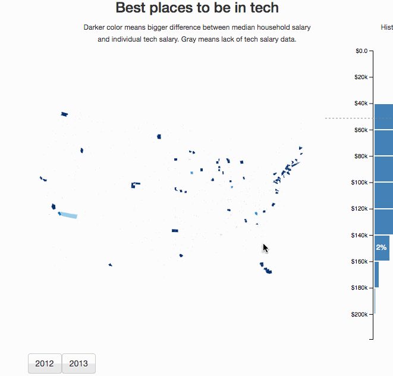
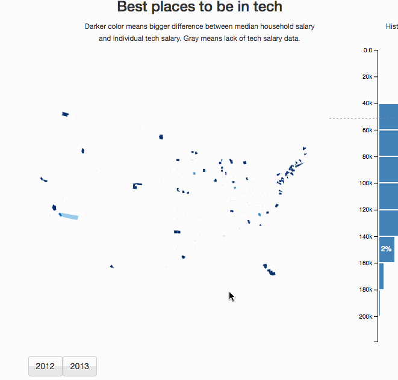

_This is a Livecoding Recap – an almost-weekly post about interesting things discovered while livecoding ?. Always under 500 words and with pictures. You can follow my channel [here](https://livecoding.tv/swizec). New streams almost every Sunday at 2pm PDT. There’s live chat, come say hai ?_  Yesterday was supposed to be all about cutting up a large-ish codebase into small chunks that are easier to explain step-by-step. I was a great plan, but it didn't _quite_ happen. Instead of doing that, I went down the rabbit hole of optimizing the choropleth map from [Livecoding 24](https://swizec.com/blog/livecoding-24-choropleth-react-js/swizec/7078). Turns out my H1B visualization wasn't slow because the dataset was big. It was slow because the map re-renders 3,220 county polygons on every update. ? Let me explain. We started with this:  See how it takes 2 or 3 seconds to react when you click a button? That's bad. And we finished with this:  Takes just a second. Still slow, but _a lot_ better. The dataset to crunch is big after all. ? Unfortunately, the paint flashing isn't useful to show you what's fixed. Looks like a parent component repaints and flashes everything. This is unfortunate and a potential clue for further improvements. To make this 50% to 66% speed improvement, we did two things:

1.  Added `shouldComponentUpdate` to the `County` component
2.  Avoided doing `_.find` to find data on every polygon draw

I don't know which improvement had a bigger effect, but when you `_.find` in a N=290 array 3220 times, that's 933,800 function calls that you're making. Oops. We fixed that by building a map beforehand. Like this:

    const countyValueMap = _.fromPairs(
        this.props.values.map(d => [d.countyID, d.value]));

Then rendering `County` components in a loop, like this:

    {counties.map((feature) => (
        
    ))}

That `value` prop used to be `_.find(counties, {countyID: feature.id})` and that was dumb. Lesson learned. Big-O matters even when you're just doing JavaScript. Inside `County`, we added `shouldComponentUpdate`. I don't know _why_ React wasn't able to optimize this for us, but it wasn't. Maybe because we were passing props in as functions? Probably. The new `County` component looks like this:

    class County extends Component {
        shouldComponentUpdate(nextProps, nextState) {
            const { zoom, value } = this.props;

            return zoom !== nextProps.zoom
                || value !== nextProps.value;
        }

            render() {
                // body from previous functional stateless version
            }
    }

We know for a fact that a county polygon only has to re-render when the map's zoom level changes or the value we're displaying changes. That enables the map to change size and the value to change polygon colors. Excellent. Many lessons learned. You can see the code for [React + D3 choropleth maps on Github](https://github.com/Swizec/h1b-software-salaries/tree/create-react-app/src/components/CountyMap). It's embedded in a larger project, so there's some context-specific stuff, but the component itself is made to be pretty general.
