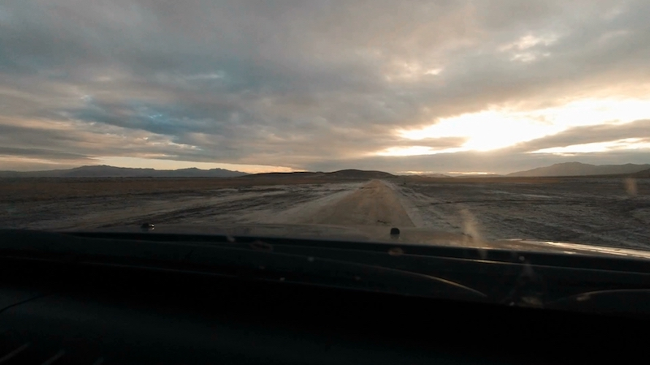

We were lost in the Mojave Desert when it finally rained. It’s the driest place in North America and we found mud, puddles, and rain.

It was the best.

We turned left off the paved Kelbaker Road near [seventeen mile point](https://www.google.com/maps/place/Soda+Lake/@35.2177389,-115.8921703,3920m/data=!3m1!1e3!4m5!3m4!1s0x80c5a2f67c7237db:0xc0edfaaf9e63aa37!8m2!3d35.16519!4d-116.07142) and set off to find Soda Lake. A dry lake inside Mojave National Preserve, near Zzyzx – the last word in the English language.

For two and a half hours, we were alone. No service, no traffic, not a soul in sight as far as the eye could see. The only signs of life were tracks left in the mud and the sand and the occasional pole saying a road was closed.

And that's how we got lost.

_"This part of the park has been closed to motor traffic to provide a motor-free experience to visitors”_ said a tiny sign on a tiny pole.

Deeper and deeper into the desert we went. The farther we went, the worse and worse Google Maps became. Then, finally, it gave up.

And we were alone. Just old tracks in the mud to guide us. We called them roads, and they had names, and they barely looked different from the rest of the desert.

If you ever get a chance to roam the Mojave, I highly recommend it. Get a 4x4, plenty of gas, some food and water, a blanket (in case you get stranded), and go explore.

The worst that could happen is that you spend the night in the desert and then continue in the morning. A road will always lead to civilization eventually.

And if you get stuck, you can follow the road on foot.

_You need a 4-by-4._ Even with our Jeep Cherokee, rocks banged against the floor, we slid around on [full opposite lock](https://en.wikipedia.org/wiki/Opposite_lock) at 20mph, and we scraped the ground in mud with tracks too deep for our grand clearance. One time, we fell into the grooves, and the car went straight no matter what I did.

I wish my girlfriend hadn't panicked when we got lost. Then we could have had fun in the mud and done donuts and driven too fast.

Then we'd pop a tire and get stuck for real.

Next time, I want to get a real off-road car. Maybe I’ll let the girlfriend stay home and take a crazy guy friend or two. What could possibly go wrong… ?

* * *

That’s what happened over the course of 10 miles of the 2,000 mile roadtrip from San Francisco to Death Valley and Las Vegas and Grand Canyon and Mojave National Preserve and back. But it was the best part.

Everywhere else had traffic and tourists and beautiful views. Death Valley is amazing, but well trafficked. The Grand Canyon is the biggest reverse mountain you'll ever see, but it was jam-packed with tourists. At least on top.

And Las Vegas… well, Las Vegas is intense. You need a drunk group of friends in the party mood to enjoy it properly. An endless budget helps, too.

I want to re-visit the Grand Canyon when there's time and weather to peel off from the tourist crowds on top and explore the downstairs. 4,500 feet of elevation distance to explore, and all we saw was the rim ?

The off-the-grid parts of Mojave Desert, though… that is what dreams are made of.

And if you enjoy watching the scenery change, here's the full 8 minute version of the roadtrip timelapse. The Mojave starts at [5:57](https://youtu.be/ZGFtrvLIq1g?t=357).