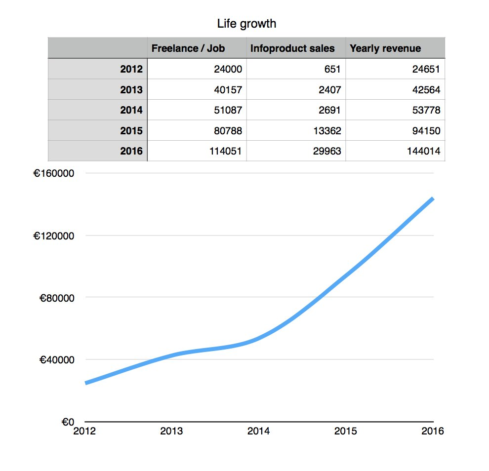
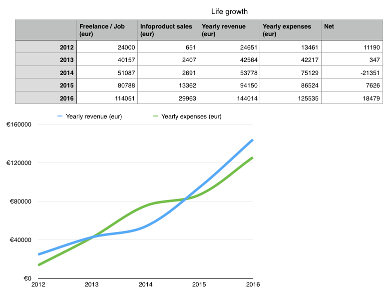

> I would say don't take advice from people like me who have gotten very lucky. We're very biased. You know, like Taylor Swift telling you to follow your dreams is like a lottery winner telling you, "Liquidize your assets, buy Powerball tickets, it works!" - Bo Burnham

I may not be Taylor Swift or Bo Burnham, but the last four years went pretty damn well. Some luck, some talent, a lot of fuck-it-let's-try backed by a sense of _"Oh yeah, I def know what I'm doing"_. Sometimes I even believed myself.  Oh, and I have a big ego. That helps. Before we begin, I want you to keep one thing in mind: this is not advice. This is a _”Here are the lottery numbers that worked for me…”_ kind of story. The things that worked for me might not work for you. In fact, they _probably_ won't work for you. But you should try anyway. Some of it might even be a good idea. The point of this article is to show you that it's possible. You _can_ double your income every year for four years in a row, even if you're not Taylor Swift or Bo Burhnam or Pewdiepie or &lt;insert your fav lucky bastard>. Even if you dropped out of college, got held back a year in high school[1](#fn1), and come from a country where the [average engineer makes just 20k/year](http://www.salaryexplorer.com/salary-survey.php?loc=2240&loctype=3). Those were the cards I was dealt. Yours might be better.  Our story begins in September 2012. I had just failed two classes yet again, for the fifth or sixth time in four years of trying. How hard can it be to memorize a [CPU pipeline](<(https://en.wikipedia.org/wiki/Pipeline(computing)>) or two? ? I even had a special tattoo planned for when I passed. But I didn't pass. So I dropped out of college two credits short of a master's degree in computer science[2](#fn2). I became a 25-year old unemployed college dropout living with his mum and sister. The [stoner comedy](https://en.wikipedia.org/wiki/Stoner_film) writes itself. To be fair, the average Slovenian guy moves out at 31, according to [this report](http://www.un.org/en/development/desa/population/events/pdf/expert/17/IACOVOU_Leaving%20Home.pptx). So I wasn't _that_ bad. But I remember one night at a bar, with a table full of absinthe cocktails, a friend said something like _"Dude, you're always so broke. Why don't you just get a job?"_. Truthfully? Because I didn't want one.

* * *

## Freelancing / consulting

For the last two years of my college career, I was freelancing as a software engineer on the side. My blog got good traffic, and the HackerNews frontpage [3](#fn3) was kind to me. I put up a _"Need a freelancer? Email me"_ link. It worked pretty well, and in September 2012, I went full-time with one local client lined up. I started with two goals in mind: focus on freelancing for US startups and only do things that interested me. Of course, all my US gigs dried up just a few months before going full-time. Focusing on exams for 2 months does that. Oops. Web scraping for a local company was fine, too. Then somebody needed an MVP, and that was much more fun. That year, I made €5,540. The government extrapolated that to a full year’s pay and charged me taxes on the €22,160 that I didn't have. That was fun. But I followed [@patio11's](https://twitter.com/patio11) advice and pushed my luck with every new client. First it was €150/day, then €200, then €250. Then that turned into €1500/week.

> **Lesson:** When a client says _"YES! LET’S DO IT!”_ instead of _"Oof! Well, we need you, so let’s do it,”_ you're leaving money on the table.

Life was great until it wasn't. In 2014, I found myself clientless in the San Francisco Bay Area. My blogging was sporadic and lame, and traffic had dwindled. Instead of sending _"Nope, I don't have time"_ emails every week, I was hoping someone, anyone, would send me any type of gig at all. An old friend remembered me, and I took the only gig I could find: keeping a jQuery and Angular monster alive for $180/day. It was a step down from what I considered my rate, but landlords don't take promises as payment. Even in the _"I'll be rich next year!"_ capital of the world.

> **Lesson:** Don't run out of money. It will make you a bad freelance consultant. You'll take gigs that don't fit, and say _yes_ instead of giving advice.

I kept looking, and soon I had another gig: developing an email-server-on-device MVP for a young startup. That was fun, and it paid $300/day at first, then $450. A magnificent rate! But because of the other gig, I could only do 2 days/week. _And_ they never paid on time. So I had two side-by-side gigs, and I was constantly stressed. Each gig was a liability for the other, and much stress was put into bridging late payments with my credit card. Turns out $1300/week is not that much in San Francisco. That year, I went $-21,351 into the hole. Guess I had savings from 2013? ¯\\\_(ツ)\_/¯

> **Lesson:** When you have a client that pays 2x of another client… maybe take the hint? Focus.

But I needed both clients to avoid a clientless situation in case one of them flopped. One paid little, but at least it was on time. One paid plenty, but it was ALWAYS late. Neither felt secure. See how running out of money makes you a bad freelancer? I kept looking. Then I fired myself from both those clients in December 2014. A friend needed help on a gig. It was $320/day, stable, it paid on time, and it was a great reference by association. I became a Google subcontractor. I'm still not sure if I’m technically allowed to say that. They were always weaselly about it. ? 6 months later, I quit. Or I got poached. A bit of both, I guess.

* * *

## The _Job_ job

One of my old clients had secured some real funding, and they wanted me back. But only if I agreed to a _Job_. As terrifying as this was, I said yes anyway. They offered $30k more than the Google subcontracting gig, an [O-1 visa](https://swizec.com/blog/how-i-got-a-visa-normally-reserved-for-nobel-laureates/swizec/6767), less stress, and shares that might actually be worth a damn. I don't usually put much stock (heh) in startup shares, but sometimes, on very special occasions, they do look promising. But only if the base offer without shares is also good enough. We started with technically-contracting: I had to come to the office every day at 10am, they offered a free laptop (to which I said no [4](#fn4)), and every month I sent an invoice. I had to handle the taxes and stuff. After my one-year cliff – June 2016 – we switched to _Job_ job. I’m talking about taxes, health insurance, dental, vision, the works. It was everything you hear about in the movies. I'm not used to caring about these things because in Europe, they're legally mandated and cannot count as perks. Even lunch and transportation money is a legal requirement. All those great "perks" that Silicon Valley companies offer are the legally mandated baseline in Europe. Fun. They also gave me a small raise, which was nice because my new post-tax income was now smaller than before. Slovenian business taxes are lower than Californian income taxes. I also learned that due to [nexus reasons](http://quickbooks.intuit.com/r/taxes/what-is-nexus-and-how-does-it-affect-your-small-business/), I owed some $20,000 to the US taxman. That was real great to find out. ?

> **Lesson:** If you feel like you’re making WAY too much money, you might be forgetting about taxes somewhere. The taxman is forgiving and lets you pay later, but he makes you pay 5% more.

Having a _job_ job isn't as bad as I thought it would be. I still think [offices are where work goes to die](https://swizec.com/blog/why-offices-are-where-work-goes-to-die/swizec/6695), but as bad as it is for personal productivity, it's great for the productivity of the company as a whole. I should write about that some day ? We've built some amazing things in the last year and a half. AND because it's a _job_ job, it's doubleplus unstressful. I have nights and weekends now! Time and headspace to focus on the side hustle. ??

> **Lesson:** It's easier to build one business at a time than it is to build two. Products and consulting don't mix as well as you'd think.

* * *

## The side hustle

That's how I 4.7x-ed my freelance/consulting/job life. Now… how did I 46x the side hustle? Damn, I've never calculated that number before ? In 2012, the products side hustle was largely nonexistent and somewhat neglected. I published the first version of [Why Programmers Work at Night](https://leanpub.com/nightowls) in November and put a link on my blog. I probably also posted the link on Reddit and HackerNews. The pricing was dumb. Records show I asked for $3+. ? That year, I made €650 in sales and was absolutely ecstatic at the fact that you can make money when you're not even doing anything. **That was so cool!**

> **Lesson:** Sell products. It doesn't matter how much you feel comfortable charging. Just do it. The feeling of making money, any money, [passively _is amazing_](https://swizec.com/blog/switch-to-products/swizec/6812).

Over the next two years, I worked on improving _Why Programmers Work at Night_, built a [landing page](http://nightowlsbook.com/), increased the price, and experimented with Google Ads. Nothing worked too well. I essentially stopped working on it as my freelancing picked up. _Some day_, I intend to finish it. It does have potential. I know it. In 2012, Packt also asked me to write [Data Visualization with D3.js](https://www.packtpub.com/web-development/data-visualization-d3js) based on my "expertise" from a single article. I said, “Fuck it, why not?” and the book was published on my 26th birthday in 2015. That was fun. And by the publish date, I hated the book so much that I didn't even write a "Yay, the book is here!" blogpost. I think. The only marketing I did was to add it to D3's github page. You'd think publishers would do shitloads of marketing. Especially when the author gets only 6%… I was wrong.

> **Lesson:** If you spend a year making a thing, market the shit out of that thing. Nobody else is gonna do it for you.

But hey, passively making a couple grand ain't bad at all. It saved my ass plenty of times during the bridge-gaps-with-credit in 2014.

> If you wrote something for which someone sent you a check, if you cashed the check and it didn't bounce, and if you then paid the light bill with the money, I consider you talented. - Stephen King

Then, in the spring of 2015, a friend of mine wanted to learn React. He said to me on IRC: _"Dude, you should write a React book. Nothing big, just something to help me get a quick feel."_ Challenge accepted! I will learn React, and I will write a book _in a month_.  Two months later, [React+d3js](https://swizec.com/blog/how-a-book-i-wrote-in-two-weeks-made-4000-in-its-first-month/swizec/6675) was born, and I made some $4,000. Great success! Learning from my earlier books, I:

-   had a launch mailing list of 200 or so people
-   made a landing page
-   focused marketing on _"You need this because"_ and not on _"I made this and need sales"_

That last part is key. The more you understand _why_ people need what you made, the better it's gonna go Reading [Nathan Barry's Authority](http://nathanbarry.com/authority/) before the launch was paramount. I probably would have fucked it up completely without his lessons. Thanks, Nathan. The mailing list helped, too. Having even 10 people eagerly anticipating what you're launching is fantastic. It’s so much more motivating than 0 people. 2015 mostly went towards reviving this blog, experimenting with Facebook Ads, learning about Drip campaigns, and building an automated sales funnel. We made some $15,000 in sales if you count the [React Indie Bundle](https://swizec.com/blog/react-indie-bundle-report-or-how-we-made-31k-in-a-week/swizec/6762) as well. I say _we_ because towards the end of 2015, I hired an editor. He makes my articles better, and he helps with the publishing process. Especially once I learned how to leverage him properly. These days, I write a thing, throw it over to him, and he handles everything. He polishes the content, adds pictures, puts it on the site, makes a Facebook post, creates weekly emails, everything. It's really the only reason I'm able to publish so much. He also edits my books :) _P.S.: You should [hire him](http://nerduprising.co/)._ _(Ed. Note: Yes, you should._ ?_)_

> **Lesson:** Automate your sales funnel. Get help. Focus on the things only you can do.

And that's really all we did to double sales in 2016. More content, better content, book updates, drip campaigns, focus on audience building, experiment with referral engines, stuff like that. I wish I had more insight to give, but we really focused on those same basics you learn in all the books and courses for small businesses. Things like [30x500](https://30x500.com/academy/), [10ksubs](http://10ksubs.com/), [microconf](http://www.microconf.com/) talk recordings, and various solopreneur podcasts. That shit works. Do it.

> **Lesson:** Do the work. Little else matters.

* * *

## The flip-side

I lined my pockets green and laughed maniacally all the way to the bank. Ha, I wish. Here's the above graph with the addition of how-much-I-spent. Thanks [Toshl](https://toshl.com/) for making it easy to track.  In the same 4 years that I 6x-ed my income, I also 9x-ed my expenses. I'm really bad with money, and people keep giving it to me! O.o At least I'm not in debt… Seriously though. In 2012, living on my mum's buck, staying in beautiful [Ljubljana, Slovenia](https://en.wikipedia.org/wiki/Ljubljana), I got through the year on just $14,000. That’s not even six months of rent here in San Francisco, not to mention food and utilities. ? Last year, I spent $125,535. I don't even know where that money went. I certainly don't feel like I got much out of all that money. Toshl says $24,850 went for rent, $17,686 for taxes I had to take care of personally, $728 went for my phone bill ?, $5,000 for ads, $3,400 for [my amazing editor](http://nerduprising.co/) and my [wonderful virtual assistant](http://vaelitellc.com) [5](#fn5), $7,700 for asset investments, $4,400 for restaurants, $700 for caffeine ?, $3,000 for taxis and car rentals ?, $3,700 for airplanes, $3,900 for internet SaaS-es ?, $2,700 for clothes, $3,300 for sports ??, $3,100 for tech, and $1,800 for gifts. So I guess that’s where it all went. #transparency What I'm trying to say is that if you grow up without money, it's _really hard_ to learn how to handle money. $10 here, $30 there adds up damn quick.

> **Lesson:** The [hedonic treadmill](https://en.wikipedia.org/wiki/Hedonic_treadmill) is a bitch.

What do I have to show for these 4 years of hustle? An expensive lifestyle and $16,000 in assets.

* * *

## What's next

Can I 6x my income in the next 4 years? Probably not. $864,000/year is crazy talk… But I can try. The job is asymptotically approaching a glass ceiling for a single contributor. Maybe I could break through if I invented some unique IP and licensed it to my employer. That sounds hard I could become a manager or a proper team lead, I guess. That depends on my employer's growth, which is not my card to play. There's growth left in infoproducts. The problem is that I can sense from other people's stories and life paths that infoproducts for a single creator cap out around $100k/year. $200k, if you're lucky. 7 figures if you're [Ramit Sethi](https://iwillteachyoutoberich.com/) or Tony Robins. Capital gains are showing some promise. My startup shares are illiquid for many years to come, but [Wealthfront](https://wlth.fr/) seems promising. I made $514 this year. Even more passively than product sales. Not sure it counts as income though ? Maybe 4x in 4 years? We'll see _PS: if you read this whole post, I'll buy you a beer._

> 2400 words and counting. If anyone reads the whole thing I'll buy them a beer.
>
> — Swizec (@Swizec) [January 9, 2017](https://twitter.com/Swizec/status/818302075595460608)

1.  I had to repeat the 3rd year of high school because my grades were so bad. And I had to take remedial summer exams 3 out of my 5 years of high school. I was a _terrible_ student. Many people told my mum I'm probably just too dumb or undisciplined and should be taken out of schooling and put to work. [↩](#ffn1)
2.  In Slovenia, you have high schools called [gymnasiums](https://en.wikipedia.org/wiki/Gymnasium_(school)). They're 4-year general high schools meant for "advanced placement" kids. You get almost the equivalent education to a college bachelor's degree, but more general. By the time I was in high school this had softened a bit.After a gymnasium, you're meant to go to a 4 year university degree that's the equivalent of a master's. While I was in college, the [Bologna reform](https://en.wikipedia.org/wiki/Bologna_Process) came through. What used to be a 4 year master's equivalent degree got changed into a 3+2. 3 years for a bachelor's, which looks and feels a lot like extended high school focused on a field; 2 years for a master's, which looks and feels a lot like the old system, but more researchey. I flunked into the new system, but was allowed to take both bachelor's and master's classes. The bachelor's were mandatory; the master's were because I already had the prerequisite credits. [↩](#ffn2)
3.  I even sold "get on HN frontpage" as a service to local startups. I charged a whopping $100 per essay :D [↩](#ffn3)
4.  I like using my own computers even at work. The US has strange employee-employer privacy and IP laws. Using your own equipment is one of the easiest ways to protect yourself as far as I know. You also immediately lose the technically-contracting status if you use their equipment. But: IANAL. [↩](#ffn4)
5.  [The editor](http://nerduprising.co/) is more of a publishing mastermind and strategic content helper, and [my VA](http://vaelitellc.com) has so far done a great job of removing inbox anxiety. I'm figuring out how to leverage her skills even more. They also both need more clients so they can afford to keep helping me. Please hire them :) [↩](#ffn5)
