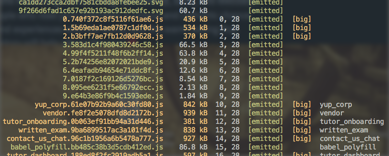
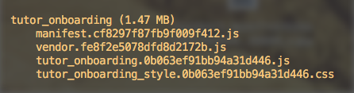

https&#x3A;//twitter.com/erikthedev/status/818990904929349632


Webpack 2.2 has reached [release candidate 4](https://github.com/webpack/webpack/releases/tag/v2.2.0-rc.4), the last pre-release version. Time to update!


My motivation was _"Ugh, I'm tired of these 3min+ local compile times. The amount of waiting is too damn high!"_ The new features are a nice bonus too.


[](https://imgflip.com/i/1hh3ii)


After many days of fiddling, my Webpack is ready. Production compiles take 219 seconds instead of 226, and local dev compilation takes 152 seconds instead of 151. It’s not _that_ worth it, but incremental compiles with Webpack in `watch` mode feel smooth as silk.


I love the new feature that highlights big files and tells you initial load sizes for different apps. I’ve been using it to eyeball different options, and I'm sure it has bigger use cases, too. Fine-tuning code splitting perhaps?








Then again, `rc4` just disabled these features by default "because they're annoying". I liked it.


Webpack recommends keeping files under 250kB, which sounds like a lot, but it looks damn small compared to my code. Did you know 196kB of source ES6 compiles into about 920kB of browser-ready JavaScript? _With_ minification, tree shaking, and dead code elimination! Without that, it's 2.3 megs. ?


The day when we ship raw ES6 code can't come soon enough.


_BTW: Tree shaking removes unused dependencies (like when you \\import a whole library but just use a function or two), and dead code elimination removes code that's unreachable, like functions you never call._


So is upgrading to Webpack 2 even worth it?


Totally. Once they and the ecosystem [resolve some issues](https://github.com/webpack/webpack/issues/2867), tree shaking will ride eternal, shiny and chrome.


Here are some gotchas I discovered while upgrading.


## It's not quiiiiite ready yet (dependency hellish)


You can use Webpack 2 in production. I'm about to start.


https&#x3A;//twitter.com/Swizec/status/819004362231943168


Although now that they’ve promised to release the final version in &lt; 10 days, I might wait. Or gently delay the code review and QA process until their release. We'll see :)


But here's one thing that's really awkward right now.


When you upgrade to Webpack 2.2.rc.x, you fall into a small dependency hell with `extract-text-webpack-plugin`. The released version depends on Webpack 2.1, which is silly. If you're going bleeding edge, you might as well go all the way, ya know?


So here's what you have to do:


```
// packages.json
"dependencies": {
  //...
    "extract-text-webpack-plugin": "git://github.com/webpack/extract-text-webpack-plugin#cbd4690",
    "webpack": "^2.2.0-rc.3"
```


I'd show you the `npm install` command, but I don't know how to point at specific commits. See that `#cbd4690` hash? That's the exact commit that says `Add webpack 2 RC compatibility`.


This is fragile and a terrible idea. You _will_ forget to update this dependency in the future, and it will continue to point at a random commit for the foreseeable future. Happens every time.


_But_ the published version on npm doesn't work. ? I assume they'll fix it for final release.


Why extract-text-webpack-plugin? It makes stylesheet \\imports better, I'm told.


> It moves every require("style.css") in entry chunks into a separate css output file. So your styles are no longer inlined into the javascript, but separate in a CSS bundle file (styles.css). If your total stylesheet volume is big, it will be faster because the stylesheet bundle is loaded in parallel to the javascript bundle.


See? Useful.


You also have to update `babel-loader` to at least `6.2.10`. That's when they added support for Webpack 2 rc. Not too bad.


## Funny config updates, but better docs


The new Webpack 2 docs are _so much better_. Check out this wonderful [Migrating from v1 to v2](https://webpack.js.org/guides/migrating/) official guide. You basically have to do a find & replace, and you're done.


Just don't forget to take `''` out of `resolve.extensions`. I don't remember why everyone needed that in the past, but I know that the new Webpack throws an error.


Error reports for bad configuration are also better now. That was fun to see. Loved it.


## CSS/Less and PostCSS plugin


If you're not using Webpack to load CSS and compile Less or Sass, you should. It's made my life a lot easier. Especially the [PostCSS](https://github.com/postcss/postcss) plugin makes your CSS easier to write.


Going from Webpack v1 to Webpack v2 involved many changes in this config. We used to have this:


```
// webpack.config.js
loaders: [
    // ...
        {
        test: /\.(less|css)$/,
        loader: ExtractTextPlugin.extract("style/useable", "css?sourceMap!postcss-loader!less-loader?sourceMap=true"),
        include: [
            path.resolve(__dirname, "app/assets/stylesheets")
        ]
    },

    {
        test: /\.css$/,
        loader: ExtractTextPlugin.extract("style/useable", "css?sourceMap!postcss-loader?sourceMap=true")
    },
    // ...
],
postcss: function () {
    return [
        precss,

        // UglifyJSPlugin mangles valid css during minfication. It is a known issue and this fix was obtained from: https://github.com/webpack/webpack/issues/666#issuecomment-184319770
        postcssImport({ addDependencyTo: webpack }),
        postcssURL(),
        postcssNext({
            browsers: ['last 2 versions', 'ie >= 9'],
            compress: true
        }),
        cssnano({zindex: false})
            // end UglifyJSPlugin fix
    ];
}
```


Which is probably too much config, but it worked. With Webpack v2 that's become more manageable and looks like this:


```
// webpack.config.js
    module: {
        rules: [
            {
                test: /\.(less|css)$/,
                use: [
                    ExtractTextPlugin.extract({
                        fallbackLoader: "style/useable",
                        loader: "style-loader"
                    }),
                    {
                        loader: 'css-loader?sourceMap',
                        query: {
                            modules: true,
                            \importLoaders: 2
                        }
                    },
                    'postcss-loader?sourceMap',
                    'less-loader?sourceMap'
                ]
            },
        ]
    },
```


So much less code ?


That's because a lot of it is now in a different file called `postcss.config.js`. That one is a copypaste of the detailed config for postcss itself:


```
const webpack = require('webpack')

module.exports = {
    plugins: [
        // UglifyJSPlugin mangles valid css during minfication. It is a known issue and this fix was obtained from: https://github.com/webpack/webpack/issues/666#issuecomment-184319770
        require('postcss-\import')({ addDependencyTo: webpack }),
        require('postcss-url'),
        require('postcss-cssnext')({
            browsers: ['last 2 versions', 'ie >= 9'],
            compress: true
        }),
        require('cssnano')({zindex: false})
            // end UglifyJSPlugin fix
    ]
}
```


I don't know if the `UglifyJS` bug we're working around still exists, so I left the config as I found it. Just to be safe.


Looking at code blobs is hard, so here's what happened:


1. Webpack 2 no longer allows plugin-specific config keys like `postcss`. Everything must fit in the `rules.use` listing.
2. PostCSS now uses a separate config file called `postcss.config.js`. This works out of the box.
3. I removed separate rules for compiled and uncompiled CSS.
4. Everything goes in the `rules.use` array.
5. **Use rules evaluate last to first.**
6. First, we use `less-loader` to compile Less to CSS.
7. Then, we use `postcss-loader` to do the PostCSS changes.
8. Then, `css-loader` enables `\import css from 'file.css'`.
9. Finally, `ExtractTextPlugin` puts it in `<style>`.


All of this used to be encoded in the loader bang syntax before: `css?sourceMap!postcss-loader!less-loader?sourceMap=true`


Whomever came up with the `use: []` syntax, you're the best. I love the new approach.


## Tree shaking and optimization


Now for the reason we're all here: tree shaking.


Webpack 2 understands native ES6 \\imports and uses them as split points. That means it can organize your code into different chunks so you're only loading the JavaScript that you're using.


What it _also_ means is that it understands when you're \\importing more than you need. Combined with the [UglifyJsPlugin](https://www.npmjs.com/package/webpack-uglify-js-plugin), it can eliminate that extra code.


I spent a lot of time looking for what exactly turns this feature on. Turns Out™, it's on by default. Just Works™.


Here's what you have to do:


1. Tell Babel _not_ to compile \\imports into CommonJS (require stuff)
2. Enable UglifyJS


```
// webpack.config.js
rules: [
    {
        test: /\.js$/,
        include: [
            path.resolve(__dirname, "app/assets/javascripts")
        ],
        exclude: [
            path.resolve(__dirname, "node_modules/")
        ],
        query: {
            plugins: ['transform-decorators-legacy',
                      'transform-runtime',
                      'transform-object-rest-spread',
                      'transform-react-constant-elements',
                      'transform-class-properties'],
            presets: [['es2015', {modules: false}], 'latest', 'react']
        },
        loader: 'babel-loader',
    },
]
// ...
plugins: [
    new webpack.optimize.UglifyJsPlugin({
        compress: {
            warnings: false,
            screw_ie8: true,
            conditionals: true,
            unused: true,
            comparisons: true,
            sequences: true,
            dead_code: true,
            evaluate: true,
            join_vars: true,
            if_return: true
        },
        output: {
            comments: false
        }
    }),
]
```


See that `{modules: false}` in the `babel-loader` config? That's new. You can specify options when defining Babel plugins and presets.


`modules: false` tells the `es2015` preset to avoid compiling `\import` statements into CommonJS. That lets Webpack do tree shaking on your code.


UglifyJsPlugin without extra config will do what we need, but I wanted to show you the options. It's `unused` and `dead_code` that enable tree shaking.


**However**, we have to wait for the ecosystem to catch up. Most libraries are distributed with ES6 modules compiled to ES5, so in a real world scenario, [you only get about 4% improvement](https://github.com/webpack/webpack/issues/2867#issuecomment-271802246). ?


With Webpack 2 around the corner, this is sure to improve. Can't wait!


You should also split your code into Your Code and Everybody Else's code. Webpack docs have a great guide on [Code Splitting for Libraries](https://webpack.js.org/guides/code-splitting-libraries/).


Happy hacking ?