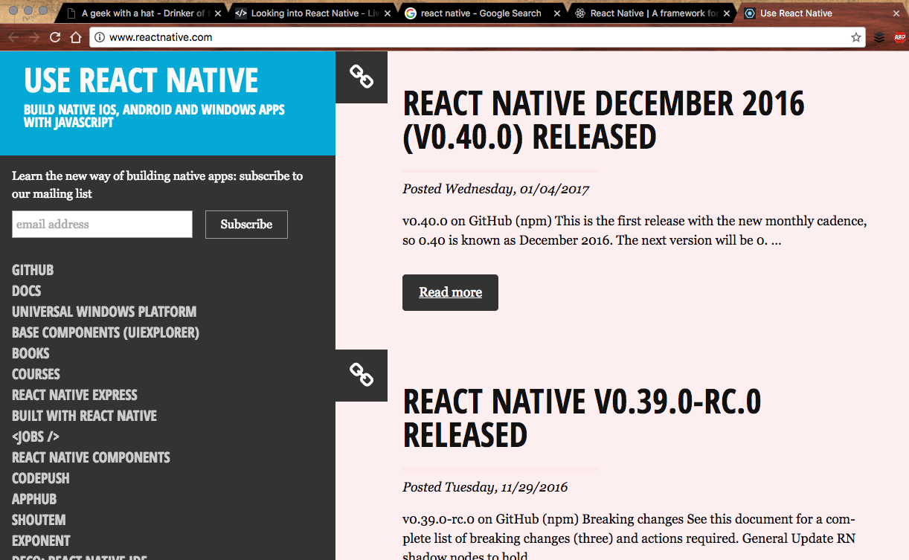
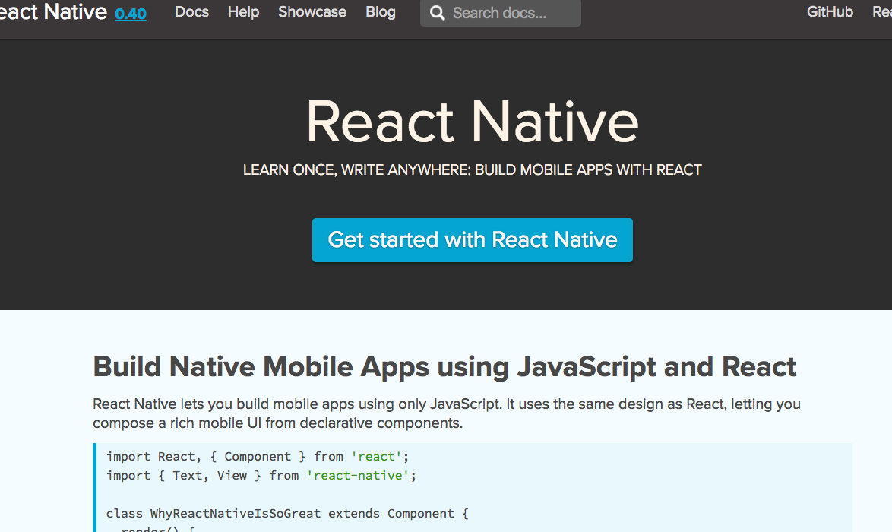
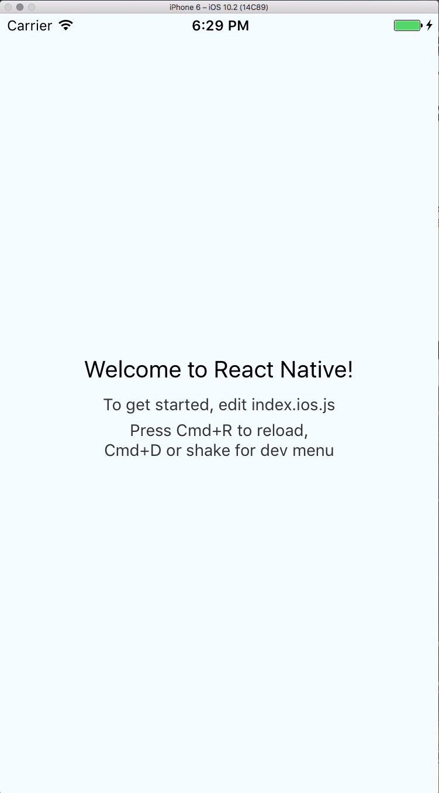
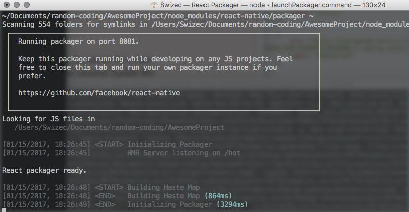

_This is a Livecoding Recap – an almost-weekly post about interesting things discovered while livecoding ?. Always under 500 words and with pictures. You can follow my channel, [here](https://livecoding.tv/swizec). New streams almost **every Sunday at 2pm PDT**. There’s live chat, come say hai ?_  After many weeks without Livecoding, we hung out again – all 10 of us. It was great ☺️ I dipped my toes in React Native and got some help from @nashio and @blackburn1911. They've done it before or had better luck with Google. Both? We built a Hello World app that lets you browse through 6 of my Instagram photos. Tap on the right to go _next_, tap on the left to go _previous_.  Sure, it would be more intuitive to swipe, but Snapchat uses taps for going back and forth in stories, and that's my excuse. I also don't know how to make swipes. The funny thing about starting with React Native is that googling `react native` gives you two big results. [The official documentation](https://facebook.github.io/react-native/) and [reactnative.com](http://www.reactnative.com/). I clicked reactnative.com and got confused immediately.  Okay, the new release cadence is monthly. Great! But how do I start using this thing? What do I do next? How do I begin? Do I need Xcode? Can I develop in a normal editor? Should I download a specialized IDE? WHAT DO I DO? Then I tried the official docs.  `Get Started With React Native`. That looks promising! And boy, was it ever. Turns out™ you don't need much to start: `node`, `watchman`, and `react-native-cli`. Docs say `watchman` isn't mandatory, but it makes life better. ¯\\_(ツ)\_/¯_ You need Xcode for the iOS simulator. If you're doing Android, you'll need that simulator, too. Then you run `react-native init NativeHelloWorld`, and it creates a bunch of things that I don't understand. When you run the simulator with `react-native run-ios`, a simulator shows up with your new app.  Simulators, it turns out, are huge. Even on my big fat Apple Thunderbolt display. Maybe I should get one of those new 4K monsters ? Running `react-native run-ios` also opens a terminal with something called React Packager. Don't know what it is, but it looks necessary. I assume it's a compiler.  Poking around the React Native API was fun, and we learned a few things:

1.  There's no `onClick`. To detect tap events, you should wrap components in `TouchableHighlight`, which takes one and only one child element. I think this is silly.
2.  Styling happens through the `style=` prop. There's no CSS. Or at least the project initiating script heavily promotes avoiding stylesheets.
3.  Layouting through Flexbox is encouraged. I assume you can do whatever you want, and Flexbox is the Best Practice™.
4.  If you use hot loading and add `state`, you have to reload the app. Otherwise, `render()` gets called without `state` getting initialized. That was a fun gotcha.
5.  Images don't size themselves. Without sizing, they're invisible.
6.  Debugging happens in a browser window, not the simulator. This feels funny.

Overall, I'm impressed with how easy it was to get started. If you know React, you should be able to build cool stuff. Now we’ve just gotta figure out why `index.android.js` is separate from `index.ios.js`, learn more mobile development principles, then get an interesting project to poke at. Ideas?
