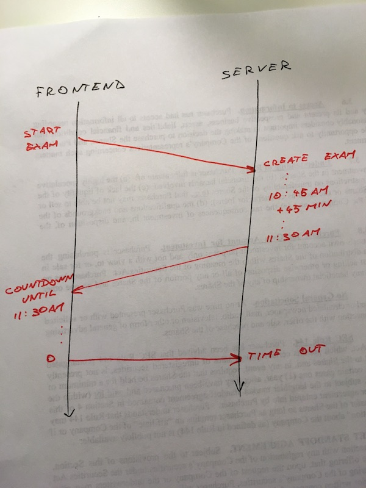
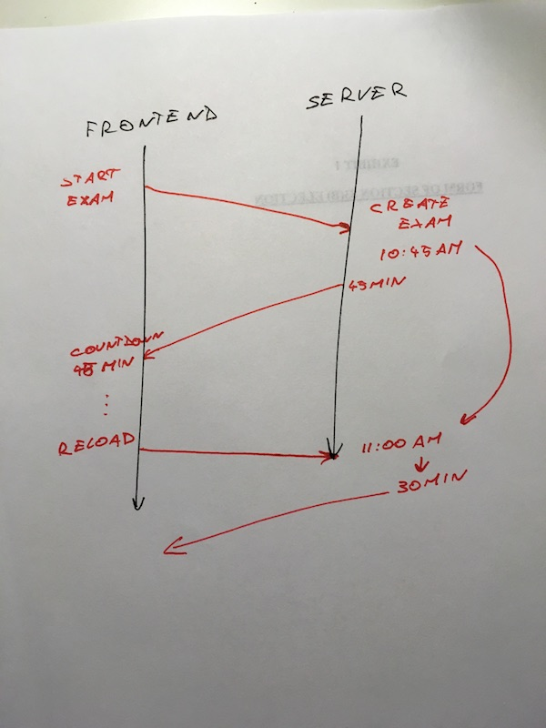

> Yo Swiz, some users complained their exam ends immediately.


> Hm… that's weird ?


So began my two day hunt for a bug.


To become a [Yup tutor](https://www.yup.com/become-tutor), you have to pass a subject exam: 25 questions about math, chemistry, or physics in 45 minutes. It's hard as hell; I tried.


There's a timer in the corner ticking down. 45 minutes, and then you're done. A dialog shows up telling you time’s up. Easy peasy to build, right? Get a start time, add 45 minutes, count down. When timer hits zero, stop. 90% of the time, it works every time.


And then there’re _those_ 7 people. For them, the timer hits zero 1 second after it starts. 45 minutes. Tick. Zero.


o.O


I looked through the code. No race conditions. You click Start, the server creates an exam, makes a `started_at` timestamp, adds 45 minutes, and tells the frontend when your exam should end. On every [Clock tick](https://swizec.com/blog/modeling-time-react/swizec/7200), the counter updates ,and a MobX observer checks if you're out of time.





Very straightforward.


We're using React and MobX, so the frontend behaves like a state machine. There's no way we're rendering stale views, no way for poorly garbage collected views to cause problems, and the more I played with the frontend state machine, the sturdier it looked.


Here's an excerpt:


```
class SubjectExam {
    constructor(user, subject) {
        when(() => this.isOutOfTime,
             () => {
                 if (!this.finished) {
                     this.finish();
                 }
             }
        );
    }
    
    @computed get isOutOfTime() {
        return !_.isNull(this.timeLeft) && this.timeLeft <= 0;
    }
    
    @computed get timeLeft() {
        if (this.should_end_by) {
            return moment.duration(moment.unix(this.should_end_by).diff(Clock.time));
        }else{
            return null;
        }
    }
}
```


MobX's `when` creates an autorun that checks the condition function, `() => this.isOutOfTime`, every time its value changes. When it evaluates to `true`, it runs the given function. In this case, that’s an action that finishes the subject exam.


The reason this works is hidden in `@computed timeLeft()`. It depends on `Clock.time`, which is a global MobX store that updates every second. It’s based on my [Modeling time in React & MobX](https://swizec.com/blog/modeling-time-react/swizec/7200) approach.


Diffing the server-provided `should_end_by` timestamp and `Clock.time` tells us how much time is left. It works great and produces a countdown timer when you add some rendering.


The nice feature of this approach is that the timer is stable. You can refresh and navigate the page as much as you want. The server calculates the time, so it doesn't care.


But… those 7 people… why was the time up after 1 second? Can you guess?


I found no pattern in who the applicants were, when they took the exam, what timezone they were in, or which browser they used. It's not a bug in MomentJS. None of the cases happened around a DST, day, month, or year boundary.


_It should work._


?


The only remaining explanation is that their system time was waaaaaayyy in the future. More than 45 minutes. I don't know why their computers thought they were in the future, but it's the only explanation that works.


How do you fix it?


You don't rely on user time. Instead of calculating a `should_end_by` timestamp on the server, calculate the delta. Look only at the delta when doing a countdown.


Like this:





The exam starts, the server looks at current time and returns `45min`. User reloads, server looks at current time, calculates delta from start time, returns new time remaining.


On the frontend, you create a local `shouldEndAt` timestamp when you load the exam – `time + delta_from_server` – then count down from there.


Lesson learned. Time is so hard that you can't even rely on people's clocks being accurate to within 1 hour. Add it to the [Falsehoods Programmers Believe About Time](http://infiniteundo.com/post/25326999628/falsehoods-programmers-believe-about-time) pile.


?