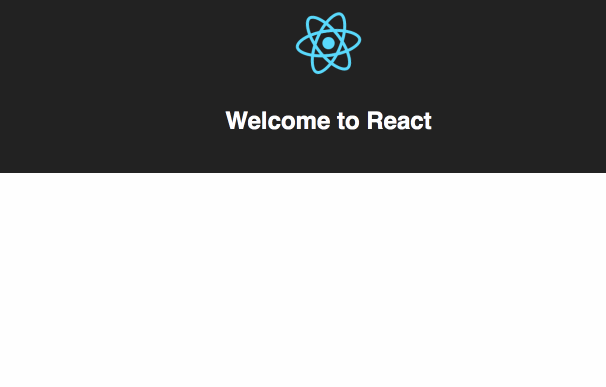
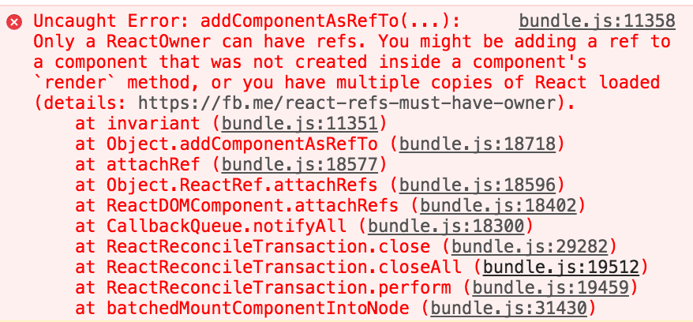

I sat down to write about a rendering technique I use to quickly wrap random D3 code in React components. I call them "blackbox components" because they're a black box.

It's already a chapter in [React+D3v4](https://gumroad.com/l/mTWg) and a [CodePen](https://codepen.io/swizec/pen/woNjVw). How hard can it be to write a post?

Then I thought, _”This is dumb. People shouldn't keep rewriting this. It should be an npm module.”_

So I started making a library.

Then I remembered that [compiling](https://swizec.com/blog/livecoding-19-its-hard-to-package-a-library/swizec/6927) [libraries](https://swizec.com/blog/livecoding-21-use-babel-for-libraries-not-webpack/swizec/6982) sucks.

So I went to copy config files from an [old transition library I did](https://github.com/Swizec/react-transitionable-component). But the files were old and out of date. Possibly copied from a 0.2.x version of `create-react-app`.

Terrible.

So I looked for a `create-react-lib` because the `-app` version creates too much stuff that libraries don't need. Like all the setup for `index.html` and assets and webpack dev and webpack prod and eslint and jest and a default app page and…

Couldn't find one. Used `create-react-app`, ejected, copied config files, removed the parts I don't need.

30 minutes in: no post, no library, but I’ve got the config I need to get started.

So I copied the code from CodePen and cleaned it up and added some \\imports and exports. Made it Real Code™.

Then I thought, _"You know, this technique can work for things that aren't SVG. There's plenty of stuff people might wanna use."_

So I added a version that uses `
` instead of `<g>`.

Then I compiled. `node_modules/babel-cli/bin/babel.js src --out-dir lib`. It worked! ?

Now, how do I test this? ?

So I started writing an example project. Create react app and all of that. `npm link` to use unpublished library. Neat trick, that.

I started with the same axis example from CodePen. `\import BlackboxSvgHOC`, use it to make an `Axis` component, render in an `<svg>`.

Error. Files not found.

Investigate, find a typo in the filename, fix, reload, renders default React app.

Waitaminute! Where's my example axis? How am I gonna add more awesome examples if I can't even load an axis?

Sigh. There's a nasty error in the console. Pretty sure I've never seen that one before.

How do you even debug that? ?

So I went to play Dirt3 for 20 minutes. To regain focus, ya know.

Then I wrote this story. And I wish I was kidding, but it took me an hour. Twitter is distracting.

3 hours after I started: no article, no library, no working code, no example project.

This is [yak shaving](https://en.wiktionary.org/wiki/yak_shaving). Don't do this.