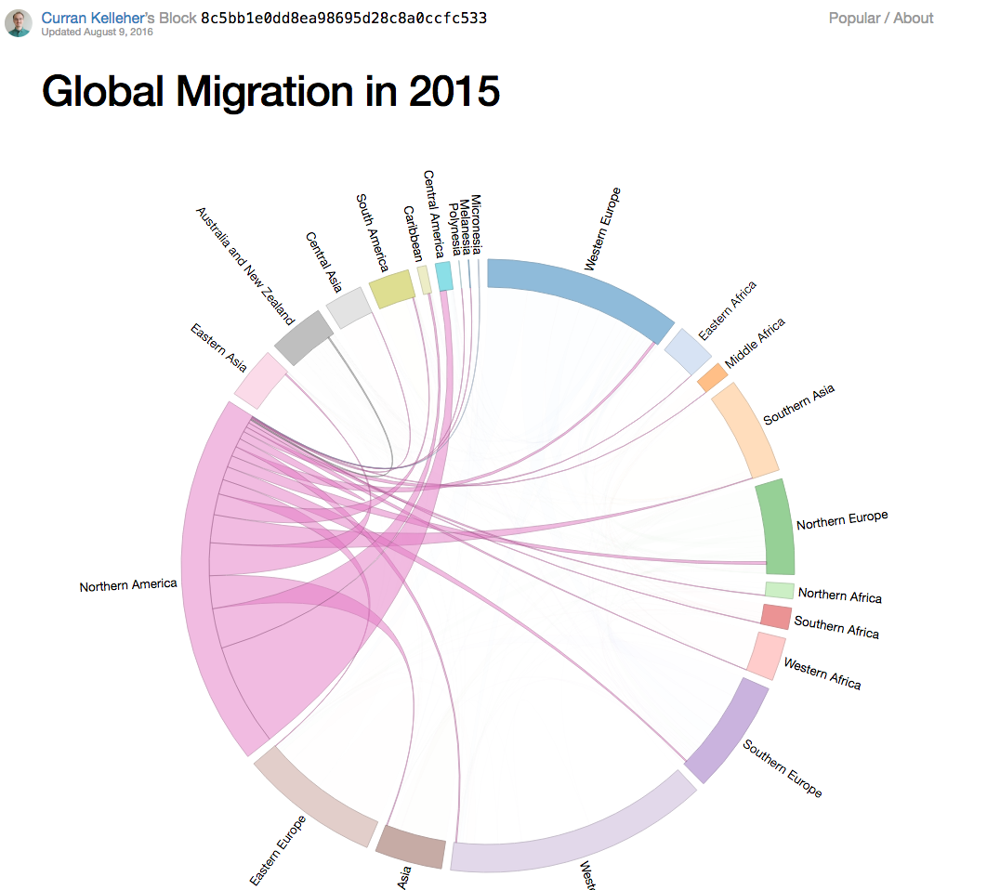
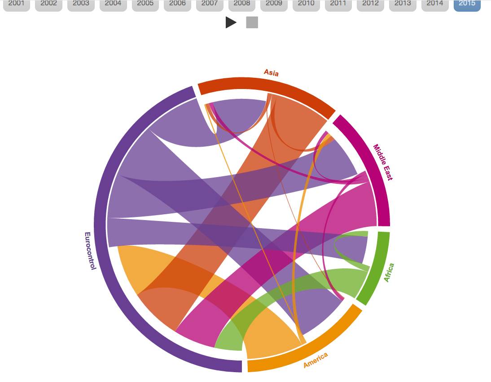

_This is a Livecoding Recap – an almost-weekly post about interesting things discovered while livecoding ?. Always under 500 words and with pictures. You can follow my channel, [here](https://livecoding.tv/swizec). New content almost **every Sunday at 2pm PDT**. There’s live chat, come say hai ?_

There were things happening this weekend that left me glued to Twitter. Distracted and ineffective, I didn't get much done. It shows in the Livecoding session too.

https&#x3A;//twitter.com/Swizec/status/825902085623341058

I'm still deciding whether I want to write about the things that were happening. Maybe I should, maybe I shouldn't, maybe I have nothing useful to add. Who knows… ¯\\_(ツ)_/¯

Completely coincidentally, I wanted to use the Livecoding session to build an immigration dataviz. Something that would show the positive economic impact of immigration, and not just This Is How Many People Came. Numbers are more interesting when coupled with impact.

Did you know that 24,000,000 people immigrated to the US in 2015 alone? That's a bunch of people.

[Curran Kelleher](https://twitter.com/currankelleher) built a great chord diagram of the [UN migrations dataset](https://github.com/curran/data/blob/gh-pages/un/migration/README.md). And there's this cool chord diagram of [flights in and out of United States](http://ansperformance.eu/studies/flows-extra/index.html) that [@espinielli](https://twitter.com/espinielli) built.

I wanted something more. I wanted to build something that shows how many businesses are created by immigrants, how much money is pumped into the economy, and how many people were employed.

I failed. For now.

Those datasets are hard to find. I was able to find a dataset that shows the number of people self-employed, having jobs, or running a business based on race and ethnicity. It's called the [Survey of Business Owners](https://catalog.data.gov/dataset/survey-of-business-owners). It’s collected by the government and released every month, I think.

Then there's the US census [current population survey](http://www.census.gov/data/tables/time-series/demo/income-poverty/cps-pinc.html) which also promised to be useful.

But I was unable to put them together and build a comprehensive dataset that shows what I wanted. Or even mentions it.

Looks like the US government is much more concerned with tracking whether somebody is Black, Asian, Hispanic, White, or a veteran than it is whether they're an immigrant or not. I wonder why… ?

That said, I found two amazing studies talking about what I wanted to show.

This [Immigrant Entrepreneurship](http://www.hbs.edu/faculty/Publication%20Files/17-011_da2c1cf4-a999-4159-ab95-457c783e3fff.pdf) 2016 paper from Harvard is the first. It's 68 pages, so I haven't read it yet.

> We examine immigrant entrepreneurship and the survival and growth of immigrant-founded businesses over time relative to native-founded companies. Our work quantifies immigrant contributions to new firm creation in a wide variety of fields and using multiple definitions. While significant research effort has gone into understanding the economic impact of immigration into the United States, comprehensive data for quantifying immigrant entrepreneurship are difficult to assemble. We combine several restricted-access U.S. Census Bureau data sets to create a unique longitudinal data platform that covers 1992-2008 and many states. We describe differences in the types of businesses initially formed by immigrants and their medium-term growth patterns. We also consider the relationship of these outcomes to the immigrant's age at arrival to the United States.

Sounds perfect, doesn't it?

Except for the _"combine several restricted-access"_. I can't do restricted access.

This [Immigrant Entrepreneurs and Small Business Owners, and their Access to Financial Capital](https://www.sba.gov/sites/default/files/rs396tot.pdf) 2012 paper from SBA tells a similar tale. Their datasets constructed out of restricted-access materials.

Alas, that puts a stop to this project for now. But I'll email the paper authors to see if they're willing to share.