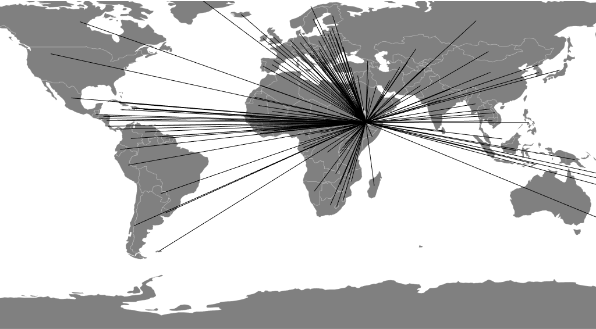

_This is a Livecoding Recap – an almost-weekly post about interesting things discovered while livecoding ?. Always under 500 words and with pictures. You can follow my channel, [here](https://liveedu.tv/swizec). New content almost **every Sunday at 2pm PDT**. There’s live chat, come say hai ?_


You know, it's really hard to compete with the Super Bowl. This Sunday must have been the lowest live coding turnout I've ever seen.


A cumulative of 80 people came to see me live, and that makes me happy, and I still don't know how [liveedu.tv](https://www.liveedu.tv/swizec/) calculates that. It doesn't matter. It's a number, it's not zero, and that's great.


Thanks to [mrmaru](https://www.liveedu.tv/mrmaru/) for teaching me how to jump to the end of line (`$`) and beginning of line (`0`) in Vim. I sure feel dumb for holding the left and right arrow keys for the past 15 years like an idiot. Why didn't I look that up? ?


Together, we talked about not understanding football and built this map:





We're going to make it better next week. I know it doesn't look like much yet.


Our (my?) goal is to build a map of global migrations using the [UN dataset](https://github.com/curran/data/blob/gh-pages/un/migration/README.md) I mentioned [last week](https://swizec.com/blog/livecoding-31-datasets-hard/swizec/7403). Initially, I wanted to build one of those cool maps that change country sizes to represent a value. No idea how to do that. Yet.


Instead we're drawing lines. Because I couldn't figure out how to make curves ?


In my defense, I was tired and dying from a cold.


Right now, you're seeing global migrations _into_ Djibouti. Lines connect `source` migrations to their `destination`. There's nothing about magnitude yet. That comes next week, and I'd love some suggestions on how to do that. Line thickness smells interesting but would probably look weird.


Oh, and the lines are going to be curved. I think what I'm missing is a third point between the `source` and `destination`. Something to give D3's curve `curveBasis` interpolator a reason to make a curve.


Right now we're rendering the migrations layer as a React component, like this:


```
const Migrations = ({ topology, projection, data, nameIdMap }) => {
    const countries = topojson.feature(topology, topology.objects.countries),
          path = d3.geoPath(projection),
          centroids = _.fromPairs(countries.features
                                           .map(country => [country.id,
                                                            path.centroid(country)]));


    return (
        
            
        
    );
};

const CountryMigrations = ({ data, nameIdMap, centroids }) => {
    const line = d3.line()
                   .curve(d3.curveBasis),
          destination = centroids[data.id];

    console.log(data.name);

    const sources =  Object.keys(data.sources)
                           .filter(name => centroids[nameIdMap[name]])
                           .map(name => centroids[nameIdMap[name]]);
    return (
        
            {sources.map((source, i) => (
                
             ))}
        
    )
};
```


The `Migrations` component builds a dictionary of country centroids, which gives us a cached mapping from country `id` to country centroid position. We use these as line anchors.


Then we iterate through the list of countries and render `CountryMigration` components. Well, in theory. There's just one `CountryMigration` right now, so it's easier to debug.


Each `CountryMigration` component creates a `d3.line` generator, compiles a list of `sources`, then iterates through them and adds `path` elements for each line. As you can see, this works, but it doesn't make curves because a curve between two points is a straight line.


That sounds stupidly obvious when I say it out loud ?


Join me next week as we curve the curves, add animation to represent migration volume, and maybe some interactivity. Mouseovers could filter countries? Perhaps.