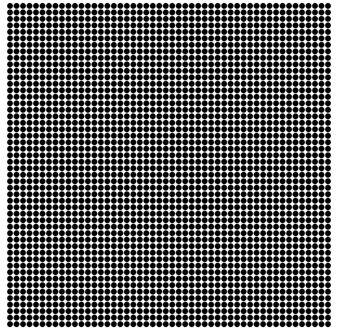
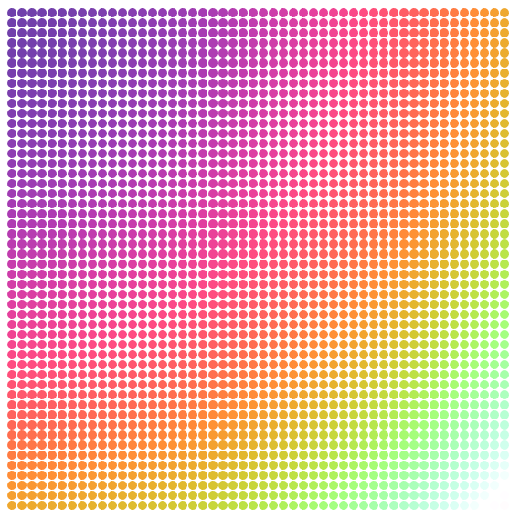
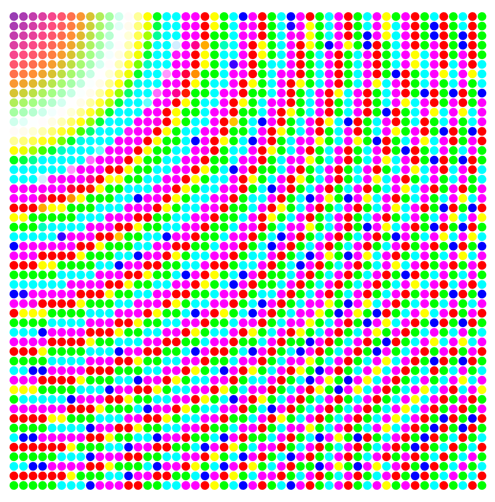

Remember that [dancing fractal tree](https://swizec.com/blog/animating-svg-nodes-react-preact-inferno-vue/swizec/7311) from December? That was built using what I like to call The Rich Animation Technique. TRAT for short.


Yes, I just came up with that. You might know of it as the "game loop" principle, or recalculate-redraw. It's how React's engine works.


When applied to animation, TRAT follows the idea that, if you update props 60 times per second and trigger a React re-render every time, animation happens. It's kinda crazy that it works so well, but work it does.


It's a spectacular approach when you need fine-grained control like making a dragged node follow the mouse or running an entire [Space Invaders](https://github.com/Swizec/space-invaders) game.


But TRAT is annoying when you don't want or need fine control. When you just want a tiny animation that does a thing and doesn't bother you with the details, it’s a bit cumbersome.





Pretty, isn't it? ?


It's a 50-by-50 field of black SVG `<circle>` elements. On mouse over, a D3 transition takes over and increases a circle's radius to 20, then back down to 5. While that's happening, we switch on colorization to make it pretty.


Colors come from D3's [`interpolateWarm` scale](https://github.com/d3/d3-scale) laid out in a radial pattern. The radial pattern is high school math. Let me show you.


You can play with the code on CodePen, tweak params, try the dancing rainbow snake. I think it looks like a snake… also, I love emergent patterns like this. Transition each circle individually, and it looks like a connected blob.


\[codepen_embed height="659" theme_id="0" slug_hash="QdVoOg" default_tab="js,result" user="swizec" editable="true" data-editable="true"]See the Pen [React D3 transition animation - rainbow field](http://codepen.io/swizec/pen/QdVoOg/) by Swizec Teller ([@swizec](http://codepen.io/swizec)) on [CodePen](http://codepen.io).\[/codepen_embed]


We have two components: `App` and `Dot`. App sets up the grid of dots, and `Dot` handles each circle's transitions and coloration.


I tried adding a fly-in transition as well, but [ReactTransitionGroup](https://facebook.github.io/react/docs/animation.html#low-level-api-reacttransitiongroup) dies on 2500 nodes. ? I have a video of that fail somewhere on snapchat.


## App


The App component needs only a `render` method that returns an SVG.


```
  render() {
    const width = 600,
          N = 50,
          pos = d3.scalePoint()
                  .domain(d3.range(N))
                  .range([0, width])
                  .padding(5)
                  .round(true);
    
    return (
      
        {d3.range(N).map(x => 
           d3.range(N).map(y =>
             
        ))}
      
    )
  }
```


We're rendering a 600px-by-600px SVG with 50 nodes per row and column. We use D3's `scalePoint` for dot positioning because it does everything we need. Makes sure they're evenly spaced, gives them padding on the sides, and ensures coordinates are rounded numbers.


Here's a diagram of how `scalePoint` works:


To render the grid, we use two nested loops going from 0 to N. `d3.range` builds an array for us so we can `.map` over it. We return a `` component for each iteration.


Looking at this code: `x={pos(x)} y={pos(y)}`, you can see why D3 scales are so neat. All positioning calculation boiled down to a 1-parameter function call. \\o/


## Dot


The Dot component has a few more moving parts. It needs a `constructor`, a transition callback – `flash`, a `color` getter, and a `render` method.


```
class Dot extends Component {
  constructor(props) {
    super(props);
    
    this.state = Object.assign({}, 
                               props,
                               {r: 5});
  }
  
  flash() {
        // transition code
  }
  
  get color() {
    // color calculation
  }
  
  render() {
    const { x, y, r, colorize } = this.state;
    
    return 
  }
}
```


We initialize state in the component `constructor`. The quickest approach is to copy all `props` to `state`, even though we don't need all props to be in state.


Normally, you want to avoid state and render all components from props. Functional principles, state is bad, and all that. But as [Freddy Rangel](https://twitter.com/frangel85) likes to say _"State is for props that change over time"_.


Guess what transitions are… props that change over time :)


So we put props in state and render from state. This lets us keep a stable platform while running transitions. It ensures that changes re-rendering `Dot` from above won't interfere with D3 transitions.


Not super \\important in our particular example because those changes never happen. But I had many interesting issues in this [animated typing example](https://swizec.com/blog/using-d3js-transitions-in-react/swizec/6797).


For the `render` method, we return an SVG `` element positioned at `(x, y)`, with a radius, an `onMouseOver` listener, and a style with the `fill` color depending on `state.colorize`.


### flash() – the transition


When you mouse over one of the dots, its `flash()` method gets called as an event callback. This is where the transition happens that pops the circle bigger, then back to normal size.


```
  flash() {
    let node = d3.select(this.refs.circle);
    
    this.setState({colorize: true});

    node.transition()
        .attr('r', 20)
        .duration(250)
        .ease(d3.easeCubicOut)
        .transition()
        .attr('r', 5)
        .duration(250)
        .ease(d3.easeCubicOut)
        .on('end', () => this.setState({colorize: false}));
  }
```


Look at those triple-nested anonymous callbacks. Does it give you shivers? It's okay for small experiments, but don't do it too much in real code. [Callback hell](http://callbackhell.com/) is real.


Here's what happens:


1. We `d3.select` the `` node. This enables D3 to take over the rendering of this particular DOM node
2. We `setState` to enable colorization. Yes, this triggers a re-render.
3. We start a `transition` that changes the `r` attribute to `20` pixels over a duration of `250` milliseconds.
4. We add a `easeCubicOut` easing function, which makes the animation look more natural
5. When the transition ends, we start another similar transition, but change `r` back to `5`.
6. When _that_'s done, we turn off colorization and trigger another re-render.


If our transition didn't return things back to normal, I would use that `'end'` opportunity to sync React component state with reality. Something like `this.setState({r: 20})` or whatever. Depends on what you're doing.


### get color() – the colorization


Colorization doesn't have anything to do with transitions, but I want to explain how it works. Mostly to remind you that high school math, which you thought you'd never use again, is useful.


Here's what the colored grid looks like:





Colors follow a radial pattern even though `d3.interpolateWarm` takes a single argument in the `[0, 1]` range. We achieve the pattern using circle parametrization.


`x^2 + y^2 = r^2`


Calibrate a linear scale to translate between `[0, maxR^2]` and `[0, 1]`, then feed it `x^2 + y^2` and you get the `interpolateWarm` parameter. Magic :)


```
  get color() {
    const { x, y, maxPos } = this.state;
    
    const t = d3.scaleLinear()
                .domain([0, 1.2*maxPos**2])
                .range([0, 1]);
    
    return d3.interpolateWarm(t(x**2 + y**2));
  }
```


We calibrate the `t` scale to `1.2*maxPos**2` for two reasons. First, you want to avoid square roots whenever possible because they're slow. Second, adding the `1.2` factor changes how the color scale behaves and makes it look better.


For example, here it is with a factor of 0.05:





Play around and try different color scales, too. :)


## Potential improvements


There are a bunch of things we could've done in this example but didn't. One of them is the radius parameter.


We really should have taken the `r` parameter in as a property on `<Dot>`, saved it in state as a, say, `baseR`, then made sure the transition returns our dot back to that instead of a magic `5` number. Avoid peppering your code with random numbers.


Another improvement could be rendering more circles to provide a tighter grid. That doesn't work so well on CodePen, however.


https&#x3A;//twitter.com/Swizec/status/829590239458922496


And I already mentioned the problems with `ReactTransitionGroup` that prevent us from making a nice load animation.


One idea I did have that would be really cool is to turn this colored grid into a music visualization thing. Not sure how to do that though. Is there a way to detect sound in a browser?


Could be a fun weekend experiment if there is ?