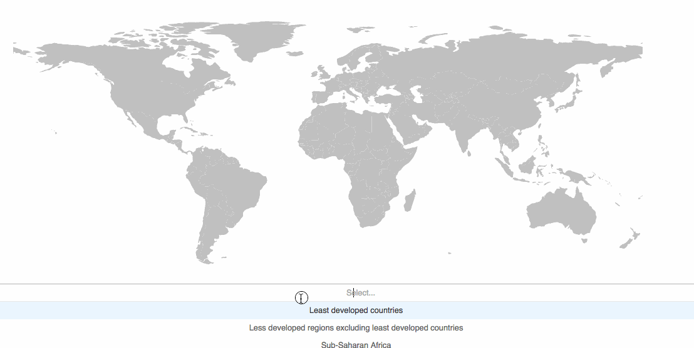
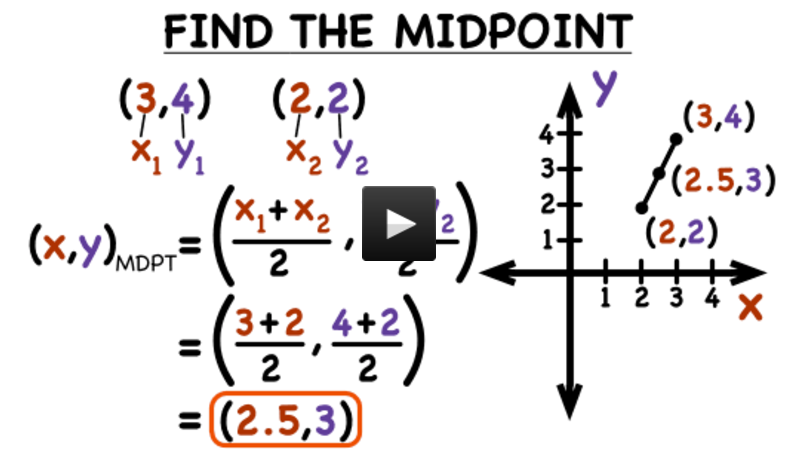
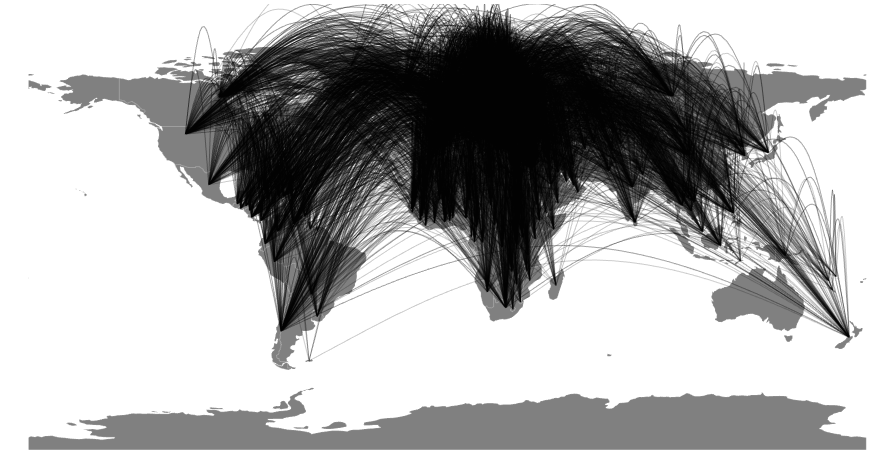

_This is a Livecoding Recap – an almost-weekly post about interesting things discovered while livecoding ?. Always under 500 words and with pictures. You can follow my channel, [here](https://liveedu.tv/swizec). New content almost **every Sunday at 2pm PDT**. There’s live chat, come say hai ?_


This Sunday, we built a colorful map and discovered that a marathon is 138,435 feet long. I don't know why Google thinks that's a useful answer to _"How long is a marathon?”_.





Our map shows migrations _into_ the selected country and uses color to show migration magnitude. The more people that moved into a country in 2015, the warmer the color of that country and its curve. Or rather, the more to the right on the `d3.interpolateWarm` color scale.


I wouldn't describe green as warmer than purple… to be honest, I'm not sure what exactly `interpolateWarm` is meant to correspond to. But the way we used it, to the right is more and to the left is less. _shrug_


Guess we'll have to add a legend next week ?


But first, the curves. [Last week](https://swizec.com/blog/livecoding-32-map-global-migrations/swizec/7415), we discovered that a curve between two points is a straight line. We fixed that by adding a middle point calculated [using high school geometry](http://www.virtualnerd.com/algebra-1/radical-expressions-equations/distance-midpoint-formulas/midpoint-formula/midpoint-between-coordinates).





Our new `Curve` component looks like this:


```
const Curve = ({ start, end, color }) => {
    const line = d3.line()
                   .curve(d3.curveBasis),
          [x1, y1] = start,
          [x2, y2] = end,
          middle = [(x1 + x2)/2, (y1 + y2)/2-200];

    return (
        
    );
};
```


A line generator with a curve interpolator, some geometry for the `middle` point pulled up by `-200` pixels, and returns a `<path>` element of a given color, and some other styling. We got the `-200` number by fiddling around until it looked good.


That and some looping created a map with very many curves all over it. It was not very useful.





nikivansevdon suggested we add some sort of filtering, and daemon92 had great ideas around colors and highlighting source countries on the map itself. Thanks guys!


So we used [react-select](https://github.com/JedWatson/react-select) to make a drop down and spent far too much time rejigging our calculations to make the map aware of them. This is where having Redux or MobX becomes useful: When you want to move things around.


With those, you have data and calculations in a global state somewhere. With our haphazard approach, most logic gets slapped into the nearest component that uses it. It works great until you want to move something, then you're in a world of pain.


Watch [the stream recording](https://www.liveedu.tv/swizec/videos/Oxp87-a-map-of-global-migrations-in-react-d3-3) from about 1h20min onwards. You'll see what I mean. Copy-pasting. So much copy-pasting :D


You can see the final [code on Github](https://github.com/Swizec/migrations-map/blob/10c93fb29117f7b0b84c30a2f598ec2efc72a957/src/Maps.js).


It came out quite well I think.


Next week, we'll add useful text info, a color legend, and add some animation to make the visualization quicker to understand. I want to add something that shows directionality for those curves.


If we can get special regions like World, Developed countries, etc. to work, that would be great too. ?