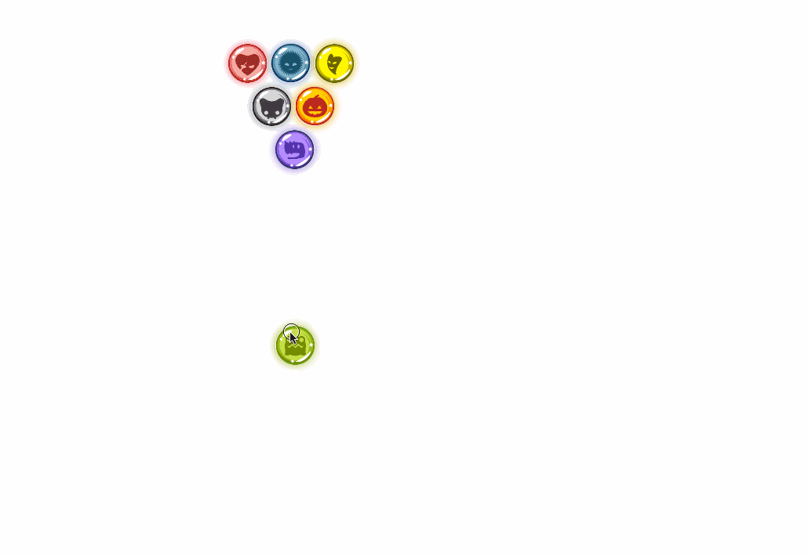
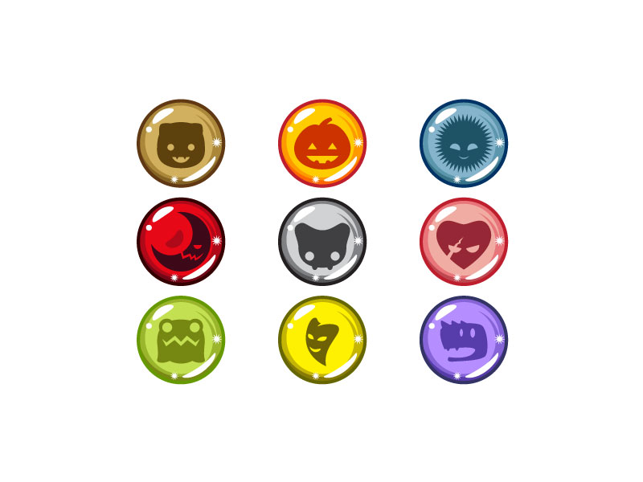

Today we're looking at declarative animation that renders on `<canvas>`: React for declarativeness, [Konva](https://konvajs.github.io/) as a canvas abstraction layer, and [react-konva](https://github.com/lavrton/react-konva) to make them work together.


In theory, this combination has better performance than SVG+React but worse performance than raw canvas because of the additional abstraction layers. We have canvas as the rendering layer, then Konva gives us basic shapes and interactions, `react-konva` turns those into React components, and our own React code makes it work together.


If that sounds complicated… it probably is. I barely know how to use it, and I have no idea how it _actually_ works.





We're building a marble simulation. You can pick up a marble and throw it, and it bounces around until it stops. I wanted to add collision detection as well, but [N-body collisions are hard](https://en.wikipedia.org/wiki/N-body_problem). Next time!


You can see the [code on Github](https://github.com/Swizec/declarative-canvas-react-konva) and play with marbles on the [live demo](https://swizec.github.io/declarative-canvas-react-konva/). The live demo looks better than the gif, I promise.


We have two components:


- `Marble`, which renders each marble and deals with drag events
- `Collisions`, which renders all the marbles and deals with the game loop logic


Yes, the game loop logic should totally be a Redux or MobX store instead of shoved into a component. This is fine. Small example ?


## Marble


The `Marble` component uses `react-konva` to render a `<Circle>` and listen for a `dragend` event. That's how you "throw".


You can think of react-konva as a very thin abstraction layer on Konva. I looked at the source code once, and it just uses a bit of magic to translate all of [Konva's classes](https://konvajs.github.io/api/Konva.html) into React components. Props are passed through unchanged as Konva attributes.


That means you don't have to think about using react-konva. Focus on the Konva docs, it's all the same.


```
class Marble extends Component {
    onDragEnd() {
        const { x, y } = this.props,
              circle = this.refs.circle;

        this.props.onShoot({
            x: circle.attrs.x,
            y: circle.attrs.y,
            vx: (circle.attrs.x-x)/7,
            vy: (circle.attrs.y-y)/7
        });
    }

    render() {
        const { x, y, sprite, type, draggable } = this.props;

        return (
            
        );
    }
}
```


We're rendering a `<Circle>` element at position `(x, y)` and giving it a radius of `15`. Very similar to SVG, right?


Here's where it gets crazy. To get the marble look, we use `fillPattern*` props and use a `sprite` for the background. We reposition and scale it to get the sprite to fit and make marbles look different.





For the shine effect, we use `shadow*` props. Shadows get a color that matches each marble (I used Photoshop), some blur, and an opacity. This gives each marble a glow that makes the marbles look shiny.


They're still shadows though, so a bunch of things are wrong. Especially when the marbles get close together, you can see that the shadows look darker when combined. Real shines would look brighter.


To get draggability, we turn it on. Konva handles the rest for us. `onDragEnd` we call the `onShoot` callback with the marble's new position and movement vector. This part is janky. I'll explain why later.


## Collisions


The `<Collisions>` component is called collisions because this was meant to be a simulation of [inelastic N-body collisions](https://en.wikipedia.org/wiki/Inelastic_collision). High school physics stuff.


But that's hard to do, so you get just the bouncing off of walls.


This component has three major parts:


- calculating the initial positions to make a triangle
- the game loop that drives animation
- declaratively rendering the marbles


```
class Collisions extends Component {
    constructor(props) {
        // setting up this.state
    }

    get initialPositions() {
        // calculating initial positions
    }

    componentDidMount() {
        // loading sprite
    }

    shoot(newPos, i) {
        // updating a thrown marble
    }

    gameLoop() {
        // moving
    }

    render() {
            // rendering
    }
```


### Initial positions and sprite loading


```
    componentDidMount() {
        const sprite = new Image();
        sprite.src = MarbleSprite;

        sprite.onload = () => {
            this.setState({
                sprite: sprite
            });

            this.timer = timer(() => this.gameLoop());
        };
    }
```


Konva takes sprites as ES6 `Image` objects. We load one up, wait for the `onload` event to fire, add it to state, which triggers a re-render, and start the game loop timer.


If you're not familiar with the `Image` object, it's basically an in-memory representation of the image bytestream. Unless you're doing something very particular, you don't need to know the details. It loads an image into memory :)


```
    get initialPositions() {
        const { width, height } = this.props,
              center = width/2;

        let marbles = range(3, 0, -1).map(y => {
            if (y === 3) return [{ x: center, y: 200,
                                   vx: 0, vy: 0}];

            const left = center - y*(MarbleR+5),
                  right = center + y*(MarbleR+5);

            return range(left, right, MarbleR*2+5).map(x => ({
                x: x,
                y: 200-y*(MarbleR*2+5),
                vx: 0,
                vy: 0
            }));
        }).reduce((acc, pos) => acc.concat(pos), []);

        marbles = marbles.concat({
            x: width/2,
            y: height-150,
            vx: 0,
            vy: 0
        });

        return marbles;
    }
```


This… this took me embarrassingly long to code. It's one of those interview question things: Render stuff in a triangle. Then you fumble for an hour, and they're like _"LoL you're an idiot, pass"_.


That was going through my mind the entire time. How the hell am I struggling _this_ hard to put marbles in a triangle?


Here's how it works:


- loop from 3 to 0 to create the rows
- in each row. go from the `left` edge to the `right` edge with a step of "marble size"
- add position to array


You get the left edge is `y` marble halves to the left, and the right is `y` marble halves to the right. This nested loop approach returns a nested array so you flatten it with a `.reduce`.


Oh, and those `range()` functions are actually `d3.range`. I got them with `\import { range } from 'd3-array'`.


### Game loop


Our game loop is a function that `d3.timer` calls on every `requestAnimationFrame`. It goes through our array of marbles, updates their positions, and triggers a re-render.


Like this:


```
    shoot(newPos, i) {
        let marbles = this.state.marbles;

        marbles[i] = newPos;

        this.setState({
            marbles: marbles
        });
    }

    gameLoop() {
        const { width, height } = this.props;

        const moveMarble = ({x, y, vx, vy}) => ({
            x: x+vx,
            y: y+vy,
            vx: ((x+vx < MarbleR) ? -vx : (x+vx > width-MarbleR) ? -vx : vx)*.99,
            vy: ((y+vy < MarbleR) ? -vy : (y+vy > height-MarbleR) ? -vy : vy)*.99
        });

        this.setState({
            marbles: this.state.marbles.map(moveMarble)
        });
    }
```


See? Loop through marbles and update their positions by adding the speed vector to the position. We invert the speed vector when a marble is about to hit a wall in the next step.


Nested ternary expressions are hard to read. I should refactor that. If `x+vx` is smaller than left edge, invert `vx`. Otherwise if `x+vx` is bigger than right edge, invert `vx`. Otherwise, leave it alone.


The `shoot()` function is that dragend callback that `<Marble>` calls. It updates the particular marble with the new position and the new speed vector.


### Rendering


After all that logic, rendering is the easy part. We loop through the marbles and declaratively add them to the `Stage`. Stage is what Konva calls the canvas element. I don't fully understand why, but I'm sure there's a reason.


```
    render() {
        const { sprite } = this.state,
              { width, height } = this.props,
              marbleTypes = Object.keys(Marbles);

        if (!sprite) {
            return (
Loading sprites ...
);
        }

        return (
            
                
                    
                        {this.state.marbles.map(({x: x, y: y}, i) => (
                             this.shoot(newPos, i)}
                                    key={`marble-${i}`} />
                        ))}
                    
                
            
        )
    }
```


See? Loop through `marbles`, put down `Marble` components. All this inside a `Stage`, which is the canvas, and `Layer`, which I think makes more sense when you have more than one, and `Group` which is the same concept as SVG's `<g>` element. It helps you think of groups of shapes as a single thing.


A Stage must always have at least one Layer. So that part is \\important albeit seemingly useless.


## Why is your demo so janky, Swizec?


Did you guess it yet? Why am I having so much trouble throwing marbles at [0:14 in the video](https://youtu.be/oli1qacE-wo?t=14)?


It's the game loop and Konva fighting each other. The game loop re-renders all our marbles every 16 milliseconds. Konva isn't telling React that they've moved, so the position is reset.


That means you _have to_ complete your throw within 16ms or it won't work.


Now, while this looks really bad, it's not a fundamental limitation of the React-Konva-Canvas stack. Just an extra step to take care of before I tackle the N-body collisions.


Gotta add a `dragmove` listener to `Marble` and make sure it updates React state. Should be easy ?