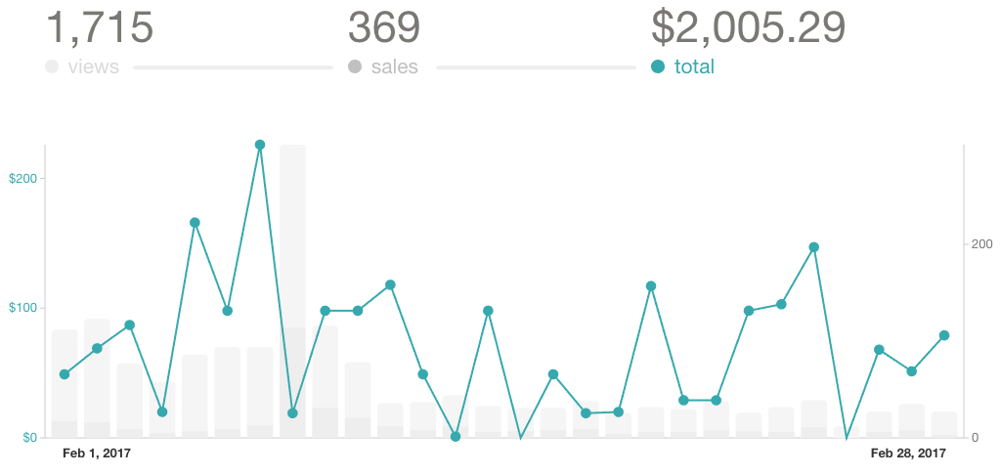
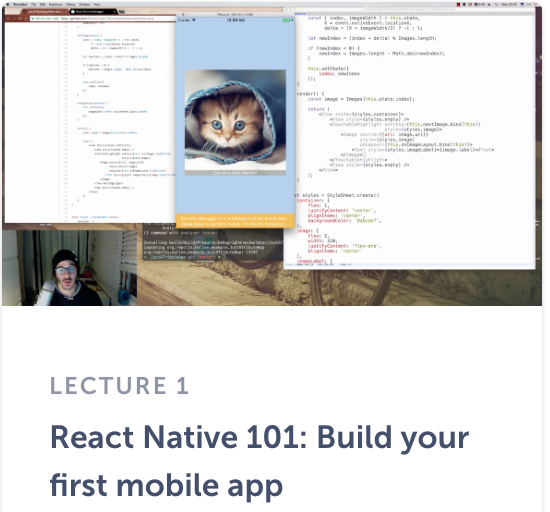

https&#x3A;//twitter.com/Swizec/status/837415105004363776

People have been asking how I sidehustle, what makes it work, and whether when the sums are up, if it's worth the time. Would I not be better off just getting a better paying job?

If that job was as a fancy pants senior engineer at Facebook… probably, yeah. But what's the fun in that? 3 hours commuting every day.

So here's the breakdown for February 2017 ?

**Total revenue:** $3,875

**Gumroad sales:**

- ES6 Cheatsheet: $30 -fees
-
- React+D3v4 preorders: $1,029 -fees
-
- React+D3 ES6: $848 -fees

**Leanpub sales:** $255

- Why Programmers Work at Night: $8.5
-
- React+D3js: $69
-
- React+D3 ES6: $177

**React Native School:** $1,840

**Time investment:** 46 hours

**Cost:** $2,382

- AppSumo: $99
- Editor: $550
-
- VA: $349
-
- Camtasia Upgrade: $120
-
- DSLR to improve videos: $800
-
- Studio lighting + mic arm: $160
-
- Drip: $184
-
- Hosting: $10
-
- LiveEdu pro account: $10
-
- Facebook ads: $100

**Output:**

- 2 React Native lectures
-
- 3+ Livecoding sessions
-
- 7 blog posts
-
- _some_ React+D3v4 progress on the animation chapter

This has been an expensive month. ? I've decided to go hard on video, and I wasn't happy with the quality. You can see a big improvement just with studio lighting.

Bottom left corner. See how much better I look with a good light? Yes, magnificent screenshot to show this off, I know. ?

**Net hourly rate:** $32 pre-tax

Not _too_ bad, gotta work on my unit economics ?

…and find time to update the [React+D3](https://swizec.com/reactd3js) landing page. It's still selling the old stuff LOL.