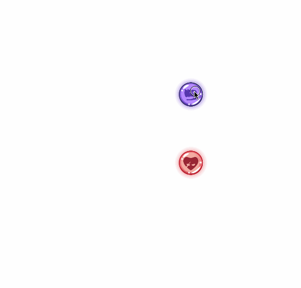
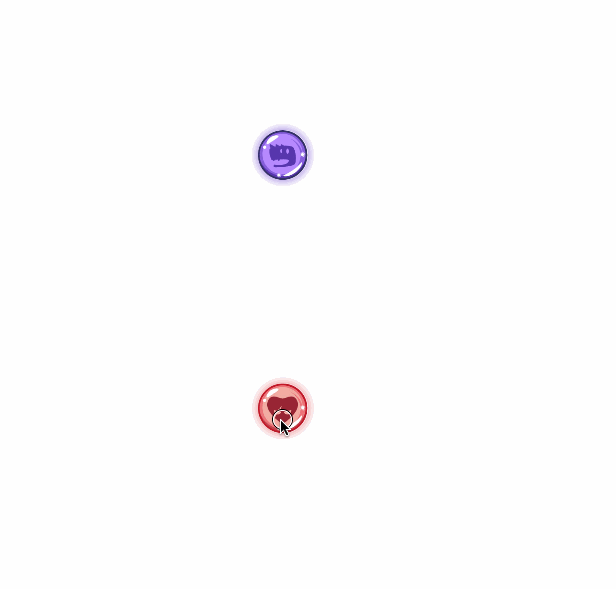
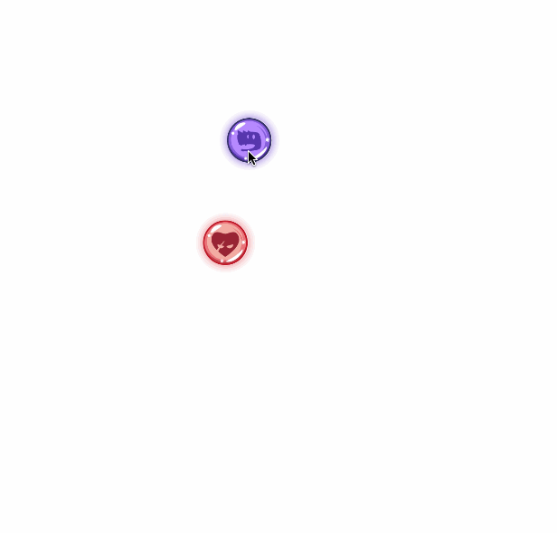
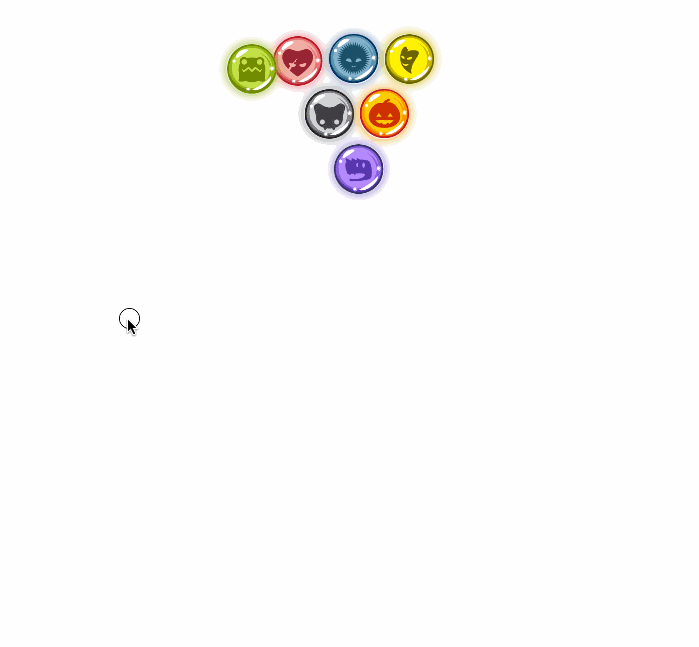
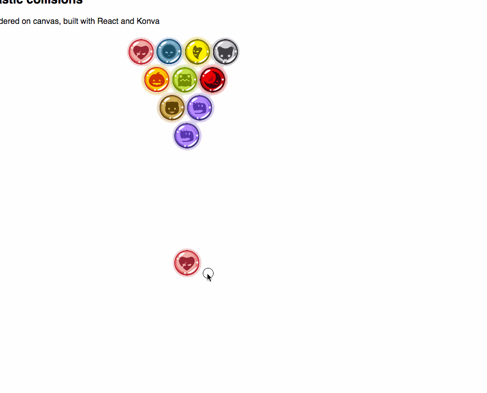
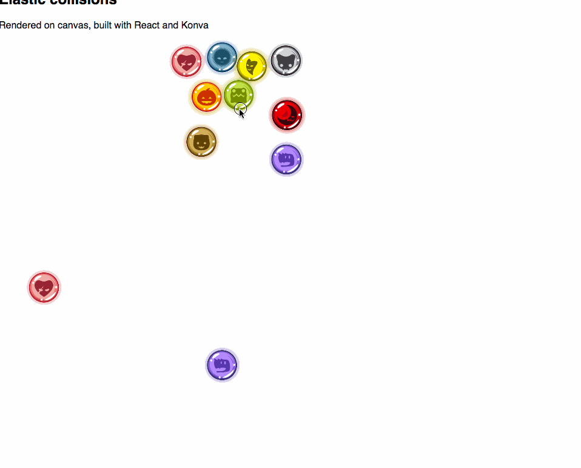

 Collision detection is one of those problems that's easy in theory but hard in practice. Even between ideal circles. All you have to do is:

1.  For every item, find all items with which it intersects
2.  Change its movement vector so it reacts to the collision
3.  Potentially change vectors of other items involved in collision

This is called [a posteriori collision detection](https://en.wikipedia.org/wiki/Collision_detection#A_posteriori_.28discrete.29_versus_a_priori_.28continuous.29). It detects collisions _after_ they happen and corrects in the next animation frame. If items move very fast, they can pass through each other. Another approach is called a priori collision detection. That predicts collisions _before_ they happen. It's more correct, but it’s hard to implement because predicting when two items will collide is, in theory, an algorithm with infinite steps. Wikipedia says the problem doesn't have a [closed-form solution](https://en.wikipedia.org/wiki/Closed-form_expression). As per this [159 page thesis on collision detection](https://wwwx.cs.unc.edu/~geom/papers/documents/dissertations/lin93.pdf), collision detection is important.

> The problem of collision detection or contact determination between two or more objects is fundamental to computer animation, physical-based modeling, molecular modeling, computer simulated environments (e.g. virtual environments) and robot motion planning as well. (Depending on the content of applications, it is also called with many different names, such as interference detection, clash detection, intersection tests, etc.)

Indeed. It's also fun to build. You can play with the final solution in this [live example](https://swizec.github.io/declarative-canvas-react-konva/). Here is my first attempt ?  ? Hmmmm… the two marbles do bounce off each other, but that's not quite right. They come too close together before bouncing. On my second attempt, I used [D3v4's quadtree](https://github.com/d3/d3-quadtree) to detect the collision. Quadtrees subdivide a space based on a list of coordinates. In my case, it’s a list of marbles. You can then perform fast lookups for _"Which items are within radius R of coordinates (x, y)?”_. With some finagling, we can use a quadtree to reduce our n-body collision problem to a series of 2-body collision problems. Each item collides only with its nearest neighbor.  Better. Mr. Quadtree catches the collision when it happens and both marbles bounce off. After the collision, they travel in the opposite direction of where they were going before. But a collision should deflect marbles, not just bounce them. So I used a [dot product](https://en.wikipedia.org/wiki/Dot_product) to calculate new vectors. Thanks to [@air_hadoken](https://twitter.com/air_hadoken/status/837363064005623810) for showing me some of his old code. It helped a lot ^\_^  Marvelous! Direction vectors get deflected, marbles bounce off each other, and something is still wrong. My collision correction algorithm doesn't account for mass. Real marbles have mass. To make life easier, I decided all marbles should have the same mass. This means each marble involved in a collision gets half the combined speed involved in the impact.  ?… hmmm… I don't think marbles are that sticky. I started tweaking parameters, changing coefficients, and tweaking multipliers. I came up with this: https&#x3A;//twitter.com/Swizec/status/841529688002449409 Click play. A gif wouldn't do it justice. Turns out, speed is definitely not additive. That looks more like a fission simulation at the atom level than a simulation of marbles hitting each other. ? After some more tweaking, I think I got it:  _In general_, marbles bounce off each other, have their vectors deflected, slow down due to friction, and share mass in a collision. I don't know if it's a physically correct simulation, but it looks good enough to me. Some marbles still stick.

## Why some marbles still stick together

Marbles sticking together can happen due to one of three reasons:

1.  User overlaid marbles manually
2.  A marble _actually_ collides with multiple marbles within the same 16ms frame. Only one of the collisions is detected
3.  A fast marble hits a small marble in such a way that their cumulative speed doesn't produce escape velocity

The 1st case often goes away when you release the mouse. Sometimes it does not, depending on angle of approach. The 2nd case is unsolvable when using quadtrees for collision detection. The 3rd case can be solved by applying the collision step until all collisions are resolved. This _might_ help with the 2nd case too ?  Well… there's no stickiness… but no.

* * *

## Here's how it works

The marbles are rendered on `<canvas>` using a combination of React, react-konva, and Konva. Each is rendered declaratively from an array of `(x, y)` positions that change with each step of the simulation. You can read about the rendering part in my [Declarative canvas with React and Konva](https://swizec.com/blog/declarative-canvas-animation-react-konva/swizec/7443) article. Since then, I have moved all logic into a MobX store called `Physics`. You can see the [full code on Github](https://github.com/Swizec/declarative-canvas-react-konva). The interesting bits for collision detection are in the [src/logic](https://github.com/Swizec/declarative-canvas-react-konva/tree/master/src/logic) directory. Our general approach goes like this:

1.  Have an observable array of marbles
2.  Run a `simulationStep` on each `requesAnimationFrame` using `d3.timer`
3.  Change marble positions and speed
4.  MobX observables and observers trigger re-renders of marbles that move

The [`Physics.js`](https://github.com/Swizec/declarative-canvas-react-konva/blob/master/src/logic/Physics.js) file is 160 lines, so let me show you just the interesting part: `@action simulationStep`. It handles collision detection and the aftermath of each collision.

## simulationStep – where collisions collision

```

@action simulationStep() {
    const { width, height, MarbleR } = this;

    const moveMarble = ({x, y, vx, vy, id}) => {
        let _vx = ((x+vx < MarbleR) ? -vx : (x+vx > width-MarbleR) ? -vx : vx)*.99,
            _vy = ((y+vy < MarbleR) ? -vy : (y+vy > height-MarbleR) ? -vy : vy)*.99;

        // nearest marble is a collision candidate
        const subdividedSpace = quadtree().extent([[-1, -1],
                                                   [this.width+1, this.height+1]])
                                          .x(d => d.x)
                                          .y(d => d.y)
                                          .addAll(this.marbles
                                                      .filter(m => id !== m.id)),
              candidate = subdividedSpace.find(x, y, MarbleR*2);

        if (candidate) {

            // borrowing @air_hadoken's implementation from here:
            // https://github.com/airhadoken/game_of_circles/blob/master/circles.js#L64
            const cx = candidate.x,
                  cy = candidate.y,
                  normx = cx - x,
                  normy = cy - y,
                  dist = (normx ** 2 + normy ** 2),
                  c = (_vx * normx + _vy * normy) / dist * 2.3;

            _vx = (_vx - c * normx)/2.3;
            _vy = (_vy - c * normy)/2.3;

            candidate.vx += -_vx;
            candidate.vy += -_vy;
            candidate.x += -_vx;
            candidate.y += -_vy;
        }

        return {
            x: x + _vx,
            y: y + _vy,
            vx: _vx,
            vy: _vy
        }
    };

    this.marbles.forEach((marble, i) => {
        const { x, y, vx, vy } = moveMarble(marble);

        this.marbles[i].x = x;
        this.marbles[i].y = y;
        this.marbles[i].vx = vx;
        this.marbles[i].vy = vy;
    });
}
```

That's a lot of code ?. Let's break it down. You can think of it as a function and a loop. At the bottom, there is a `.forEach` that applies a `moveMarble` function to each marble.

        this.marbles.forEach((marble, i) => {
            const { x, y, vx, vy } = moveMarble(marble);

            this.marbles[i].x = x;
            this.marbles[i].y = y;
            this.marbles[i].vx = vx;
            this.marbles[i].vy = vy;
        });

We iterate over the list of marbles, feed them into `moveMarble`, get their new properties, and save them in the main marbles array. This might be unnecessary because of MobX. We _should_ be able to change them inside the loop and rely on MobX observables to do the heavy lifting. I wonder why I did it like this ? Maybe a leftover from before MobX?

### moveMarble

`moveMarble` is itself a hairy function. Things happen in 3 steps:

1.  Handle collisions with walls
2.  Find collision with closest other marble
3.  Handle collision with marble

**Handling collisions with walls happens** in two lines of code. One per coordinate.

    let _vx = ((x+vx < MarbleR) ? -vx : (x+vx > width-MarbleR) ? -vx : vx)*.99,
        _vy = ((y+vy < MarbleR) ? -vy : (y+vy > height-MarbleR) ? -vy : vy)*.99;

Nested ternary expressions are kinda messy, but they’re good enough. If a marble is beyond any boundary, we reverse its direction. We _always_ apply a `.99` friction coefficient so that marbles slow down. **Finding collisions** with the next closest marble happens via a quadtree. Since we don't have too many marbles, we can afford to build a new quadtree from scratch every time.

    // nearest marble is a collision candidate
    const subdividedSpace = quadtree().extent([[-1, -1],
                                               [this.width+1, this.height+1]])
                                      .x(d => d.x)
                                      .y(d => d.y)
                                      .addAll(this.marbles
                                                  .filter(m => id !== m.id)),
          candidate = subdividedSpace.find(x, y, MarbleR*2);

We're using [`d3-quadtree`](https://github.com/d3/d3-quadtree) for the quadtree implementation. It takes an `extent`, which tells it how big our space is. It uses `x` and `y` accessors to get coordinates out of our marble objects, and we use `addAll` to fill it with marbles. To avoid detecting each marble as colliding with itself, we take each marble out of our list before feeding the quadtree. Once we have a quadtree built out, we use `.find` to look for the nearest marble within `MarbleR*2` of the current marble. Which is exactly the one we're colliding with! :) **Handling collisions with marbles** involves math. It’s the sort of thing you think you remember from high school and then suddenly realize you don't when the time comes to use it. The code looks like this:

    if (candidate) {

        // borrowing @air_hadoken's implementation from here:
        // https://github.com/airhadoken/game_of_circles/blob/master/circles.js#L64
        const cx = candidate.x,
              cy = candidate.y,
              normx = cx - x,
              normy = cy - y,
              dist = (normx ** 2 + normy ** 2),
              c = (_vx * normx + _vy * normy) / dist * 2.3;

        _vx = (_vx - c * normx)/2.3;
        _vy = (_vy - c * normy)/2.3;

        candidate.vx += -_vx;
        candidate.vy += -_vy;
        candidate.x += -_vx;
        candidate.y += -_vy;
    }

    return {
        x: x + _vx,
        y: y + _vy,
        vx: _vx,
        vy: _vy
    }

Ok, the `return` statement isn't about handling collisions. It updates the current marble. The rest kind of looks like magic. I implemented it and it looks like magic and I feel like I don't _really_ understand it. You can think of `[normx, normy]` as a vector that points from current marble to collision candidate. It gives us bounce direction. We use the [euclidean distance](https://en.wikipedia.org/wiki/Euclidean_distance) formula to calculate the length of this vector. It measures the distance between the centers of both marbles. Then we calculate the [dot product](https://en.wikipedia.org/wiki/Dot_product) between our marble's speed vector and the collision direction vector. We normalize it by distance. Multiplying distance by `2` accounts for there being two marbles in the collision. That extra `.3` made the simulation look better. I fiddled with it :) Then we use the dot product scalar to adjust the marble's speed vector. Dividing by `2` takes into account that half the energy goes to the other marble. This is only true because we assume their masses are equal. Finally, we update the `candidate` marble and make sure it bounces off as well. We do it additively because that's how it happens in real life. Two marbles traveling towards each other in exactly opposite directions with exactly the same speed will stop dead and stay there. As soon as there's any misalignment, deflection happens. If one is stationary, it starts moving. If it's moving in the same direction, it speeds up… etc. The end result is a decent-looking simulation of billiards. [](https://swizec.github.io/declarative-canvas-react-konva/)
