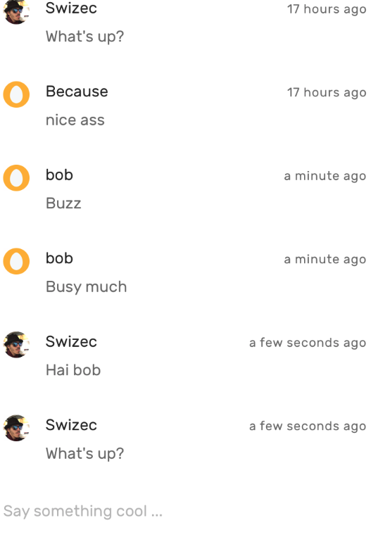
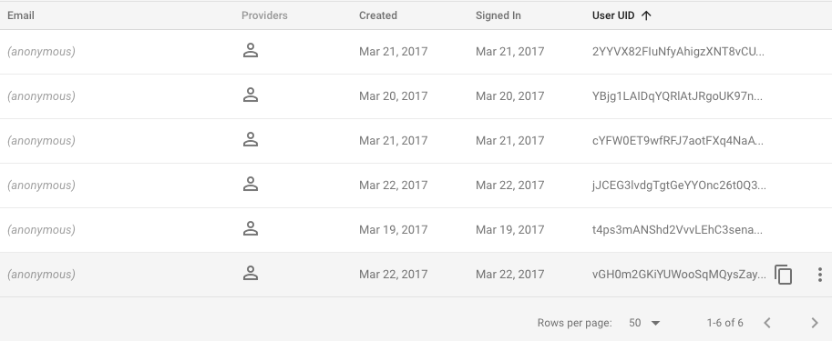

 On Tuesday, I launched a chatroom. But not just any chatroom. Oh no, it’s a hacker haven. A chatroom that you can only get into if you [follow my React Native tutorial](http://school.shoutem.com/lectures/chat-app-firebase-redux-react-native/), and build the app, and run it in a simulator. Or if you write an HTML clone. https&#x3A;//twitter.com/lukeed05/status/844651989715726336 And you thought IRC was hard for not-nerds to figure out. Ha! ? My global chatroom is _exclusive_. I launched the chatroom at 10am on Tuesday. The tutorial went out, the social posts went out, I fired up my simulator, and then I waited. Like a spider in disguise. Or a fly waiting to be eaten ? Seven hours later, at 1 minute and 8 seconds past 5pm, somebody said _"Howdy"_. It worked! I asked the internet for lulz and the internet lulzed! ?? https&#x3A;//twitter.com/Swizec/status/844346387168866305 Then one hour later, it happened again. The top secret social experiment worked o/ https&#x3A;//twitter.com/Swizec/status/844357086083399680 It was amazing. Nine hours exposed to the internet, available for anyone to say anything _anonymously_. The worst that happened was that somebody said "ass". Faith in humanity restored! The internet is clean and pure. ? It got more interesting on Wednesday. Some more people came in to say hello. This time they pretended to be me.  React Native `<Text>` doesn't render backslashes. Or does Firebase filter them out? ? Either way, shit was going down. For like twenty minutes, the chatroom was alive. Real. Busy like the public bazaar of an old village in Siberia. 6 people came to say hello.  That's a lot for a place that only exists as an unpublished app. And then, just as it had started, the fun was over. Firebase sent an automated message saying that we were done. That you can't just run a public chatroom by sharing Firebase account credentials with everyone. That we're abusing the system and that we should find better things to do. https&#x3A;//twitter.com/Swizec/status/844649016294039554 I went into the Firebase console, found the link, copy pasted into the browser and  ? The internet is a beautiful place. My experiment is going ridiculously well. I'm gonna keep the simulator running for a few more days. Come say hi.
