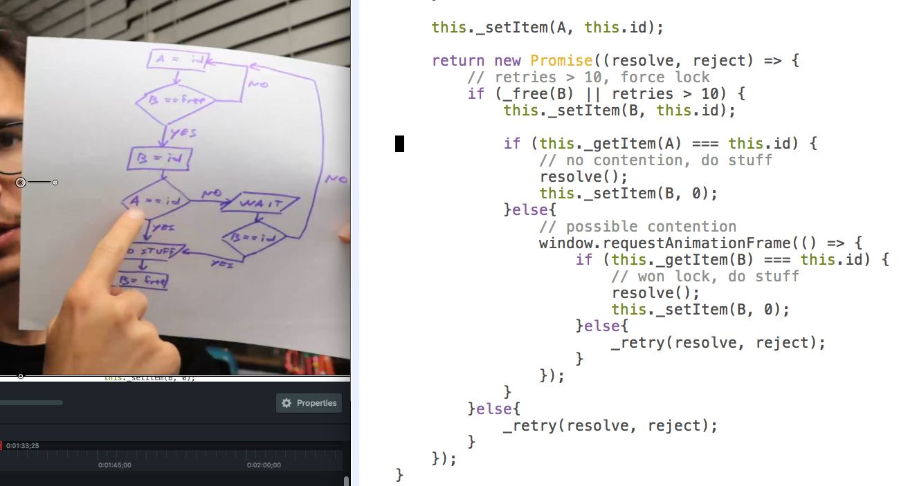

I'm trying something new. Today the video is stronger than the post. Watch it ?


On Tuesday, I implemented a JavaScript queue backed by local storage. It's goal in life is to ensure we don't lose events when tracking usage funnels on our app.


Yes, losing an event that takes 600ms to send is an edge case.


Yes, we still want to make sure we don't lose anything.


Plus, with a queue we have more flexibility to send bursts of events to our backend. Firing an XHR request every time a user clicks a button feels excessive.


That's why it's going in a queue, and the queue will eventually process it. At first, 1 event is 1 request, and we have a good path forward to send in batches.


Because we store the queue in local storage, you don't lose events even if you close your tab before something finishes saving. Hopefully you come back a second time so we get a chance to process your queue. If you don't, we can't. ?


Simple, right?


Yep. Stringify a JSON array. Save to local storage. Pull out, JSON parse, add stuff, put back in.


And what if the same user runs multiple tabs? What if some events that you want to track happen without user interaction? And just like that, tabs step on each other's toes, and you lose events because local storage is a shared resource.


## Fast mutex to the rescue!


Here's how the [Lamport lock algorithm](http://www.cs.rochester.edu/research/synchronization/pseudocode/fastlock.html) works:


You need 2 shared memory locations, `A` and `B`.


When a new thread needs the lock, it first sets `A` to its `id`. Then it checks if `B` is free. If `B` is _not_ free, we retry. If `B` _is_ free, we set `B` to `id`. Then we check that `A` is still equal to `id`.


If `A` has changed, we're potentially facing a lock contention. So we wait long enough for others to realize we're doing stuff and back off. Then we check that `B` is still `id`. If `B` is _not_ equal to `id`, then we've lost the lock and we go back to beginning. If `B` _is_ equal to `id`, it means we've won the lock and we do stuff.


It sounds confusing because it _is_ confusing. Study the flowchart. Drawing it helped me understand how this works. And I'm not sure I could _prove_ that it works.


Here's what the Lamport lock looks like when implemented with JavaScript promises.


```
get lock() {
    return this._lock(0);
}

_lock(retries) {
    const A = `${this.name}_lock_A`,
          B = `${this.name}_lock_B`;

    const _retry = (resolve, reject) => {
        window.requestAnimationFrame(() =>
            this._lock(retries + 1).then(resolve, reject)
        );
    }

    const _free = (name) => {
        const val = this._getItem(name);
        return Number(val) === 0 || val === undefined || val === null;
    }

    this._setItem(A, this.id);

    return new Promise((resolve, reject) => {
        // retries > 10, force lock
        if (_free(B) || retries > 10) {
            this._setItem(B, this.id);

            if (this._getItem(A) === this.id) {
                // no contention, do stuff
                resolve();
                this._setItem(B, 0);
            }else{
                // possible contention
                window.requestAnimationFrame(() => {
                    if (this._getItem(B) === this.id) {
                        // won lock, do stuff
                        resolve();
                        this._setItem(B, 0);
                    }else{
                        _retry(resolve, reject);
                    }
                });
            }
        }else{
            _retry(resolve, reject);
        }
    });
}
```


Done with promises so it's easier to use. You'd do something like this when writing to local storage:


```
this.lock.then(() => writeStuff())
```


That's elegant, right? I think it is.


But what does all that lock code _do_? Well, it implements the Lamport lock algorithm with one small addition.


Our threads – browser tabs – can die before releasing the lock. The user closes the tab, JavaScript error, things like that. That's why we limit retries to `<10`.


Yes, that's an arbitrary value. No, saving to local storage should never take more than 10 requestAnimationFrames. It's a fast, synchronous operation.


Look at the code and the flowchart side-by-side. I made sure they're the same ?





Don't believe me that it works? [Read Lamport's original paper](https://www.microsoft.com/en-us/research/publication/fast-mutual-exclusion-algorithm/?from=http://research.microsoft.com/en-us/um/people/lamport/pubs/fast-mutex.pdf); it includes correctness proofs.


Watch [the video](https://youtu.be/NQqDJoLqMtE) to see it in action.


Thanks to [Dan Pupius for the idea](https://medium.engineering/wait-dont-touch-that-a211832adc3a).