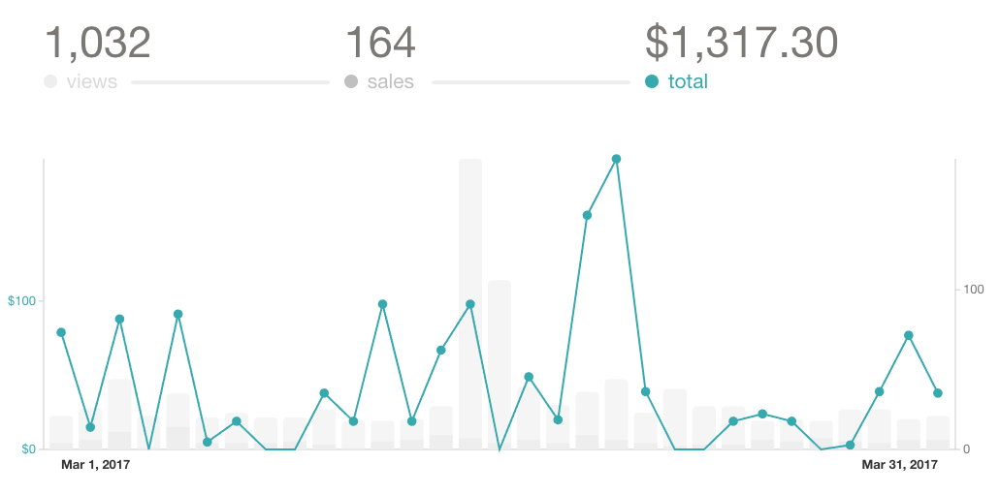

 In March, my sidehustle made $5,874 in gross pre-tax revenue. That's just $200 short of my post-tax day job income. ? Unfortunately, this is not a trend. There were bumps, and I already know April is going to be slow. Unless a few Hail Marys come through… you don't wanna rely on Hail Marys when rent is due, though. :D Here's why that revenue can't pay rent (yet):  Such stable sales LOL **Total revenue:** $5874 **Gumroad sales:**

-   React + D3v4 preorders: $381 - fees
-   ES6 Cheatsheet: $50 - fees
-   React + D3 ES6: $886 - fees

**Leanpub sales:** $249

-   Why Programmers Work at Night: $8
-   React + D3 ES6: $92
-   React + D3v4: $149

**Packt royalties:** $514 **React Native School:** $1464 **In-Person Workshops:** $1819

-   ForwardJS: $256
-   Self-organized: $1534

**Time investment:** 96 hours **Cost:** $2277

-   More camera gear: $279
-   Editor: $575
-   VA: $337
-   Apple Developer Account: $107
-   reactd3js.com domain: $10
-   AppSumo: $99
-   Drip: $184
-   Hosting: $10
-   LiveEdu account: $10
-   Ads (Facebook + Twitter): $256
-   Lunch for workshop peeps: $60
-   Workshop space: $350

**Net hourly rate:** $37 pre-tax That's $5 more than last month! ?? I've arrived!  You might not notice this, but there are plenty of business failings in those numbers. The new React+D3v4 edition is better priced, a better product, _and_ people who read it rave about how great it is. It's making low sales because 1) I'm not advertising it and 2) if you don't know it exists, you'll never find it. None of my websites, not even the book's landing page, link to it. There isn't even a buy button unless you send me an email and say, _"Yo dude, your book looks outdated"_. Then I send you an email like _"Yes, here's the new one.”_ This is terrible, and I should feel bad. (hint: I do) Yes, I should _just_ fix it. As time passes, emotional baggage builds around that "just". The book is not done yet, I'm gonna feel even more pressures once I switch the buy buttons, the landing page copy needs to be redone, the page itself needs redoing, I have to set up ads, there are emails to send, even more existing customers need to be sent their free upgrade, there's more and more of them every week that I don't change the landing page and just so many different things… Why can't I just build cool shit and let all that other stuff care for itself? Oh yeah, 'cause I haven't hired anyone to handle that. Because I'm too swamped to spend time finding people to help me. Nice spiral of doom, that one. Working _on_ the business versus working _in_ the business. ? And [the workshop… that was great](http://swizec.com/blog/boutique-react-d3v4-workshop/swizec/7519). Magnificent. People loved it. We sold 6 tickets out of the 12 tickets we had. Don't start marketing stuff like that two weeks before it happens. Lesson learned. The Chicago workshop in May is going to do even better.
