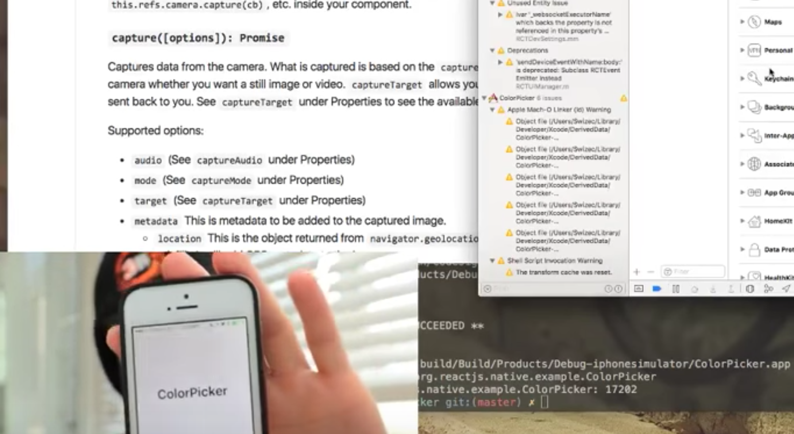
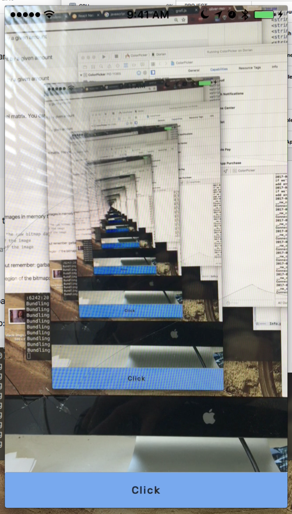

_This is a Livecoding Recap – an almost-weekly post about interesting things discovered while livecoding. Shorter than 500 words. With pictures. Livecoding happens almost **every Sunday at 2pm PDT** on multiple channels. You should follow [My Youtube](https://www.youtube.com/channel/UCoyHgaeLLI7Knp7LDHOwZMw) channel to catch me live._

This weekend we set out to build a color picker for real life. Grab your phone, point it at a thing, find that thing's RGB color.

Not sure _why_, but it's a fun little way to play with React Native and device camera. We found a package called [react-native-camera](https://github.com/lwansbrough/react-native-camera) that makes camera integration easy.

Import the project, use `` to render a live view of the camera in your app. That was easier than I thought it would be. Guess that's the benefit of being late to the game. Others have already built the things that are hard. Now you just gotta put them together like LEGO pieces in novel ways.

That's the main benefit of React Native isn't it? Components that do stuff and fit together. Little glue code to write. Everything fits.

My favorite discovery was Quicktime's movie recording mode. You can show your phone screen on your main screen.

No more this:

This:

Isn't that better? I think it is.

Thanks blackburn1911 for showing me that trick. It's going to improve future livecoding sessions and [React Native School](http://reactnative.school) videos.

Hm ... this isn't a very long livecoding recap. Could we really have done so little? Was I _that_ wasted from running a lot on Sunday morning? ?

I mean, we found three JavaScript image manipulation libraries that are going to help us find color codes, but we didn't get to use them before our time was up.

- [jimp](https://github.com/oliver-moran/jimp)
- [grafi.js](http://grafijs.org/)
- [camanjs](http://camanjs.com/)

And we discovered that even if you're saving photos temporarily, you still need Photo Library permissions. Forget to ask and your app will crash. That part was confusing.

But that's basically it ... damn. Next time I should drink more caffeine.

Here is next day's followup session. That was fun too, we learned that my computer is crazy slow.