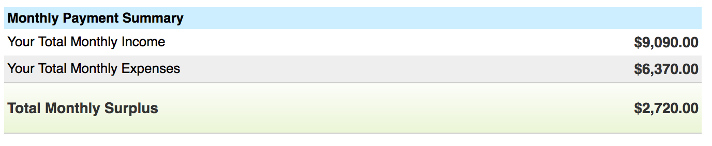

When I bitch and moan about taxes, everyone always asks, _"How the fuck did this happen? What the hell did you do!?"_ So here's a short story about how I became a real American: Someone whose debt is gonna take a few years to pay off. 28 months by current count.

I know, I know. _Real_ debt is for 30 years. Bear with me. This is uncharted territory. I don't usually spend money I don't have. Well, okay, sometimes I cover a budgeting mishap with a credit card or a painful withdrawal from the savings account I keep for patching holes in cashflow. But who doesn't? —— The story begins in April 2016. A friend hooked me up with a wonderful \[read: expensive] CPA who was willing to take on my complicated case. I spent the first 4 months of 2015 in Slovenia, then 8 months in San Francisco. Throughout the year, I worked through my Slovenian company: a sole proprietorship taxed in Slovenia at an effective rate of about 10%. The way it works is that for revenue under $100k, some 80% is considered "expenses" and you are taxed on the rest as your personal income. You fall into a tax bracket and pay taxes, mandatory health insurance, and mandatory pension contributions. Americans would call it socialism. At least the mandatory health care and pension part. Okay, so that's the Slovenian taxes. Mandatory monthly payments or Bad Things happen. All fine and well. Where it gets tricky, as my CPA explained in April 2016, is that because my company is a sole proprietorship, and because I'm the sole employee, the USA considers the [nexus](https://en.wikipedia.org/wiki/Nexus#Law) to be wherever I am physically located. So even though I'm paying Slovenian taxes, I have to pay US income taxes on my total revenue when I'm in San Francisco. Great… There is, however, a bilateral agreement that says Slovenia and USA credit each other's income taxes. My CPA was nice enough to read through the entire agreement and figure that out. It's not information either government advertises very loudly. Here's the rub: USA says Slovenia should credit my taxes paid to the USA. I was physically in San Francisco, so those taxes belong to them. Slovenia says USA should credit my taxes paid to Slovenia. My company is registered in Slovenia, so those taxes belong to them.

Then my CPA discovered even more great news. Turns out I had spent 2 or 3 days over the 6-month limit in San Francisco back in 2014. So I was a US tax resident in 2014 too. Lovely. Oh and Mr. Swizec, you haven't been paying your Obamacare. You have to pay that, too. Wait, what's Obamacare? The national health something, of course. Everyone has to pay that. But I didn't use it! I didn't even know I _could_ use it! I have health insurance in Slovenia, damn it. Yeah? Tough. Gotta pay. Oh, and there's no bilateral agreement between Slovenia and USA for health care. Wonderful. Damage for 2014 and 2015 taxes: You owe $2,775 to California, and $14,071 to the federal government. Bye bye, all the fuck you money I took so long to save up. Poof! Just like that.

At least I had the money, right? My reserves were used up, but you can always make more money. Better to be kinda broke than have the ire of IRS on your back. You do not fuck with the taxman. Al Capone went to jail for that shit. Not for killing people, not for bootlegging, not for organized crime. For tax evasion. Let that sink in. Lesson learned, right? Swizec paid a bunch of taxes in April 2016, learned his lesson, and the story ends there. Swizec, it turns out, does not learn lessons. He's kinda dumb like that.

## Come April 2017

_"Hello Mr. Swizec, it is time once again to do your tax return. You've been ignoring our offers to help you with quarterly returns. Prepare your butthole.”_ _gulp_ A-ha, but I am ready this time, Mr. Taxman! I've been racking up expenses on my sidehustle, I know that I can claim the home office part of my rent as an expense, I've paid freelancers and bought equipment and all the things. Come at me, bro!

I was overconfident. I had spent the entire year in San Francisco. I still had my Slovenian company until January 2017. All year. This did not bode well. You see, I became properly employed in USA after I got some bureaucracy things in order. I felt it prudent to keep Slovenian stuff going until that happened. Wouldn't wanna be caught completely without health insurance in case something happens, ya know? In June 2016, I filed a piece of paper with the Slovenian government saying that I have moved out of the country, and I wanted to stop paying taxes, pretty please. In November 2016, they sent me an email: _"Yo, wtf? Do you got some papers to prove this shit?"_ I replied to the email with some PDFs. In December 2016, I got a piece of paper at my old address in Slovenia. It said _"Fuck it, you're out. We retroactively grant you status of not paying taxes since August 2016"_. But what about all the deductions I had to keep paying until December? You'll get them back with your tax return in April 2017. Maybe. Joke's on them: A few months after June 2016, I got frustrated with my USA salary being deducted _and_ having to wire money to Slovenia to pay for Slovenian taxes and health care and pension. So I stopped. It's all going away soon anyway, might as well not pay, right? Nope. In January 2017, my Slovenian accountant was like _"Yo dude, you haven't been paying that shit. You should pay that shit.”_ But… No buts. Pay. Wait, but I'm not a tax resident anymore. Why am I paying health care? You still have a company in Slovenia. Even if you're not paying taxes, you have to pay the mandatory health care and pension contributions. Wait, what? I'm not even using that company anymore! Tough. It exists. Gotta pay. So I closed the company, wired some $5000 to Slovenia, and paid what I owed. About $2000 of that was for taxes past the retroactive August 2016 date when I stopped being a tax resident. In April 2017, Slovenia sent me $200 of the taxes I had overpaid. What happened to the rest, I don't know. Guess they looked at my revenue and decided that I was not overpaying. Now comes the fun part. The American IRS is unfazed by any of this. I was here all year, I'm a tax resident, gotta pay for all my global income _and_ report the highest value of my foreign assets in 2016. Wait, but I used those $18,000 in my Slovenian savings account to pay USA taxes in 2016. I don't wanna say my foreign accounts had that much money and pay taxes on it… Tough. Gotta pay. -.- I ended up with a convoluted 3-part tax return my CPA pulled out of his hat: One for while I was employed. One for the time I was a contractor. One for my sidehustle. The final damage was $3,824 owed to California, $20,822 owed to the federal government. Some of that is for 6 months of Obamacare before I got real insurance, I think. Now this is the sort of money I don't have. There's $13,000 in my Wealthfront investment account… a few thousand laying around in various PayPal and savings accounts. But it's not enough. Even if I liquidated everything, it's still not enough to get the taxman monkey off my back. I also don't want all my accounts to be at $0. That's not a good place to be. Especially not when your sidehustle has freelancers who expect to be paid on time.

My CPA suggested I pay off California in full. It's not a huge amount, and it gives me one less authority to deal with. Took the money out of my sidehustle's PayPal account and paid off California. One down, one to go. The IRS offers something called a payment plan. You can go on their website and say _"Look, guys, I'm broke. Can we come to some sort of agreement?"_ They offer several options. You can pay in full within 3 months. Within 6 months. Or opt for a however-long-it-takes monthly payment plan. You are warned, however, there's 5% interest per year on the money you owe. You don't want to pay more than you owe, do you!? 5% of $20,822 is $1041. Like I give a shit. I spend 3x that on rent, bills, and groceries every month 😂 So I used their helpful calculator. You put in how much you make, how much you think you spend, and they tell you how much you can afford to pay.

Lol, I'm not paying you $2,000 per month, dear IRS. You crazy? I still gotta put money in savings. I am certain beyond a grain of doubt that my money is better off in my savings and investment accounts than it is in your grubby little paws. Besides, Wealthfront has been giving me a steady 13% return, and your interest is just 5%. Where do _you_ think I should put that money, eh? So I committed to paying the IRS $800/month in back taxes. I can manage that, I think. Including interest, it's gonna take me until September 2019 to pay this off. 😅 Next year, taxes will be easier. I hope. No more double taxing. No more double health care. Deducting all year. That should help. 🤘🏼
