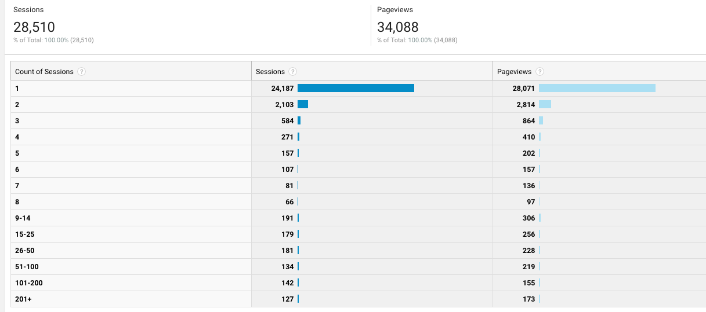
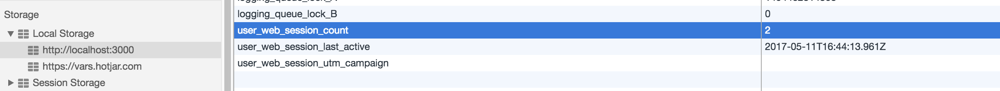

What do you do if your boss comes up to you and asks, _"So how many times must a person come to our app before they give us $500?"_


It's an \\important question. How many touch points does your sales process require? Do you need 2 ad clicks or 5? Two shiny demos or one fat video?


As an engineer, you might not care, but this is the stuff that keeps your CEO and growth lead and head of product up at night. A business owner that can answer that 👆 question reliably is god amongst men.


It's an \\important question, therefore Google Analytics has the answer, right?


Wrong.


The best Google Analytics can do is this view:


\[caption id="attachment_7596" align="alignnone" width="1217"] GA Count of Sessions view\[/caption]


This histogram tells you that out of the 24,187 people that visited swizec.com in the last 30 days, 24,187 of them started their first session. 2,103 started their 2nd, all the way down to the 127 people who started their 201st session.


Those people are… odd. My blog is not _that_ interesting 🤔 Even I don't visit the site that much.


Ok, so Google Analytics doesn't want to tell us how many sessions a particular user had before they converted. But what's a session anyway?


This is [how a web session is defined in GA](https://support.google.com/analytics/answer/2731565?hl=en). The tl;dr is that a new session starts after every:


- 30 minutes of inactivity
- midnight
- `utm_campaign` query change


We count something as a new session every 30 minutes (even if the site was left open), on every new day, and following every new ad click. I don't know why Google defined web sessions this way, but if you're building business intelligence, it's best to use standard definitions.


**So how do you count those web sessions?**


Well, you need to keep track of the 3 parameters above, and you need to keep track of a counter. Then you up the counter on every change. That gives you the count and you can do whatever you want.


Save it to the backend via some sort of API perhaps ;)





Here's the solution I came up with. You can use it as [an npm module](https://github.com/Swizec/web-session-counter), or read onwards to learn how it works.


## WebSessionCounter


To make your life easier, I made this [web-session-counter npm module](https://www.npmjs.com/package/web-session-counter). You can see the [full code on Github](https://github.com/Swizec/web-session-counter), too.


Install the utility with `npm install web-session-counter`, then use it like this:


```
\import WebSessionCounter from 'web-session-counter';

// Do this on user activity
WebSessionCounter.update();

// To get the total count of sessions
const count = WebSessionCounter.count;
```


`WebSessionCounter` automatically calls `.update()` on every initialization. When you \\import the library, that is. It's a singleton. You can get the current count through the `.count` property.


I suggest calling `.update()` every time your user performs a significant action. In my day job, we tie this to our internal funnel tracking. Whenever we track an event for business analytics, we update the counter as well.


If your thing is built as a single page app, you have to keep calling `.update()`. Otherwise, you might miss the 30-minute inactivity window or make it look too big.


If you often reload the page, don't worry about calling `.update()`. The reload will do it for you.


### Here's how it works


The gist of `WebSessionCounter` is this 71-line class.


```
class WebSessionCounter {
    constructor() {
        this.update();
    }

    get count() {
        if (canUseLocalStorage) {
            return Number(window.localStorage.getItem('user_web_session_count'));
        }else{
            return NaN;
        }
    }

    set count(val) {
        window.localStorage.setItem('user_web_session_count', val);
    }

    get lastActive() {
        const time = window.localStorage.getItem('user_web_session_last_active');

        if (time) {
            return moment(time);
        }else{
            return moment();
        }
    }

    set lastActive(time) {
        window.localStorage.setItem('user_web_session_last_active', time.toISOString());
    }

    get lastUtmCampaign() {
        return window.localStorage.getItem('user_web_session_utm_campaign');
    }

    set lastUtmCampaign(val) {
        window.localStorage.setItem('user_web_session_utm_campaign', val);
    }

    get currentUtmCampaign() {
        const [ path, query = '' ] = window.location.href.split('?'),
              { utm_campaign = '' } = querystring.parse(query);

        return utm_campaign;
    }

    update() {
        if (canUseLocalStorage) {
            let count = this.count,
                time = this.lastActive;

            if (count === 0 || this.isNewSession()) {
                this.count = count + 1;
                this.lastActive = moment();
                this.lastUtmCampaign = this.currentUtmCampaign;
            }
        }
    }

    isNewSession() {
        // use definition from https://support.google.com/analytics/answer/2731565?hl=en

        const time = this.lastActive,
              now = moment();

        return [
            moment.duration(now.diff(time)).asMinutes() > 30,
            now.format('YYYY-MM-DD') !== time.format('YYYY-MM-DD'),
            this.lastUtmCampaign !== this.currentUtmCampaign
        ].some(b => b);
    }
}
```


When I say "gist", I mean that's all there is to it. Doesn't look like much, but it did take me an hour or two to write. You can use my `web-session-counter` module, and it will take you 5 minutes. :)


We have 3 sets of getters and setters for the `count`, the `lastActive` timestamp, and `lastUtmCampaign`. Getters read values from local storage; setters save them.


The `currentUtmCampaign` getter reads the URL and returns the current value of `utm_campaign`. Having a pair of getters for current and last `utm_campaign` helps us detect changes.


https&#x3A;//twitter.com/svensauleau/status/862401992110551042


Our business logic lies in the `update` and `isNewSession` methods.


```
    update() {
        if (canUseLocalStorage) {
            let count = this.count;

            if (count === 0 || this.isNewSession()) {
                this.count = count + 1;
                this.lastActive = moment();
                this.lastUtmCampaign = this.currentUtmCampaign;
            }
        }
    }

    isNewSession() {
        // use definition from https://support.google.com/analytics/answer/2731565?hl=en

        const time = this.lastActive,
              now = moment();

        return [
            moment.duration(now.diff(time)).asMinutes() > 30,
            now.format('YYYY-MM-DD') !== time.format('YYYY-MM-DD'),
            this.lastUtmCampaign !== this.currentUtmCampaign
        ].some(b => b);
    }
```


`update` first checks if local storage is available. Wouldn't wanna throw errors and kill all JavaScript if it isn't.


If we can use local storage, then we get the current `count` from local storage. If the `count` is zero or `isNewSession` returns `true`, we have to update info in local storage.


We increase the `count`, update the `lastActive` timestamp, and store the current `utm_campaign` value.


To detect new sessions, we use a helper method – `isNewSession`. Some say my code isn't readable, but I think it's not too bad. The function name tells you what it does 😜


The first condition checks if 30 minutes have passed since the last update, the second checks if the date has changed, and the third check if the `utm_campaign` is different. `.some(b => b)` returns `true` if any of the conditions are truthy.


https&#x3A;//twitter.com/Bladtman/status/862432478572752896


## Caveats


Users can clear local storage and you lose track. That's okay; real users don't do that. Only cheeky engineers.


Some browsers don't have local storage, like Safari in incognito mode for example. That's okay; those users don't want to be tracked, so you shouldn't track them.


Happy hacking. 🤓