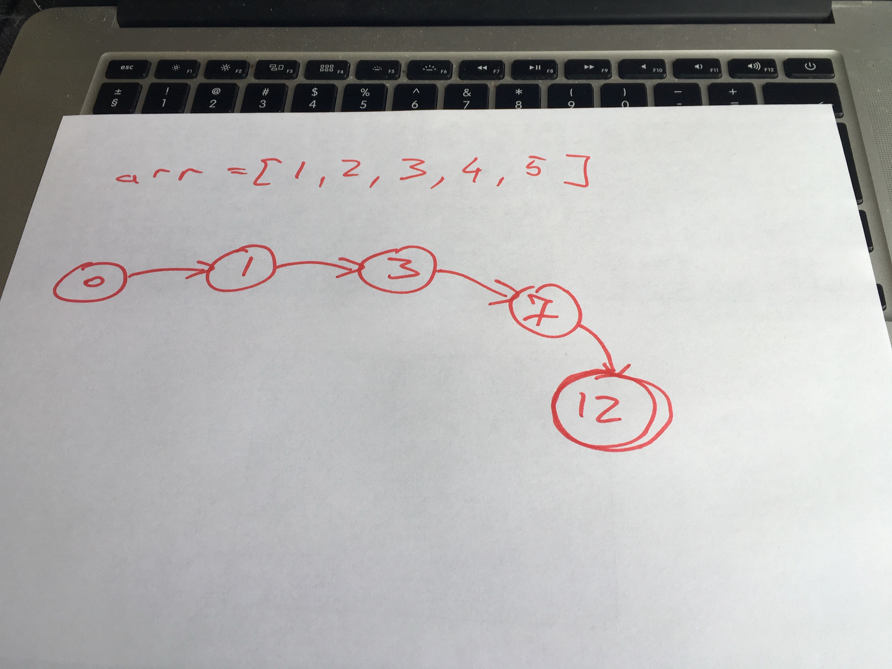

[Immutable state](https://en.wikipedia.org/wiki/Immutable_object) has been all the rage for the past few years or decades. The multithreaded multiprocessing future is coming! Save yourselves and your sanity, use immutable data! Be functional! Object-oriented is for dinosaurs. _hair on fire_


This push has been particularly strong and revered in JavaScript land. Everyone got tired of messing around with jQuery, so now we're doing immutable everything with [fancy-pants unidirectional architectures](http://redux.js.org/docs/basics/DataFlow.html).


I'm not saying that's a bad thing. It's a great thing.


I've been on the functional hype train ever since [I played around with Haskell](https://swizec.com/blog/learning-me-a-haskell/swizec/3272) and [Clojure](https://swizec.com/blog/checking-for-primes-dumber-algorithm-is-faster-algorithm/swizec/1580) back in college. Some 6 or 7 years ago. 😳


Even I switched to JavaScript after I realized that at its heart, JavaScript is a neat functional language. And literally everyone has a VM for it.


## So why immutable data?


Immutable data purports to solve all your problems. You take an object or string or number or whatever, and you don't _change_ it to make a change. Oh no, you make a copy and change that. Or rather, you make a copy with changes and you pretend that was an [atomic operation](https://en.wikipedia.org/wiki/Linearizability).


The issue you're trying to solve is this:


> Another few hours of debugging time wasted because an object was being shared somewhere and then mutated causing side effects elsewhere
>
>
>
> ~ Jani Hartikainen


Time wasted because when state changed over here, stuff wiggled and moved over yonder. We don't want that. The bigger your application, the harder it gets to understand what's going on.


Wouldn't want to have side effects, would we?


But here's the thing: you're using a [Von Neumann machine](https://en.wikipedia.org/wiki/Von_Neumann_architecture). There are _always_ side-effects. State is _always_ mutable. At the very end of the day, under all your layers of abstraction, you have memory. Memory is a series of bytes, and if you want things to happen, those bytes have to change.


You can copy state all you want, but at some point you're going to run out of memory and you will have to start changing things. That's a fact of life unless you're very fortunate and have infinite storage and infinite memory somehow. In that case, you're probably Google or Amazon. Lucky bastard.


And I'm sure even Google or Amazon don't keep copies of useless old objects lying around. They're the kind of people who remove the closing `</html>` tag from their homepages to save a few terabytes of bandwidth per day.


It's not an issue of mutability; it's an issue of how you think about your application.


## Why we think immutability helps


I think immutability is a head fake. It forces you to think about how you structure your application.


Look at something like a `sum` operation. Done the old way, it looks something like this:


```
let sum = 0;
for (let i = 0; i < arr.length; i++) {
    sum += arr[i]
}
```


You take a piece of memory, set it to `0`, then walk through an array of memory locations, and add them to your original piece of memory. That memory spot keeps changing.


This is a hairy situation because [another thread](https://en.wikipedia.org/wiki/Thread%5C_(computing)) might change that same spot of memory. If that happens, your result could be incorrect.


We can fix that with a functional/immutable approach, like this:


```
let sum = arr.reduce((sum, n) => sum+n, 0)
```


Walk through the array of memory locations, but with a function call each time. Each function gets the previous `sum` and the new `n` and returns the next `sum`. When we're done, we put it in the new `sum` memory location.


The function call stack ensures that we never re-used a memory location. We are therefore safe from tampering from other threads.


Great. Very useful in multi-threaded programming.


Guess what isn't multithreaded, though. JavaScript. 😁


Unless you're dealing with [LocalStorage](https://swizec.com/blog/fast-mutex-lamport-lock-javascript-promises/swizec/7532) or [web workers](https://en.wikipedia.org/wiki/Web_worker), JavaScript can never suffer from problems of multiple threads and shared state. At least not in the way that more traditional runtime environments might.


Sure, you have asynchronous code, and if you're not careful, that's going to mess you up. That same `.reduce()` call above is resilient against asynchronousness, the `for` approach is not.


But the real trick isn't that we used an immutable approach and that was magically better. The trick is that we changed how we think of summing numbers.


We changed `sum` into the final stage of a [state machine](https://en.wikipedia.org/wiki/Finite-state_machine). Our result was no longer an expression of `state and some steps`, but a pure expression of `state`.


## Good apps are state machines


You can think of our `sum` example above as constructing a custom [state machine](https://en.wikipedia.org/wiki/Finite-state_machine) for just that array in particular. It contains as many states as there are elements in the array. Each state knows the current total sum. The final state knows the entire sum.


This is where a picture would help.





In this particular state machine, transitions only go in one direction. With bigger apps, it gets hairier. States can transition in many ways, and the states themselves are more complex, too.


But if you think of your whole application as a state machine, where everything is a pure expression of state, then immutability stops being a problem.


Once state changes, you _want_ that change to reflect everywhere. If I press "Play" on Spotify, I _want_ my whole phone to react. iTunes has to stop playing, the music dock thingy has to update its UI, my headphones have to make sound, things like that.


The state of my whole device, an entire OS and all its apps, is an expression of the state of playing music.


If one of the things you expect to change doesn't change, say a Youtube video keeps playing while you're listening to music, that would be a bug. You'd hate that.


Why then are we so afraid of side effects in our own apps? Users _want_ the entire app to work together in unison.


Just remember how annoying it was when you replied to a message on your phone, but the Facebook website still showed notifications. They've fixed that.


Or when you reply to a comment on a post, but the widget still says you have new comments. Annoying.


Users want side effects. Users _need_ side effects.


Embrace them. Your app should be a state machine where _everything_ is an expression of state. Your logic should manipulate the state and your app should react.


Problems start when you break that promise.