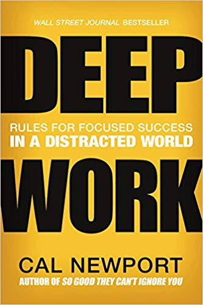

 [Deep Work](https://www.amazon.com/gp/product/1455586692/ref=as%5C_li%5C_tl?ie=UTF8&camp=1789&creative=9325&creativeASIN=1455586692&linkCode=as2&tag=ageewitahat-20&linkId=68a7387719cbcc931a798a5f7ee533ae%22%3E%3Cimg%20border=%220%22%20src=%22//ws-na.amazon-adsystem.com/widgets/q?%5C_encoding=UTF8&MarketPlace=US&ASIN=1455586692&ServiceVersion=20070822&ID=AsinImage&WS=1&Format=%5C_SL250%5C_&tag=ageewitahat-20) is what Why Programmers Work at Night should have been: an insightful masterpiece that tells you how to get shit done when everyone's grabbing for your attention. _"OMAIGOD YASS"_ pretty much sums up my reaction to everything Cal Newport said in the book. Ignore email so you can focus on things that matter? YASSSS. Get off the internets so you can focus on things you enjoy? YASSS. Block that addictive shit if you have to? OMAIGOD YASSS. Train people that you're flakey in communication and never to expect a prompt reply? YASSS. Batch meetings into chunks and avoid as many as you can in the first place? YAS! Schedule long swathes of uninterrupted time, and lock yourself in a cabin if you have to? OMAIGOD YES PLEASE. Say No to as many opportunities as you can because they're a distraction from what you really want to do? YES! Schedule every last moment of your time so you always have a game plan? Yes, great idea, but I prefer routines because I'm bad at scheduling. Take five minutes at the start of the day and at its end to go over your priorities and close any running mental loops? OMAIGOD YAS. Ask your boss, _"Is my job to Do The Work or to be available to coworkers' whims"_? I've been meaning to, but I'm afraid of the answer :D When inspiration strikes, clear your schedule, focus on that shit. Don't let it go. OMAIGOD YASS Schedule regular time to reflect and to think without distraction? FUCK YES (this is why I run) Basically, it's an amazing book, and I cannot do it justice. I listened to it as an audiobooks and now I want to buy like fifty copies and give them to everyone I know. Maaaybe I'll do that but probably not because that would be expensive :) Outside the practical advice he gives on _how_ to do these things that he suggests you should do, I enjoyed the results. The guy went from publishing 2 academic papers per year as a freeloading student to publishing 9 academic papers _and writing Deep Work_ **while competing for tenure**. All in one year. Holy shit, dude. He does admit that it was too tiring and he's going to chillax a little. Maybe publish only 8 papers while writing another book. :D I want to say there's something I don't like about the book, but there isn't. The whole thing was great. You should read it.
