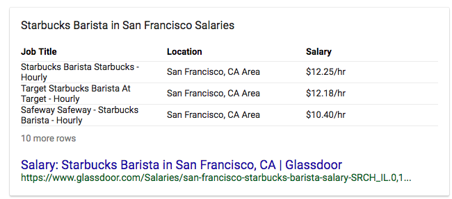

May flew by in a blur. One day it was April, and the next it was June. Whooosh like a deadline! Most of the month went towards building a React Native Music App: [Part 1](https://school.shoutem.com/lectures/build-react-native-music-app-tutorial-part1/) and [Part 2](https://school.shoutem.com/lectures/react-native-soundcloud-streaming-app-tutorial-part-2/). Subscribers on the React Native School project still aren't growing as fast as I'd like. Gonna have to figure something out. I think a combination of viral loops and better signup forms is necessary. The articles are long, so I don't think most people even scroll down to the form. Another big portion of the month went towards completing [React + D3v4](https://gum.co/mTWg). IT IS FUNCTIONALLY COMPLETE \\o/ What remains is to test drive it, turn it into a course, polish the intro and outro texts, make a new landing page, update the offerings, spruce up some ads, update the email crash course, write an email launch sequence. Stuff like that. Y'know, the hard stuff, now that the fun stuff is done :) This focus on not-published-on-swizec.com content meant there was less traffic, which resulted in lower sales. As you can read in the numbers below. Might also be time to organize another workshop. Those always boost my numbers when they sell well. So… 👇 **Net hourly rate before tax:** $14/hour  I am officially better off doing this than working a second job at Starbucks. Life goals 💪🏼 **Total revenue:** $2890 **Gumroad sales:** $1084

-   React D3v4 preorders: $539 -fees
-   React D3js ES6: $712 - fees
-   ES6 Cheatsheet: $21 - fees

That's $188 in Gumroad fees 🤔 Perhaps it's time to explore Stripe and building my own integrations. **Leanpub sales:** $361

-   Why Programmers Work at Night: $13
-   React+D3: $26
-   React D3js ES6: $322

**React Native School:** $1445 **Time investment:** 73 hours **Expenses:** $1872

-   Editor: $400
-   VA: $262
-   Ads: $331
-   Drip: $184
-   Hosting: $10
-   LiveEdu account: $10
-   SumoMe: $99
-   Mailchimp: $20
-   Tech: $492
-   Domains: $64
-   \[expense?] Seth Godin marketing course: $345

I'm a little worried that I can't remember what those $492 in tech expenses were. There was one video game; inspiration and relaxation, totally serious business expense. And a new carry-on suitcase because I got a discount. Super necessary. But what was the other $200… I need to take better notes. On the bright side, swizec.com is securely mine for another 5 years. That was def worth the price. Does a marketing course count as an expense? Pretty sure Starbucks wouldn't pay for that if I was a barista, but my sidehustle did because my sidehustle values me as a gentleman and a scholar. 🤔
