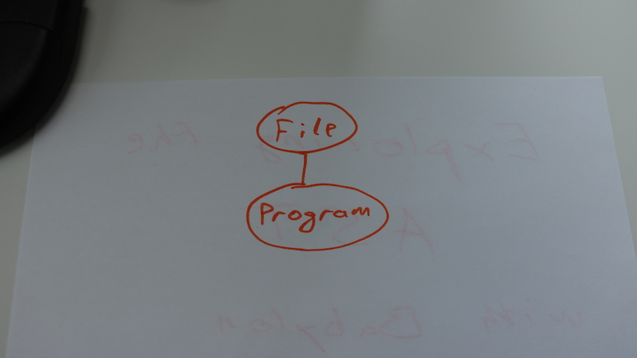
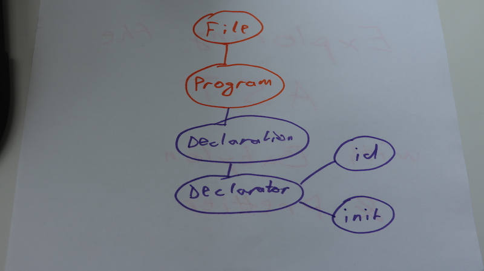

At [this week's livecoding session](https://swizec.com/blog/livecoding-39-towards-ai-writes-javascript/swizec/7621), I mentioned mutating ASTs to improve the performance of our [faux AI that writes JavaScript](https://github.com/Swizec/faux-js-ai) algorithm. It would help us converge on a solution faster.


But what is an AST?


Well, it's an abstract syntax tree. It's that thing computers use to understand your code. Let me explain how they work. I think every programmer can benefit from knowing this stuff.


It took my compilers professor in college a few hours. Let's see if I can show you the gist of it in a few hundred words. With a picture or two.


We're going to use [Babylon](https://github.com/babel/babylon) to parse code into an AST and [Prettier](https://github.com/prettier/prettier) to print it back out into code. Coincidentally, that's how Prettier approaches making your code pretty. You'll see that too.


We begin with a test harness runnable in node.js.


```
const util = require('util')
const babylon = require('babylon');

const code = `
`;

let AST = babylon.parse(code);

console.log(util.inspect(
    AST,
    false, null
));
```


We're going to put the code we're testing into `code`. The rest is there to parse it and print the resulting AST. `babylon.parse` is where the magic happens.


Parsing an empty piece of code creates an AST like this:


```
Node {
  type: 'File',
  start: 0,
  end: 1,
  loc: 
   SourceLocation {
     start: Position { line: 1, column: 0 },
     end: Position { line: 2, column: 0 } },
  program: 
   Node {
     type: 'Program',
     start: 0,
     end: 1,
     loc: 
      SourceLocation {
        start: Position { line: 1, column: 0 },
        end: Position { line: 2, column: 0 } },
     sourceType: 'script',
     body: [],
     directives: [] },
  comments: [],
  tokens: 
   [ Token {
       type: 
        TokenType {
          label: 'eof',
          keyword: undefined,
          beforeExpr: false,
          startsExpr: false,
          rightAssociative: false,
          isLoop: false,
          isAssign: false,
          prefix: false,
          postfix: false,
          binop: null,
          updateContext: null },
       value: undefined,
       start: 1,
       end: 1,
       loc: 
        SourceLocation {
          start: Position { line: 2, column: 0 },
          end: Position { line: 2, column: 0 } } } ] }
```


That doesn't tell you much, does it? It doesn't tell me anything. Most of it is for Babylon to know what's going on.


Here's the part we care about:


```
  program: 
   Node {
     type: 'Program',
     start: 0,
     end: 1,
     loc: 
      SourceLocation {
        start: Position { line: 1, column: 0 },
        end: Position { line: 2, column: 0 } },
     sourceType: 'script',
     body: [],
     directives: [] },
```


You can read this as _"There is a program that starts at 0:1 and ends at 0:2 and has an empty body. It is a script."_. That means our code isn't as empty as we thought; it's got a whole empty line!


In a picture, that AST looks something like this:





Root `file` node, child `program` node.


Now let's try a variable assignment.


```
const code = `
let a = 5;
`;
```


That outputs a bigger AST. I'm going to snip out some of the details to make this readable.


```
program: 
   Node {
     type: 'Program',
     start: 0,
     end: 12,
     loc: 
      SourceLocation {},
     sourceType: 'script',
     body: 
      [ Node {
          type: 'VariableDeclaration',
          start: 1,
          end: 11,
          loc: 
           SourceLocation {},
          declarations: 
           [ Node {
               type: 'VariableDeclarator',
               start: 5,
               end: 10,
               loc: 
                SourceLocation {},
               id: 
                Node {
                  type: 'Identifier',
                  start: 5,
                  end: 6,
                  loc: 
                   SourceLocation {},
                  name: 'a' },
               init: 
                Node {
                  type: 'NumericLiteral',
                  start: 9,
                  end: 10,
                  loc: 
                   SourceLocation {},
                  extra: { rawValue: 5, raw: '5' },
                  value: 5 } } ],
          kind: 'let' } ],
     directives: [] },
```


Our body now has a `variableDeclaration` node, which contains a `variableDeclarator` with an `Identifier` and a `NumericLiteral`. From this AST, you can infer that a `variableDeclarator` can contain multiple declarators, and that each declarator has an `id` and an `init`. The `id` node identifies the resulting variable and `init` sets its value.


In a picture, that looks something like this:





You'll notice the AST doesn't talk much about what our code says. There's no lets and equal signs or any of that. Sure, the identifier has a `name` and the init has a `value`, but the rest is an abstraction level higher.


An AST talks about what the code does, not what it is.


There's a list of tokens if you want to know what the code says:


```
tokens: 
   [ Token {
       type: 
        KeywordTokenType {
          label: 'let',
          keyword: 'let',
          beforeExpr: false,
          startsExpr: false,
          rightAssociative: false,
          isLoop: false,
          isAssign: false,
          prefix: false,
          postfix: false,
          binop: null,
          updateContext: null },
       value: 'let',
       start: 1,
       end: 4,
       loc: 
        SourceLocation {},
     Token {
       type: 
        TokenType {
          label: 'name',
          keyword: undefined,
          beforeExpr: false,
          startsExpr: true,
          rightAssociative: false,
          isLoop: false,
          isAssign: false,
          prefix: false,
          postfix: false,
          binop: null,
          updateContext: [Function] },
       value: 'a',
       start: 5,
       end: 6,
       loc: 
        SourceLocation {},
     Token {
       type: 
        TokenType {
          label: '=',
          keyword: undefined,
          beforeExpr: true,
          startsExpr: false,
          rightAssociative: false,
          isLoop: false,
          isAssign: true,
          prefix: false,
          postfix: false,
          binop: null,
          updateContext: null },
       value: '=',
       start: 7,
       end: 8,
       loc: 
        SourceLocation { },
     Token {
       type: 
        TokenType {
          label: 'num',
          keyword: undefined,
          beforeExpr: false,
          startsExpr: true,
          rightAssociative: false,
          isLoop: false,
          isAssign: false,
          prefix: false,
          postfix: false,
          binop: null,
          updateContext: null },
       value: 5,
       start: 9,
       end: 10,
       loc: 
        SourceLocation {},
     Token {
       type: 
        TokenType {
          label: ';',
          keyword: undefined,
          beforeExpr: true,
          startsExpr: false,
          rightAssociative: false,
          isLoop: false,
          isAssign: false,
          prefix: false,
          postfix: false,
          binop: null,
          updateContext: null },
       value: undefined,
       start: 10,
       end: 11,
       loc: 
        SourceLocation {},
     Token {
       type: 
        TokenType {
          label: 'eof',
          keyword: undefined,
          beforeExpr: false,
          startsExpr: false,
          rightAssociative: false,
          isLoop: false,
          isAssign: false,
          prefix: false,
          postfix: false,
          binop: null,
          updateContext: null },
       value: undefined,
       start: 12,
       end: 12,
       loc: 
        SourceLocation { } ]
```


The list of tokens is a lot more interesting to Babylon than it is to you or I. It explains how to translate your code into a syntax tree.


For example, let's say our parser encounters the `a` token. Just like you, it recognizes that this is not a JavaScript reserved word. That must mean it's a name for something and it starts a new expression.


```
Token {
   type: 
    TokenType {
      label: 'name',
      keyword: undefined,
      beforeExpr: false,
      startsExpr: true,
      rightAssociative: false,
      isLoop: false,
      isAssign: false,
      prefix: false,
      postfix: false,
      binop: null,
      updateContext: [Function] },
   value: 'a',
   start: 5,
   end: 6
}
```


The parser keeps going. It doesn't know yet what this new expression is going to be, but its name is `a`.


So it finds the `=` sign.


```
type: 
TokenType {
  label: '=',
  keyword: undefined,
  beforeExpr: true,
  startsExpr: false,
  rightAssociative: false,
  isLoop: false,
  isAssign: true,
  prefix: false,
  postfix: false,
  binop: null,
  updateContext: null },
value: '=',
```


Ah, so we're doing assignment, `isAssign`, and we're expecting an expression afterwards. At least that's what I think `beforeExpr` means. It's hard to know for sure because `;` also gets the `beforeExpr` flag 🤔


Either way, Babylon then encounters a `num` token, which also starts a new expression. In this case, an expression that's the length of a single token, but still a new expression.


As the parser goes through these tokens, it builds a syntax tree. Some tokens build new branches; others add more children to existing nodes.


Making this work is tricky. I remember building a compiler at school, and it nearly broke my brain. The hard part is that you're reading a flat stream of tokens and converting it into a rich tree.


And yet, you do it every day when reading other people's code! Quite impressive.


Now, once you have an AST, you can use something like Prettier to print it back out into readable code.


```
const code = `
let

a
         =

 5;
`;

console.log(prettier.format(code));

// let a = 5;
```


I couldn't find the internal Prettier function that takes an AST and outputs it, but that's what `.format` does internally. Parses your code, prints it back out with less cruft.


When I have some time, I'll figure out how to manipulate those ASTs to create different code.


Now excuse me while I install Prettier in my editor. 🤓