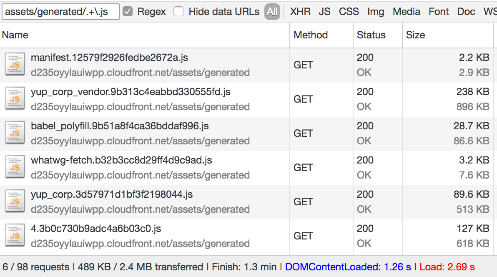
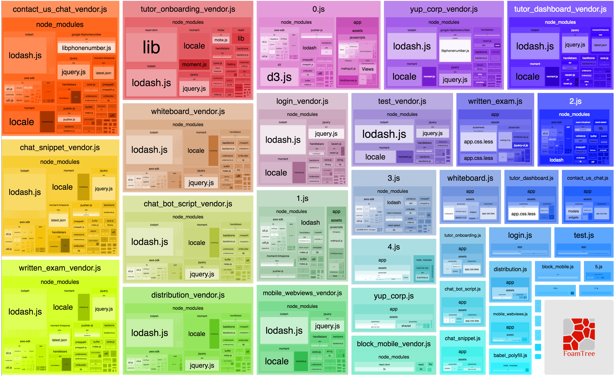
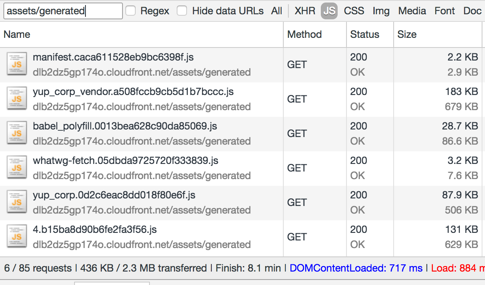
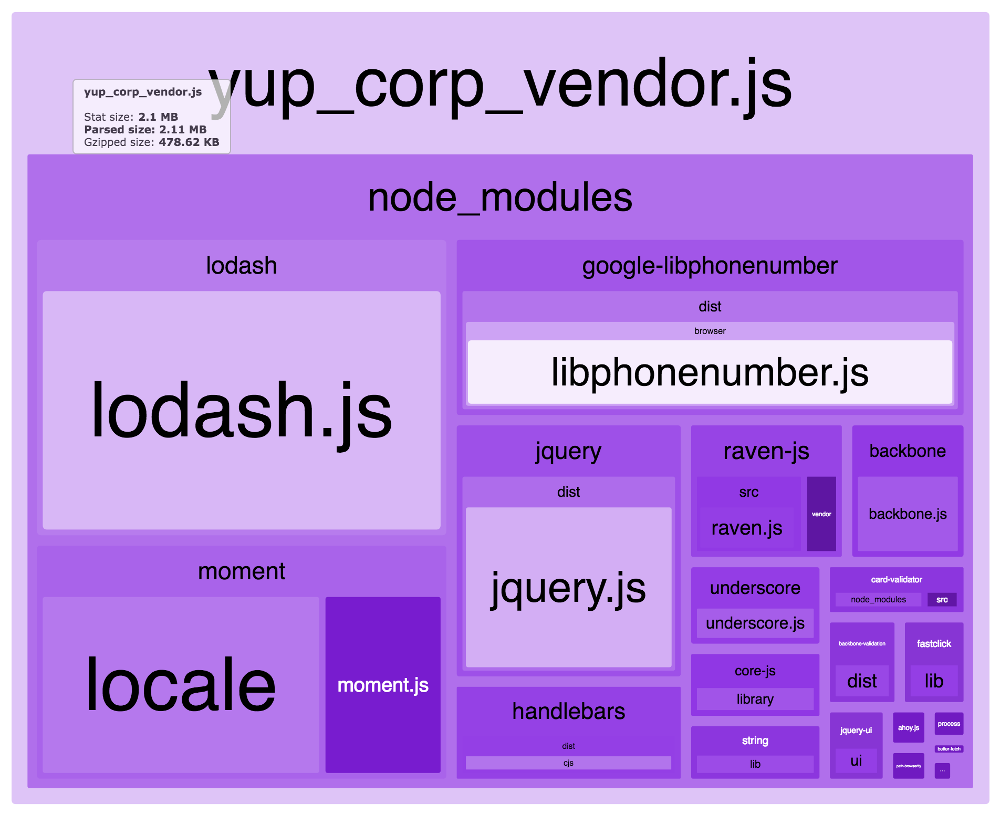
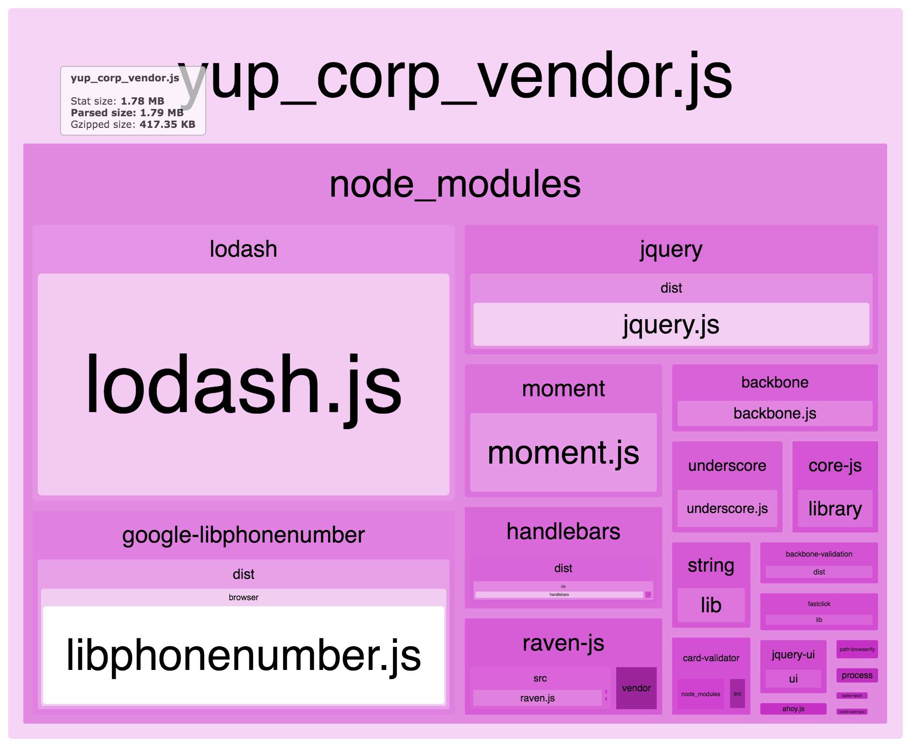
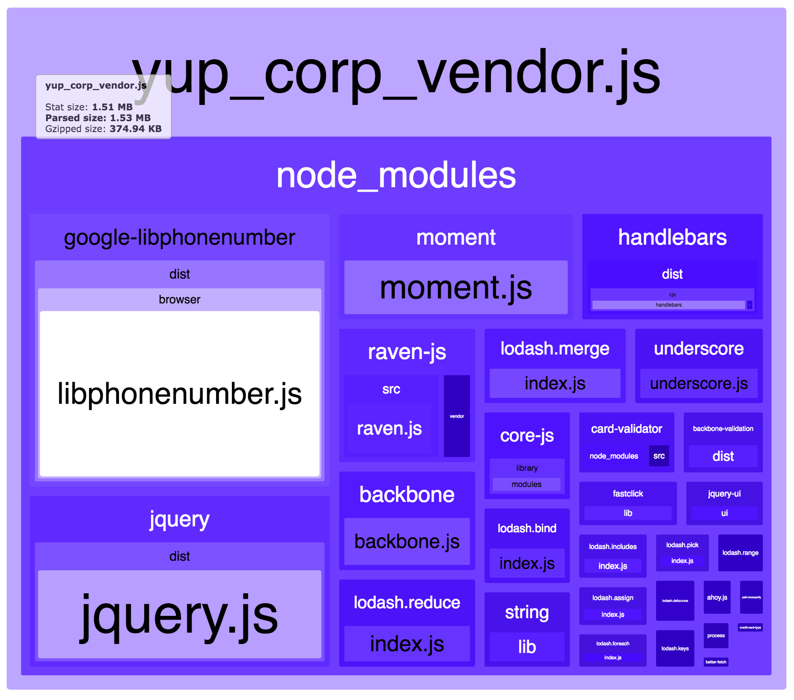

At my day job, we're using Webpack 2 to make our JavaScript as small as possible.


Bundle splitting ensures web apps get only the code they need, individual vendor files ensure caching stays as stable as possible, dead code elimination and tree shaking make our files small. Everything is minified and gzipped and cached forever. Fingerprinting ensures the code you download is never stale.


Despite all that, hitting our corp site, you're downloading 489KB of JavaScript. That's one of our most optimized apps. The apps that people use to work with our product are worse. Some go up to 1MB of gzipped JavaScript. 😅





If you look at the `BundleAnalyzerPlugin` output of our Webpack build, you'll see why. The vendors file, all our dependencies, is 238KB of that footprint.





[Lodash](https://lodash.com/) and [Moment](https://momentjs.com/) locales and jQuery everywhere! Most of the code we're shipping is made up of libraries which we use maybe 20% of.


We use 32 functions out of all of Lodash for example. I counted. We don't even use Moment locales!


## Here's how I optimized that


Here's how I optimized that to take 55KB off our gzipped vendors file. At least for the corp site that is. Results in other apps vary :)





See, corp site vendors file is down to 183KB. Overall, JavaScript footprint is down by 53KB. Not bad for gzipped minified code.


Let's look at the unminified `BundleAnalyzerPlugin` output for our corp site.





2.1 megs of unminified ungzipped code 😅


The first thing I did was to get rid of Moment's locales following a suggestion in [this issue](https://github.com/moment/moment/issues/2373). Moment is unfortunately not modularizable. They've been working on it for 2 years, so the best you can do is to use the `webpack.IgnorePlugin` to remove them from your build.


Like this:


```
// webpack.config.js

// ...
 plugins: [
        // ..
        new webpack.IgnorePlugin(/^\.\/locale$/, /moment$/)
    ]
```


I'm not sure _how_ that works, but it removes most of what makes Moment big. We weren't using locales anyway; all our string formatting used explicit format strings.





That was easy.


Smallifying Lodash, that made me feel cheeky. I ran a quick `git grep` to see how much of it we use. 32 functions. Out of well over 100 (200? More?) functions in the library.


But J Dalton is amazing and publishes [Lodash as a series of modules](https://www.npmjs.com/browse/keyword/lodash-modularized). Each function has its own npm module.


Armed with my `grep`, I set to work. The goal:


- \\import only those Lodash modules that are used
- _install_ only those that are used
- avoid manually having to manage Lodash dependencies
- using `_.somethingLodash` should work without explicitly \\importing anything


Here's what I came up with:


```
// webpack.config.js

const LodashModules = (() => {
    const path = require('path'),
          execSync = require('child_process').execSync;

    const files = path.resolve(__dirname, './app/assets/javascripts'),
          code = execSync(`grep -r "_\\\." ${files} --exclude=mathquill.js`,
                          {encoding: 'utf-8'});


    const matches = new Set(code.match(/_\.([a-z]+)/ig));

    return Array.from(matches.values())
                .map(m => {
                    let module = m.replace('_.', 'lodash.').toLowerCase(),
                        vars = [m];

                    if (module === 'lodash.extend') {
                        module = 'lodash.assign';
                        vars = vars.concat('_.assign');
                    }
                    if (module === 'lodash.each') {
                        module = 'lodash.foreach';
                        vars = vars.concat('_.forEach');
                    }

                    try {
                        require.resolve(module);
                    }catch(e) {
                        console.log(`Installing ${module}`);
                        execSync(`npm install --save ${module}`);
                    }

                    return new webpack.ProvidePlugin(
                        _.fromPairs(vars.map(v => [v, module]))
                    )
                })
})();

// ...

 plugins: [
        // ..
        new webpack.IgnorePlugin(/^\.\/locale$/, /moment$/)
    ].concat(LodashModules)
```


It's dirty, cheeky, and beautifully insane. It might be brittle, but I found no signs of brokenness. It's slow on first run and gets fast once all your modules are installed. Subsequent Webpack runs are just as fast as they've always been.


And yes, you definitely should test your app thoroughly after using this. Very thoroughly.


I think it's similar to J Dalton's [babel-plugin-lodash](https://github.com/lodash/babel-plugin-lodash) in its core idea. To use only those parts of Lodash that you use.


It differs in how this goal is achieved. Dalton's plugin uses proper code analysis to find functions that are used and \\import them as `lodash/<function>` from a full install of Lodash.


My solution goes for modular installation as well modular usage. If I'm not mistaken, this is easier for Webpack to optimize.


And I think Dalton's plugin needs you to explicitly \\import Lodash when you use it. Mine turns it into a magic super global via `webpack.ProvidePlugin`.


In a nutshell, when you say `_.map(stuff)`, my solution transforms that into `require('lodash.map')(stuff)`.


Let me explain.


### Find all occurrences of Lodash use


```
const LodashModules = (() => {
    const path = require('path'),
          execSync = require('child_process').execSync;

    const files = path.resolve(__dirname, './app/assets/javascripts'),
          code = execSync(`grep -r "_\\\." ${files} --exclude=mathquill.js`,
                          {encoding: 'utf-8'});


    const matches = new Set(code.match(/_\.([a-z]+)/ig));
```


We run a `grep -r "_\." <files>` search as a shell command. This returns all lines in all our files that use Lodash. I'm excluding `mathquill.js` in my case because it's breaking convention and building its own old skool Lodash internally. Old library :)


With `grep` output in hand, we run a regex that extracts all occurrences of `_.something`. That means chaining doesn't work. If you're used to composing Lodash methods, you're fine; if you're not, you should get used to it.


`babel-lodash-plugin` also doesn't understand chaining by the way.


All occurrences of `_.something` are put in a `Set`. This removes any duplicates (of which there are many) and pares us down to 32 functions in my case.


### Make magic \\imports


```
    return Array.from(matches.values())
                .map(m => {
                    let module = m.replace('_.', 'lodash.').toLowerCase(),
                        vars = [m];

                    if (module === 'lodash.extend') {
                        module = 'lodash.assign';
                        vars = vars.concat('_.assign');
                    }
                    if (module === 'lodash.each') {
                        module = 'lodash.foreach';
                        vars = vars.concat('_.forEach');
                    }

                    try {
                        require.resolve(module);
                    }catch(e) {
                        console.log(`Installing ${module}`);
                        execSync(`npm install --save ${module}`);
                    }

                    return new webpack.ProvidePlugin(
                        _.fromPairs(vars.map(v => [v, module]))
                    )
                })
})();
```


When we have those unique Lodash function calls, we walk through them, and for each one we:


- get a clean module name, `module.replace ...`
- resolve aliases (the list is incomplete, it covers only what our codebase uses)
- try to \\import the module
- if it exists, move on
- if module doesn't exist, install it and save to package.json
- create a new `ProvidePlugin` entry for the module


The resulting `ProvidePlugin` entries are added to the `plugins` array in our overall config.





And that's how we removed 55KB of gzipped dependencies. I feel like an evil mastermind.


Use this in production carefully.


* * *


Got questions? Twitter me.